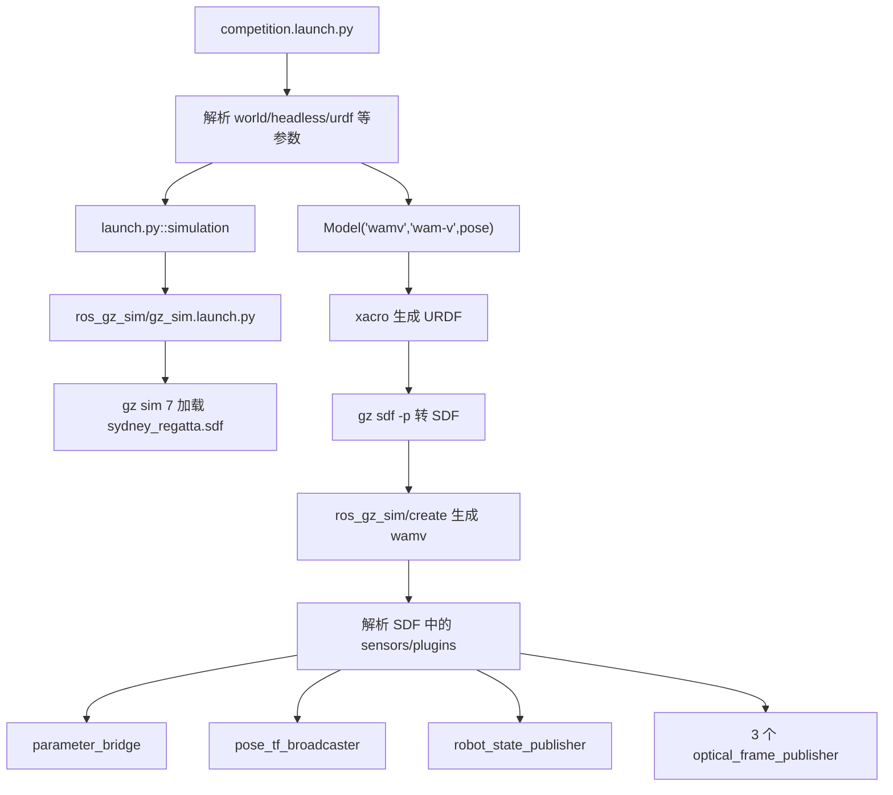
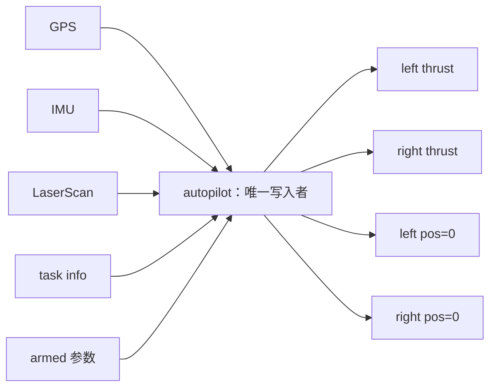
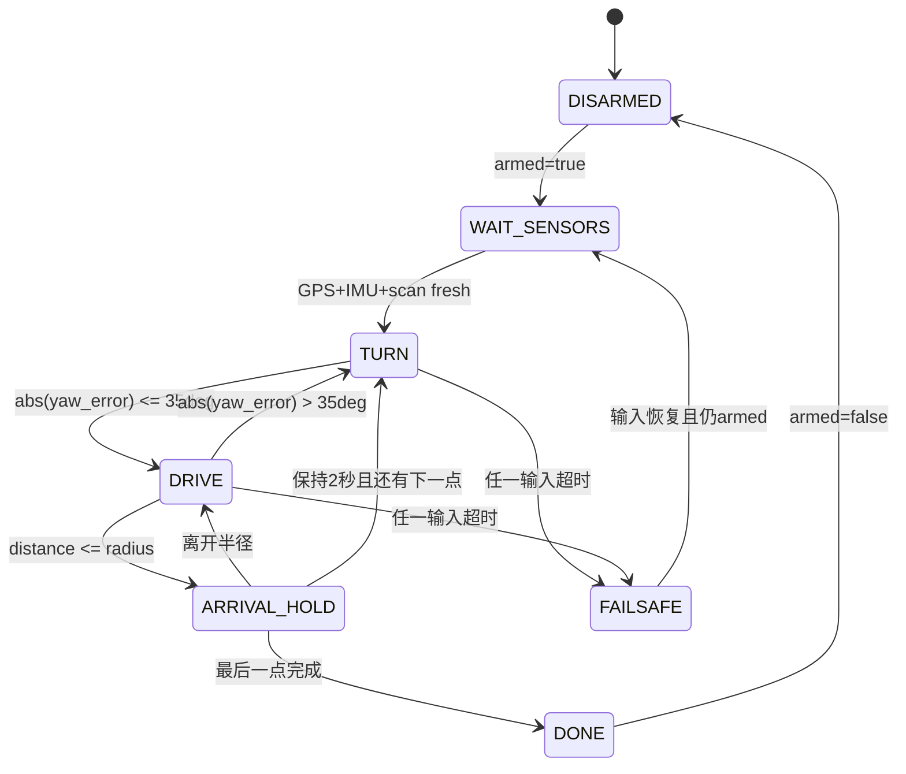
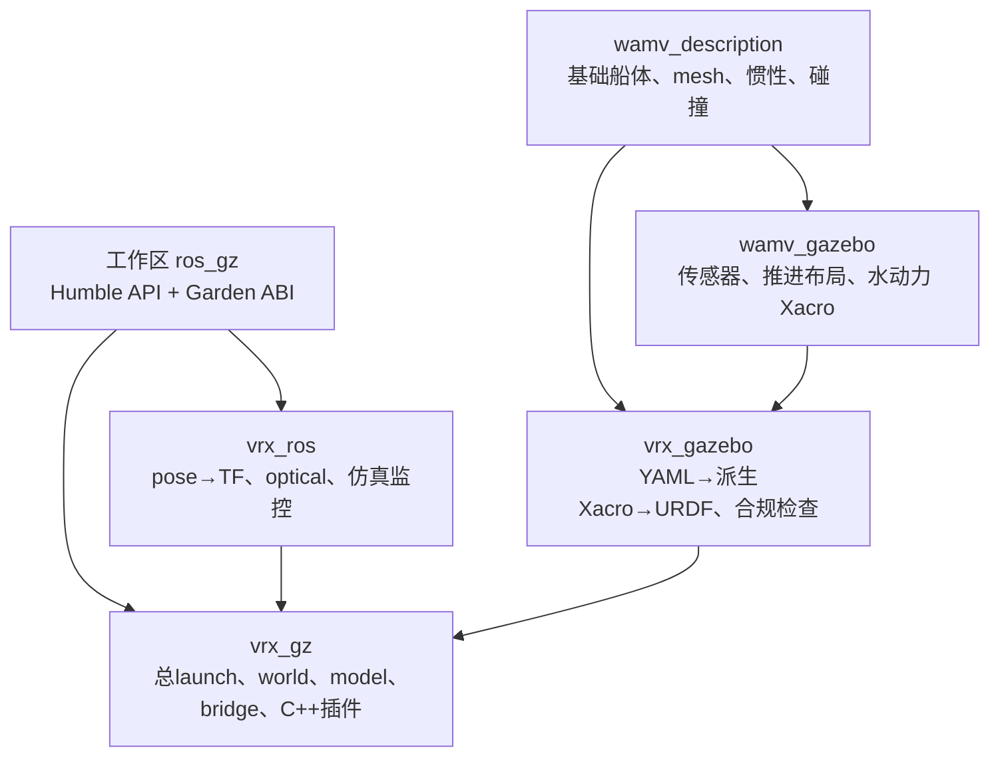
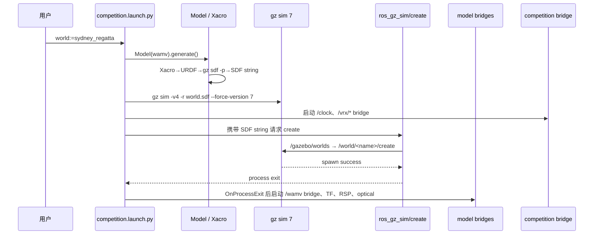
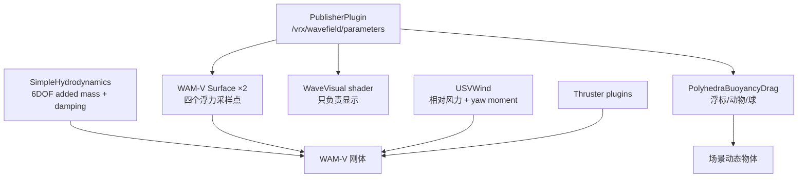
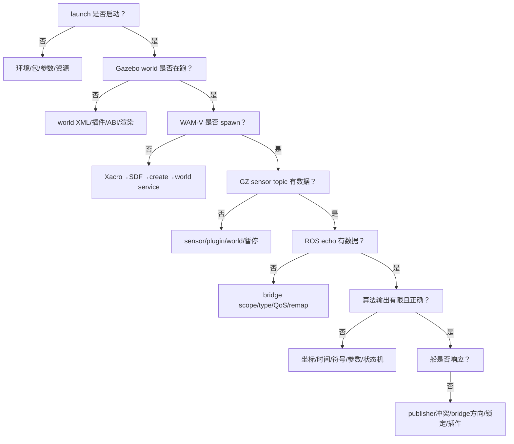
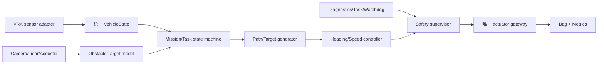

# VRX 从零到自主航行：高级工程师带练式工程教程

> 文档版本：2.0，基于多 agent 源码审计、官方 Wiki 核对和本机真实运行结果重新编写。  
> 工作区：`/home/han/Ai_ws/Study/vrx_ws`  
> 核心源码：`/home/han/Ai_ws/Study/vrx_ws/src/vrx-humble`  
> 实际技术栈：Ubuntu 22.04、ROS 2 Humble、Gazebo Garden / `gz-sim7` 7.9.0  
> 核验日期：2026-07-14  
> 官方仓库：<https://github.com/osrf/vrx>  
> 官方 Wiki：<https://github.com/osrf/vrx/wiki>

---

## 这不是“阅读材料”，而是一套带练工程

你不需要先系统学习 Linux、ROS、Gazebo、控制理论再回来。本文采用下面的顺序：

```text
先复制命令做出结果
→ 看懂刚才用到的最少概念
→ 用检查命令证明结果是真的
→ 故意制造一个小问题并修复
→ 把本次操作连接到真实源码
→ 交付一个可以保存的工程产物
```

每一课都包含：

- **目标**：完成后你能做什么；
- **现在操作**：逐行可复制的命令；
- **你应该看到**：正常结果的具体样子；
- **验收**：满足什么才允许进入下一课；
- **如果失败**：按顺序检查什么；
- **源码连接**：刚才的现象由哪个文件产生；
- **工程产物**：这一课应该留下什么。

不要只阅读代码块。必须在终端执行、观察、记录并完成验收。

### 三种标记

> **必须做**：主线步骤，跳过后后面的课程可能无法进行。

> **危险**：可能让船失控、产生控制冲突、批量修改源码或破坏环境。

> **版本陷阱**：官方资料与当前本地 Humble/Garden 实现不一致。

### 本版先纠正的关键事实

这不是文字润色，而是三名子 agent 分别审计架构、真实运行、八项评分插件后得到的工程修正：

| 容易被旧资料/旧脚本带偏的点 | 本机与本地源码事实 |
|---|---|
| 当前 Wiki 默认 Jazzy/Harmonic | 本工作区是 VRX 2.4.1 Humble 快照 + Garden 7 |
| 顶层脚本称负推力“前进” | 实测正推力前进、负推力后退 |
| 理想 frame 为 `wamv/base_link` | 当前真实 TF 是 `wamv/wamv/base_link` 双前缀 |
| 任意 source install/setup | 该文件混入 fishbot underlay；教程用 current `local_setup` |
| 传感器 bridge 是 Best Effort | 本机发布端实测 Reliable/Volatile |
| topic list 有就代表有数据 | bridge 可先建空端点，必须 echo/GZ 双侧验证 |
| `wamv_locked` 可切换锁定 | true/false Xacro hash 相同，实际由 platform+scorer release |
| 自定义 world 只改文件名 | 文件 stem、`<world name>`、launch basename 必须一致 |
| 声学 Wiki 旧 topic | 本地为 `/wamv/sensors/acoustics/receiver/range_bearing` |
| 所有 task score 都越低越好 | Follow Path、Scan/Dock 越高越好，其余六项越低越好 |
| Scan color sequence 是 service | 本地是 ROS→GZ `StringVec` topic |
| base Scan/Dock 可做最终验收 | 基础 world correct bay 配置矛盾，使用三个 practice world |

后文每个修正都给出复现命令、源码入口和验收条件。

### 终端编号

本文始终使用以下分工：

| 终端 | 长期用途 | 是否可以继续输入其他命令 |
|---|---|---|
| 终端 1 | Gazebo + VRX launch | launch 运行期间不可以 |
| 终端 2 | ROS 话题、TF、任务状态、诊断 | 可以 |
| 终端 3 | 键盘、手柄或自主控制器 | 控制器运行期间不可以 |
| 终端 4 | rosbag、RViz、rqt、临时实验 | 可以按实验使用 |

在任何新终端中，第一件事都是加载环境。后文把这四行称为“环境四连”：

```bash
cd /home/han/Ai_ws/Study/vrx_ws
export GZ_VERSION=garden
source /opt/ros/humble/setup.bash
source /home/han/Ai_ws/Study/vrx_ws/install/local_setup.bash
```

### 完整路线图

| 阶段 | 你要交付的结果 | 对应内容 |
|---|---|---|
| A. 生存与启动 | 能独立启动、停止、检查默认仿真 | 第 0～6 课 |
| B. 传感器与坐标 | 能读取并解释 GPS、IMU、相机、lidar、TF | 第 7～14 课 |
| C. 第一个 ROS 工程 | 一个规范的 `vrx_beginner` 包 | 第 15～18 课 |
| D. 自主控制 | 安全执行器、航向保持、航点跟踪、避障 | 第 19～27 课 |
| E. 读懂项目 | launch、bridge、URDF/Xacro/SDF、插件调用链 | 第 28～35 课 |
| F. 二次开发 | 自定义 WAM-V、world、风浪和物理参数 | 第 36～41 课 |
| G. 竞赛任务 | 跑通并理解 2023 八类任务 | 第 42～51 课 |
| H. 工程化 | 参数、launch、测试、rosbag、故障恢复 | 第 52～58 课 |
| I. 自动驾驶迁移 | 把 VRX 能力迁移到 CARLA/Autoware | 第 59～61 课 |
| 附录 | 话题表、文件表、命令表、故障树 | 文末附录 |

---

# 第一部分：先活下来，再启动项目

## 第 0 课：先锁定版本，避免一开始就装错

### 目标

你能解释为什么当前工程必须使用 Humble + Garden，并能识别网上不适用的命令。

### 0.1 VRX 有三条互不兼容的技术线

| 技术线 | ROS | Gazebo | 典型资料 |
|---|---|---|---|
| VRX Classic | ROS 1 | Gazebo Classic | `roscore`、`catkin_make`、XML `.launch` |
| VRX 2.x / 2023 | ROS 2 Humble | Gazebo Garden / `gz-sim7` | 当前本地源码 |
| VRX 3.0 | ROS 2 Jazzy | Gazebo Harmonic / `gz-sim8` | 官方 Wiki 当前默认 |

官方 Wiki 首页在 2025-08 更新后写明：VRX 3.0 默认使用 ROS 2 Jazzy + Gazebo Harmonic。官方系统要求页现在也写 Ubuntu 24.04、Jazzy、Harmonic。

这不代表本地工程也应该升级。本地 `vrx_gz/CMakeLists.txt` 明确要求：

```text
gz-sim7
gz-common5
gz-fuel_tools8
gz-math7
gz-msgs9
gz-transport12
gz-plugin2
gz-rendering7
gz-sensors7
gz-utils2
sdformat13
```

因此本教程的事实优先级是：

```text
当前本地源码和真实运行
  > 本地 install/build 结果
  > 与 2023/Humble 对应的 Wiki 内容
  > Wiki 当前主线命令
  > 搜索引擎或旧博客
```

### 0.2 现在操作：证明本机版本

```bash
source /opt/ros/humble/setup.bash
echo "$ROS_DISTRO"
gz sim --versions
```

你应该看到：

```text
humble
7.9.0
```

再检查源码约束：

```bash
rg -n 'find_package\(gz-|find_package\(sdformat' \
  /home/han/Ai_ws/Study/vrx_ws/src/vrx-humble/vrx_gz/CMakeLists.txt
```

### 0.3 一眼识别错误资料

看到下面任意内容，先暂停，不要复制：

| 看到的命令/词 | 说明 |
|---|---|
| `source /opt/ros/jazzy/setup.bash` | VRX 3.0 新主线，不是本工作区 |
| `GZ_VERSION=harmonic` | 新主线，不是 Garden 7 |
| `roscore`、`roslaunch` | ROS 1 / Classic |
| `catkin_make` | ROS 1 构建系统 |
| `gazebo --verbose` | 多半是 Gazebo Classic |
| `/wamv/pingers/pinger/range_bearing` | Wiki 的旧声学话题，本地已改名 |
| `usv_joy_teleop.launch` | 旧页面残留，本地文件是 `.py` |
| `ros-jazzy-joy-teleop` | 当前机器应该对应 `ros-humble-*` |

### 0.4 本地不是有效 Git 克隆

当前工作区的 `.git` 目录不含正常仓库元数据。下面命令会失败：

```bash
git status
```

这意味着：

- 不能在这里直接 `git pull`；
- 不能用 `git branch` 证明版本；
- 当前源码可能含本地修复，不能拿上游覆盖；
- 批量修改前要自己复制备份；
- 需要更新时，应另建目录克隆并人工比较。

### 验收

- [ ] `ROS_DISTRO` 输出 `humble`；
- [ ] `gz sim --versions` 输出 `7.9.0` 或同代 Garden 7；
- [ ] 你能说出为什么 Wiki 的 Jazzy 命令不能直接用；
- [ ] 你不会在当前目录执行 `git pull`。

---

## 第 1 课：零基础终端生存技能

### 目标

你能进入工作区、区分文件和目录、停止进程、复制命令，并理解 `source` 只对当前终端生效。

### 1.1 认识当前位置

```bash
pwd
```

`pwd` = print working directory。期望：

```text
/home/han/Ai_ws/Study/vrx_ws
```

如果不是：

```bash
cd /home/han/Ai_ws/Study/vrx_ws
pwd
```

### 1.2 查看文件

```bash
ls
ls -lh
```

你应该能找到：

```text
src
build
install
log
virtual_joystick.py
auto_pilot.py
camera.py
gpt-5.6sol.md
```

含义：

| 名称 | 作用 | 能否直接修改 |
|---|---|---|
| `src/` | 真正源码 | 可以，主要修改区 |
| `build/` | CMake/colcon 中间产物 | 不手改 |
| `install/` | ROS 实际运行读取的安装空间 | 不手改，靠构建生成 |
| `log/` | 构建日志 | 可查看，不作为源码 |

### 1.3 路径规则

```text
/home/han/...     绝对路径，从根目录开始
src/vrx-humble    相对路径，从当前目录开始
~/Ai_ws/...       ~ 代表当前用户 home，即 /home/han
..                上一级目录
.                 当前目录
```

新手阶段优先使用本文给出的绝对路径，减少“在错误目录执行命令”。

### 1.4 终止长期进程

当 `ros2 launch`、`ros2 topic echo` 或 Python 节点一直运行时，按：

```text
Ctrl+C
```

这是请求程序正常退出，不是复制快捷键。Linux 终端复制通常是 `Ctrl+Shift+C`，粘贴是 `Ctrl+Shift+V`。

### 1.5 `source` 到底做了什么

```bash
source /opt/ros/humble/setup.bash
```

让当前终端知道系统 ROS 2 Humble 在哪里。

```bash
source /home/han/Ai_ws/Study/vrx_ws/install/local_setup.bash
```

再让当前终端知道本工作区自己编译的 VRX 和 `ros_gz`。这里故意使用
`local_setup.bash`，因为本机的 `install/setup.bash` 是构建时生成的 prefix
chain，它还会悄悄加载 `/home/han/fishbot_slam_nav_ws/install`。那会把另一个
工作区带入排错现场。用系统 Humble 加当前 `local_setup.bash`，实测仍能找到
全部 VRX 包，同时 `AMENT_PREFIX_PATH` 更干净。

只有当你明确需要复现“构建时所有 underlay”时才使用：

```bash
source /home/han/Ai_ws/Study/vrx_ws/install/setup.bash
```

诊断和本教程主线都使用 `local_setup.bash`。

顺序必须是：

```text
系统 ROS
→ 当前工作区 local setup
```

关闭终端后这些环境变量消失，新终端必须重新 source。

### 1.6 证明 source 是否成功

```bash
source /opt/ros/humble/setup.bash
source /home/han/Ai_ws/Study/vrx_ws/install/local_setup.bash
ros2 pkg prefix vrx_gz
ros2 pkg prefix ros_gz_bridge
```

两者都应该指向：

```text
/home/han/Ai_ws/Study/vrx_ws/install
```

如果 `ros_gz_bridge` 指向 `/opt/ros/humble`，说明本地源码版 bridge 没有覆盖系统版，Garden transport 可能出问题。

### 验收

- [ ] 会用 `pwd` 和 `cd`；
- [ ] 知道 `src/build/install/log` 的区别；
- [ ] 知道 `Ctrl+C` 是结束进程；
- [ ] 新终端会执行环境四连；
- [ ] `ros2 pkg prefix vrx_gz` 指向本工作区。

---

## 第 2 课：不启动仿真，先做工作区健康检查

### 目标

在耗时启动 Gazebo 前，快速确认版本、包、world、插件和 transport 都在。

### 2.1 环境四连

```bash
cd /home/han/Ai_ws/Study/vrx_ws
export GZ_VERSION=garden
source /opt/ros/humble/setup.bash
source /home/han/Ai_ws/Study/vrx_ws/install/local_setup.bash
```

### 2.2 检查五个 VRX 包

```bash
for p in vrx_gz vrx_ros vrx_gazebo wamv_description wamv_gazebo; do
  ros2 pkg prefix "$p"
done
```

五条都应成功。

五个包的职责：

| 包 | 一句话职责 |
|---|---|
| `vrx_gz` | world、模型、launch、bridge 组装、VRX C++ 插件 |
| `vrx_ros` | TF、相机光学帧、Gazebo 生命周期辅助节点 |
| `vrx_gazebo` | 自定义 WAM-V 生成器、合规检查和模型资源 |
| `wamv_description` | WAM-V 基础几何、质量、船体和推进器描述 |
| `wamv_gazebo` | 传感器、水动力和推进布局 Xacro |

### 2.3 检查默认 world

```bash
test -f /home/han/Ai_ws/Study/vrx_ws/install/share/vrx_gz/worlds/sydney_regatta.sdf \
  && echo 'world: OK' \
  || echo 'world: MISSING'
```

### 2.4 检查关键插件

```bash
for f in \
  libUSVWind.so \
  libWaveVisual.so \
  libSimpleHydrodynamics.so \
  libScoringPlugin.so \
  libStationkeepingScoringPlugin.so; do
  test -f "/home/han/Ai_ws/Study/vrx_ws/install/lib/$f" \
    && echo "$f: OK" \
    || echo "$f: MISSING"
done
```

### 2.5 检查 Garden transport

```bash
ldd /home/han/Ai_ws/Study/vrx_ws/install/lib/ros_gz_sim/create \
  | grep -E 'gz-transport|ignition-transport'
```

当前正确目标是：

```text
libgz-transport12.so
```

如果只看到 `libignition-transport11.so`，说明它链接了 Fortress 代际，典型症状是 `create` 节点一直输出 `Requesting list of world names`。

### 2.6 检查 launch 参数能否解析

如果 `~/.ros/log` 不可写，先临时指定：

```bash
export ROS_LOG_DIR=/tmp/vrx_ros_log
mkdir -p /tmp/vrx_ros_log
```

然后：

```bash
ros2 launch vrx_gz competition.launch.py --show-args
```

应该显示：

```text
world
sim_mode
bridge_competition_topics
config_file
robot
headless
urdf
paused
competition_mode
extra_gz_args
```

### 2.7 当前构建布局的真实状态

```bash
sed -n '1p' /home/han/Ai_ws/Study/vrx_ws/install/.colcon_install_layout
rg '^AMENT_CMAKE_SYMLINK_INSTALL:BOOL=' \
  /home/han/Ai_ws/Study/vrx_ws/build/vrx_gz/CMakeCache.txt
```

本机实际是：

```text
merged
AMENT_CMAKE_SYMLINK_INSTALL:BOOL=OFF
```

也就是“合并安装空间 + 普通复制安装”，不是 symlink-install。后面重新构建时会保持 merged，并明确说明何时可以切换 symlink 策略。

### 验收

- [ ] 五个 VRX 包都能定位；
- [ ] 默认 world 存在；
- [ ] 五个关键 `.so` 存在；
- [ ] `create` 链接 `gz-transport12`；
- [ ] launch 参数能正常显示；
- [ ] 知道本机当前不是 symlink-install。

---

## 第 3 课：第一次完整启动

### 目标

启动 Sydney Regatta、自动生成 WAM-V、启动完整 bridge 和 TF，并能区分正常警告与真正错误。

### 3.1 终端 1：启动

```bash
cd /home/han/Ai_ws/Study/vrx_ws
export GZ_VERSION=garden
source /opt/ros/humble/setup.bash
source /home/han/Ai_ws/Study/vrx_ws/install/local_setup.bash
ros2 launch vrx_gz competition.launch.py world:=sydney_regatta
```

不要在 launch 运行期间关闭终端 1。

### 3.2 这一个命令内部做了什么



默认模型参数来自 `competition.launch.py`：

```text
ROS/Gazebo 模型名：wamv
模型类型：wam-v
初始位置：x=-532, y=162, z=0
初始姿态：roll=0, pitch=0, yaw=1 rad
传感器：vrx_sensors_enabled=true
推进布局：H，两台可转向尾部推进器
```

### 3.3 正常启动的关键日志

按出现顺序寻找：

```text
Gazebo Sim Server v7.9.0
Loading SDF world file [.../sydney_regatta.sdf]
Create service on [/world/sydney_regatta/create]
Creating GZ->ROS Bridge: [/clock ...]
Created entity [...] named [wamv]
Camera images ... advertised on [...]
Laser scans ... advertised on [...]
IMU data ... advertised on [...]
```

### 3.4 下面这些通常不是致命失败

| 日志 | 当前本机含义 |
|---|---|
| `Server directory does not exist ~/.gz/fuel/fuel.ignitionrobotics.org` | 查找旧 Fuel 缓存目录的警告；模型仍可能从其他缓存/URL加载 |
| `libEGL warning: failed to create dri2 screen` | 无界面/软件渲染时常见；传感器可能仍工作 |
| Ogre2 visibility mask warning | 渲染保留位警告，通常不阻止相机 |
| KDL root link inertia warning | `robot_state_publisher` 对根 link 惯量的已知限制 |
| DART mesh collision not implemented | 某些 mesh 碰撞无法由 DART创建，需看是否影响目标模型 |

下面这些必须停下排查：

```text
libXXX.so: cannot open shared object file
Unable to find world
create 节点持续几十秒 Requesting list of world names
parameter_bridge 进程立即退出
模型生成 Python traceback
Gazebo server 立即退出
```

### 3.5 首次加载为什么慢

Sydney Regatta 包含大量资源。第一次可能需要从 Gazebo Fuel 获取模型。不要连续反复 `Ctrl+C`；先观察是否仍有下载/加载活动。

### 3.6 退出

在终端 1 按一次 `Ctrl+C`，等待节点清理。

本机实测在 `headless:=True` 下退出时，`libWaveVisual.so` 偶尔会在 Ogre2/Material 析构阶段打印栈并段错误。判断方式：

- 如果它发生在你主动 `Ctrl+C` 之后、仿真运行期间数据正常，属于退出阶段问题；
- 如果启动过程中立即发生，则是致命问题；
- 无论哪种情况都检查是否有残留进程。

```bash
pgrep -a -f 'gz sim|parameter_bridge|pose_tf_broadcaster|robot_state_publisher'
```

正常退出后不应有真正的相关进程；`pgrep` 命令自身可能出现在结果中。

### 验收

- [ ] Gazebo GUI 出现；
- [ ] 能看到 Sydney Regatta 和 WAM-V；
- [ ] 日志出现 `Created entity ... wamv`；
- [ ] 相机、lidar、IMU 至少各出现一次 advertised 日志；
- [ ] 退出后无残留 Gazebo/bridge 进程。

### 源码连接

```text
src/vrx-humble/vrx_gz/launch/competition.launch.py
src/vrx-humble/vrx_gz/src/vrx_gz/launch.py
src/vrx-humble/vrx_gz/src/vrx_gz/model.py
```

---

## 第 4 课：Gazebo GUI 只学现在需要的按钮

### 目标

能暂停、继续、观察 real-time factor、选中 WAM-V、改变视角并判断仿真是否真的在计算。

### 4.1 重新启动默认 world

终端 1执行环境四连，然后：

```bash
ros2 launch vrx_gz competition.launch.py world:=sydney_regatta
```

### 4.2 World Control

Gazebo 左下或界面停靠区通常有：

- ▶ / ❚❚：播放和暂停；
- Step：暂停时只推进一个仿真步；
- Reset：重置世界，使用前先停控制器。

如果所有 ROS 话题都存在但 GPS/IMU 时间不变化，先看是不是暂停。

### 4.3 World Stats

重点看：

| 指标 | 含义 |
|---|---|
| Sim Time | 仿真内部时间 |
| Real Time | 现实经过时间 |
| Real Time Factor | 仿真速度 / 现实速度 |
| Iterations | 物理步数 |

`real_time_factor=1` 表示 1 秒现实时间推进约 1 秒仿真时间。小于 1 不等于算法错误，可能是相机、lidar、波浪和 GUI 占用过高。

### 4.4 Entity Tree

展开并找到：

```text
wamv
```

其下会有 base link、相机、lidar、IMU、GPS、推进器等实体。后续“模型存在但传感器话题没有”时，Entity Tree 是判断 sensor 是否生成的重要证据。

### 4.5 视角操作

不同桌面/鼠标绑定略有差异，目标不是背快捷键，而是做到：

1. 把相机移到船后上方；
2. 能看清左右尾部推进器；
3. 选中 `wamv`；
4. 控船时能观察船体方向；
5. 不把移动视角误认为移动模型。

### 4.6 一个容易误判的现象

水面视觉波浪与施加给船体的物理波浪来自同步参数，但在极端海况下可能不完全一致。不要只凭画面估计物理扰动，后面要记录姿态和误差。

### 验收

- [ ] 能播放/暂停；
- [ ] 暂停时 `/clock` 停止变化，继续后恢复；
- [ ] 能找到 real-time factor；
- [ ] 能在 Entity Tree 找到 `wamv`；
- [ ] 能看见左右推进器。

---

## 第 5 课：第一次读取真实 ROS 图

### 目标

认识 package、node、topic、message、publisher、subscriber，且每个概念都用当前 VRX 验证。

### 5.1 先启动仿真

终端 1保持默认 world 运行。

终端 2执行环境四连。

### 5.2 五个概念，只记一句话

| 概念 | 这里的实例 | 一句话 |
|---|---|---|
| package | `vrx_gz` | 一组可构建、可安装的软件和资源 |
| node | `parameter_bridge` | 运行中的程序参与者 |
| topic | `/wamv/sensors/imu/imu/data` | 连续消息通道 |
| message | `sensor_msgs/msg/Imu` | 通道里每一帧的数据结构 |
| publisher/subscriber | Gazebo bridge / 你的节点 | 发送者 / 接收者 |

### 5.3 查看所有 topic 和类型

```bash
ros2 topic list -t | sort
```

本机真实完整启动结果是 **36 个 ROS 话题**：

```text
/clock [rosgraph_msgs/msg/Clock]
/parameter_events [rcl_interfaces/msg/ParameterEvent]
/pinger/set_pinger_position [geometry_msgs/msg/Vector3]
/rosout [rcl_interfaces/msg/Log]
/tf [tf2_msgs/msg/TFMessage]
/tf_static [tf2_msgs/msg/TFMessage]
/vrx/contacts [ros_gz_interfaces/msg/Contacts]
/vrx/debug/wind/direction [std_msgs/msg/Float32]
/vrx/debug/wind/speed [std_msgs/msg/Float32]
/vrx/task/info [ros_gz_interfaces/msg/ParamVec]
/wamv/joint_states [sensor_msgs/msg/JointState]
/wamv/pose [tf2_msgs/msg/TFMessage]
/wamv/pose_static [tf2_msgs/msg/TFMessage]
/wamv/robot_description [std_msgs/msg/String]
/wamv/sensors/acoustics/receiver/range_bearing [ros_gz_interfaces/msg/ParamVec]
/wamv/sensors/cameras/front_left_camera_sensor/camera_info [sensor_msgs/msg/CameraInfo]
/wamv/sensors/cameras/front_left_camera_sensor/image_raw [sensor_msgs/msg/Image]
/wamv/sensors/cameras/front_left_camera_sensor/optical/camera_info [sensor_msgs/msg/CameraInfo]
/wamv/sensors/cameras/front_left_camera_sensor/optical/image_raw [sensor_msgs/msg/Image]
/wamv/sensors/cameras/front_right_camera_sensor/camera_info [sensor_msgs/msg/CameraInfo]
/wamv/sensors/cameras/front_right_camera_sensor/image_raw [sensor_msgs/msg/Image]
/wamv/sensors/cameras/front_right_camera_sensor/optical/camera_info [sensor_msgs/msg/CameraInfo]
/wamv/sensors/cameras/front_right_camera_sensor/optical/image_raw [sensor_msgs/msg/Image]
/wamv/sensors/cameras/middle_right_camera_sensor/camera_info [sensor_msgs/msg/CameraInfo]
/wamv/sensors/cameras/middle_right_camera_sensor/image_raw [sensor_msgs/msg/Image]
/wamv/sensors/cameras/middle_right_camera_sensor/optical/camera_info [sensor_msgs/msg/CameraInfo]
/wamv/sensors/cameras/middle_right_camera_sensor/optical/image_raw [sensor_msgs/msg/Image]
/wamv/sensors/gps/gps/fix [sensor_msgs/msg/NavSatFix]
/wamv/sensors/imu/imu/data [sensor_msgs/msg/Imu]
/wamv/sensors/lidars/lidar_wamv_sensor/points [sensor_msgs/msg/PointCloud2]
/wamv/sensors/lidars/lidar_wamv_sensor/scan [sensor_msgs/msg/LaserScan]
/wamv/shooters/ball_shooter/fire [std_msgs/msg/Bool]
/wamv/thrusters/left/pos [std_msgs/msg/Float64]
/wamv/thrusters/left/thrust [std_msgs/msg/Float64]
/wamv/thrusters/right/pos [std_msgs/msg/Float64]
/wamv/thrusters/right/thrust [std_msgs/msg/Float64]
```

数量不是唯一健康标准。换任务 world 后会增加任务专属话题；某些节点没启动时也会变化。必须同时检查关键话题。

更重要的是：**列表里有 topic，不等于真的有数据。** `parameter_bridge` 会先创建
ROS publisher。默认 `sydney_regatta` 没有评分插件，所以 Gazebo 侧没有
`/vrx/task/info` 数据，但 ROS 侧仍能列出同名 publisher。`/wamv/pose_static` 也有
相同“接口存在、默认无消息”的情况。验收数据必须使用：

```bash
timeout 10 ros2 topic echo --once /wamv/sensors/gps/gps/fix
gz topic -l | sort | rg 'wamv|vrx'
```

不要只拿 `ros2 topic list` 截图当作传感器健康证据。

### 5.4 查看一个 topic 的类型

```bash
ros2 topic type /wamv/sensors/imu/imu/data
```

期望：

```text
sensor_msgs/msg/Imu
```

查看结构：

```bash
ros2 interface show sensor_msgs/msg/Imu
```

### 5.5 查看发布者和订阅者

```bash
ros2 topic info /wamv/sensors/imu/imu/data --verbose
ros2 topic info /wamv/thrusters/left/thrust --verbose
```

理解方向：

```text
IMU：Gazebo → bridge publisher → 你的 subscriber
推力：你的 publisher → bridge subscriber → Gazebo
```

### 5.6 `ros2 node list` 为空怎么办

DDS discovery 或 ROS daemon 偶尔会让 `node list` 与 topic 可见性短暂不同。依次做：

```bash
ros2 daemon status
ros2 daemon stop
ros2 daemon start
ros2 node list
```

不要因为 node list 一次为空就忽略已经可读取的 topic；用 `topic info --verbose` 交叉判断。

### 验收

- [ ] 能列出 36 个默认话题；
- [ ] 能查 IMU 类型；
- [ ] 能解释传感器和推进器的消息方向；
- [ ] 知道任务 world 会改变话题数量；
- [ ] 会处理 ROS daemon 的发现问题。

---

## 第 6 课：先识别旧脚本错误，再安全控船

### 目标

识别工作区顶层键盘脚本的方向错误，用小推力完成一次受控实验，并能证明只有一个控制源、退出时推力归零。

### 6.1 安全规则

> **危险：任意时刻只能有一个推进器命令源。**

以下程序不能同时运行：

- `virtual_joystick.py`；
- `auto_pilot.py`；
- `thruster_test.py`；
- `direct_controller.py`；
- 手柄 `joy_teleop`；
- 你的自主控制器；
- 持续运行的 `ros2 topic pub --rate`。

多个 publisher 不会自动“选最新”。消息会交错到达，船会抖动、随机转向或无法停止。

### 6.2 先做代码审查：不要相信按键字母

```bash
cd /home/han/Ai_ws/Study/vrx_ws
source /opt/ros/humble/setup.bash
source /home/han/Ai_ws/Study/vrx_ws/install/local_setup.bash
python3 /home/han/Ai_ws/Study/vrx_ws/virtual_joystick.py
```

这个脚本的界面把 W/S/A/D 标成常见方向，但它的推力符号写反了。多 agent
审计后又用 GPS 和 IMU 做了真实运行验证，当前模型的实际合同是：

```text
双侧正推力：沿艇首 +x 前进
双侧负推力：后退
left 小、right 大：正 yaw，左转
left 大、right 小：负 yaw，右转
```

所以当前脚本按键的**实际动作**是：

| 键 | 脚本声称 | 当前实测动作 |
|---|---|---|
| `W` | 前进 | 后退 |
| `S` | 后退 | 前进 |
| `A` | 左转 | 右转 |
| `D` | 右转 | 左转 |
| 空格 | 停止 | 停止 |
| `Q` | 退出 | 退出流程还存在归零时序风险 |

本课只用它做一次低风险观察：在开阔水面短按 `S`，随后立即按空格；不要长按，
不要用最大推力做方向标定。第 20 课会写一个真正带 watchdog、限幅和 `finally`
归零的安全执行器节点，之后停止使用这个旧脚本。

### 6.3 为什么松手后会停

普通终端只能可靠读取按下事件，不能可靠读取松开事件。脚本每次按键只把命令保持 0.25 秒；按住时键盘自动重复，持续刷新截止时间；松开后超时回零。

脚本以 50 Hz 发布：

```text
/wamv/thrusters/left/thrust
/wamv/thrusters/right/thrust
/wamv/thrusters/left/pos
/wamv/thrusters/right/pos
```

### 6.4 当前符号不是“常识”，而是实测合同

当前本地脚本使用：

```text
前进：left>0, right>0
后退：left<0, right<0
左转：left<right，原地左转可用 left<0, right>0
右转：left>right，原地右转可用 left>0, right<0
直行推进器角：left_pos=0, right_pos=0
```

实测 `left=-100, right=+100` 时 `angular_velocity.z≈+0.219 rad/s`，所以正 yaw
是左转。正负合同也与 `src/vrx-humble/vrx_gz/config/wamv.yaml` 的
`scale=+1000` 一致。
换模型、推进布局或 joint axis 后仍必须重新标定。

> **危险：推进器插件保持最后一个命令。** 绝不能只发一次非零值然后离开。
> 非零实验必须有持续发布的截止时间，并在正常结束、异常和 Ctrl+C 三条路径都归零。

### 6.5 终端 2：确认只有一个 publisher

```bash
ros2 topic info /wamv/thrusters/left/thrust --verbose
```

找到 publisher 列表。此时应该只有键盘控制器一个 ROS publisher。

### 6.6 观察实时命令

```bash
ros2 topic echo /wamv/thrusters/left/thrust
```

去终端 3按 W/A/D/空格，观察数值。完成后在终端 2按 `Ctrl+C` 停止 echo。

### 6.7 正确停止

优先在控制器终端按 `Q`。脚本会发布零推力并退出。

再检查：

```bash
ros2 topic info /wamv/thrusters/left/thrust --verbose
```

控制器 publisher 应消失。

如果控制器异常崩溃，先确认没有持续 publisher，再发：

```bash
ros2 topic pub --once /wamv/thrusters/left/thrust \
  std_msgs/msg/Float64 '{data: 0.0}'
ros2 topic pub --once /wamv/thrusters/right/thrust \
  std_msgs/msg/Float64 '{data: 0.0}'
```

单次零值不能覆盖另一个仍以 50 Hz 发布的节点，所以第一步始终是停止冲突节点。

### 6.8 为什么不推荐其他顶层脚本

| 脚本 | 问题 | 适合用途 |
|---|---|---|
| `auto_pilot.py` | 300 秒固定 -2353，实际是满速后退且无反馈 | 只做反例阅读 |
| `thruster_test.py` | +3000 方向是前进，但超出约 2353.53 的模型上限 | 历史对比，不做模板 |
| `direct_controller.py` | 调 shell 调 `gz topic`，绕开 ROS；+3000 | 定位 bridge 问题时临时使用 |
| `camera.py` | 直接 reshape，未按 encoding 处理 | 最小图像演示，不做生产模板 |

### 验收

- [ ] W/S/A/D 能控制；
- [ ] 空格会停止加推力；
- [ ] topic echo 能看到对应命令；
- [ ] topic info 中只有一个控制 publisher；
- [ ] 按 Q 后 publisher 消失；
- [ ] 你能解释为什么本地正值前进、负值后退；
- [ ] 你知道一次非零 `--once` 不会自动归零；
- [ ] 你已经把旧脚本标记为反例，后面改用安全执行器节点。

---

# 第二部分：把传感器真正看懂

## 第 7 课：仿真时间、频率和 QoS

### 目标

能判断传感器是否持续发布、仿真是否暂停，并理解“话题存在但节点收不到”为什么常是 QoS 问题。

### 7.1 查看仿真时钟

终端 2：

```bash
ros2 topic echo /clock --once
```

应该得到：

```text
clock:
  sec: ...
  nanosec: ...
```

Gazebo 暂停后多执行几次，数值不再前进；继续播放后恢复。

### 7.2 查看发布频率

```bash
ros2 topic hz /wamv/sensors/imu/imu/data
```

等待数秒再按 `Ctrl+C`。不要只看第一帧，`hz` 需要采样窗口。

相机、lidar、IMU 的频率不同，不要要求都等于物理步进 250 Hz。

### 7.3 为什么高带宽话题不要完整 echo

下面两个消息包含大量数组：

```text
sensor_msgs/msg/Image
sensor_msgs/msg/PointCloud2
```

完整 echo 会让终端滚屏并增加序列化开销。对它们使用：

```bash
ros2 topic hz <topic>
ros2 topic info <topic> --verbose
```

图像用 `rqt_image_view`，点云用 RViz。

### 7.4 QoS 最少要知道什么

ROS 2 publisher 和 subscriber 的可靠性策略必须兼容。许多实体传感器常使用
`best_effort`，但当前本地 bridge 的 GPS、IMU、LaserScan 发布端实测为：

```text
reliable
volatile
```

Python 实时感知订阅仍可以优先使用：

```python
from rclpy.qos import qos_profile_sensor_data
```

然后：

```python
self.create_subscription(Imu, topic, callback, qos_profile_sensor_data)
```

这里的 Best Effort subscriber 能匹配 Reliable publisher。选择它的原因是实时控制
允许拥塞时丢掉旧帧，而不是“当前发布者本来就是 Best Effort”。做无损实验记录时可用：

```python
from rclpy.qos import QoSProfile, ReliabilityPolicy, DurabilityPolicy

reliable_qos = QoSProfile(depth=10)
reliable_qos.reliability = ReliabilityPolicy.RELIABLE
reliable_qos.durability = DurabilityPolicy.VOLATILE
```

### 7.5 检查 QoS

```bash
ros2 topic info /wamv/sensors/imu/imu/data --verbose
```

关注 publisher endpoint 的：

```text
Reliability
Durability
History
Depth
```

### 7.6 仿真时间与 watchdog 不应混为一谈

算法的消息时间戳应该使用 ROS 仿真时间；安全超时判断建议同时使用单调真实时钟：

```python
time.monotonic()
```

原因：仿真暂停时 `/clock` 也暂停。如果 watchdog 只依赖仿真时间，传感器已经不更新，但超时计时也不增加，推进器可能保持最后命令。

### 验收

- [ ] 能看 `/clock`；
- [ ] 能用 `topic hz`；
- [ ] 不对 Image/PointCloud2 长期完整 echo；
- [ ] 知道传感器订阅用 sensor data QoS；
- [ ] 能解释仿真时间和安全超时为什么分开。

---

## 第 8 课：GPS——从经纬度到“目标还有几米”

### 目标

能读取 GPS，理解 frame/status/covariance，并能把小范围经纬度差转换为东/北方向米数。

### 8.1 读取一帧

```bash
ros2 topic echo /wamv/sensors/gps/gps/fix --once
```

本机实测一帧：

```yaml
header:
  frame_id: wamv/wamv/gps_wamv_link/navsat
status:
  status: 0
  service: 0
latitude: -33.722768833025576
longitude: 150.67399021350707
altitude: 1.1572636514902115
position_covariance: [0.0, 0.0, 0.0, 0.0, 0.0, 0.0, 0.0, 0.0, 0.0]
position_covariance_type: 0
```

### 8.2 不要急着“修复”双层 `wamv/wamv`

frame id 中的双层前缀来自模型内部 link 命名与 ROS namespace/frame_prefix 叠加。它看起来不漂亮，但当前 bridge 和 TF 可能以此为事实。修改前必须同时检查 URDF、PosePublisher、TF broadcaster 和下游配置，不能只字符串替换。

### 8.3 字段含义

| 字段 | 现在怎么用 |
|---|---|
| `header.stamp` | 与其他传感器做时间关联 |
| `header.frame_id` | 这个测量属于哪个传感器 frame |
| `status.status` | 是否有有效定位 |
| `latitude/longitude` | WGS84 经纬度，单位度 |
| `altitude` | 高程，当前任务通常不用于平面导航 |
| `position_covariance` | 位置不确定度；当前仿真可能全 0/unknown |

### 8.4 小范围经纬度差转 ENU

Sydney 场地范围不大，可先用局部近似：

```python
import math

EARTH_RADIUS = 6378137.0


def geodetic_delta_m(current_lat, current_lon, target_lat, target_lon):
    """返回目标相对当前位置的 east、north，单位米。"""
    mean_lat = math.radians((current_lat + target_lat) * 0.5)
    d_lat = math.radians(target_lat - current_lat)
    d_lon = math.radians(target_lon - current_lon)
    north = EARTH_RADIUS * d_lat
    east = EARTH_RADIUS * math.cos(mean_lat) * d_lon
    return east, north
```

目标方位：

```python
desired_yaw = math.atan2(north, east)
distance = math.hypot(east, north)
```

这里遵循 ENU：

```text
x / yaw=0：东
y / yaw=+90°：北
z：上
```

### 8.5 做一次位移实验

1. 读取并保存初始 GPS；
2. 运行 `virtual_joystick.py`；
3. 持续按 W 约 10 秒；
4. 按空格；
5. 再读取 GPS；
6. 用上面的函数计算 east/north/distance。

不要只看 Gazebo 画面。GPS 数值变化才证明“执行器 → 物理 → 传感器 → bridge → ROS”闭环成立。

### 验收

- [ ] 能读取 GPS；
- [ ] 知道 frame id 为什么可能有双前缀；
- [ ] 能解释经纬度单位不是米；
- [ ] 能计算两点相对 east/north/distance；
- [ ] 控船前后 GPS 确实变化。

---

## 第 9 课：IMU——不要把四元数 z 当成偏航角

### 目标

能读取 IMU、把四元数变成 yaw、观察转向时的 yaw rate，并分清姿态与角速度。

### 9.1 读取一帧

```bash
ros2 topic echo /wamv/sensors/imu/imu/data --once
```

本机实测片段：

```yaml
header:
  frame_id: wamv/wamv/imu_wamv_link/imu_wamv_sensor
orientation:
  x: -0.004886
  y: 0.001578
  z: 0.479472
  w: 0.877542
angular_velocity:
  x: 0.013
  y: -0.006
  z: 0.021
linear_acceleration:
  x: -0.08
  y: -0.06
  z: 9.74
```

### 9.2 三组量

| 字段 | 含义 | 单位 |
|---|---|---|
| `orientation` | 当前姿态四元数 | 无单位 |
| `angular_velocity` | 绕 x/y/z 的角速度 | rad/s |
| `linear_acceleration` | x/y/z 线加速度 | m/s² |

静止时 z 轴加速度接近 9.8，不是船在向上加速，而是 IMU 的重力/比力约定。

### 9.3 四元数转 yaw

```python
import math


def quaternion_to_yaw(x, y, z, w):
    siny_cosp = 2.0 * (w * z + x * y)
    cosy_cosp = 1.0 - 2.0 * (y * y + z * z)
    return math.atan2(siny_cosp, cosy_cosp)
```

不要这样写：

```python
yaw = msg.orientation.z  # 错误
```

四元数的 `z` 只是四个分量之一。

### 9.4 角度误差必须 wrap

```python
def wrap_pi(angle):
    return math.atan2(math.sin(angle), math.cos(angle))

error = wrap_pi(target_yaw - current_yaw)
```

例如从 +179° 到 -179° 的最短误差是约 +2°，不是 -358°。

### 9.5 转向实验

终端 2：

```bash
ros2 topic echo /wamv/sensors/imu/imu/data --field angular_velocity
```

终端 3启动键盘控制，按 A，再按 D：

- `angular_velocity.z` 的符号应该切换；
- orientation 会持续变化；
- 停止后角速度不会瞬间完美归零，水动力有惯性。

### 验收

- [ ] 能读取 IMU；
- [ ] 不把 `orientation.z` 当 yaw；
- [ ] 会把四元数转 yaw；
- [ ] 会把角度误差 wrap 到 `[-π,π]`；
- [ ] A/D 时 `angular_velocity.z` 有响应。

---

## 第 10 课：相机——先看见，再正确转成 OpenCV 图像

### 目标

用 `rqt_image_view` 看见三路相机，识别 raw/optical 两组接口，并写出不会红蓝颠倒、不会忽略 stride 的图像订阅方法。

### 10.1 先列出相机，而不是手敲猜名字

终端 2：

```bash
ros2 topic list -t | rg '/wamv/sensors/cameras/.+(image_raw|camera_info)'
```

默认船有三台相机：

```text
front_left_camera_sensor
front_right_camera_sensor
middle_right_camera_sensor
```

每台都有原始和 optical 两组图像。以左前相机为例：

```text
/wamv/sensors/cameras/front_left_camera_sensor/image_raw
/wamv/sensors/cameras/front_left_camera_sensor/camera_info
/wamv/sensors/cameras/front_left_camera_sensor/optical/image_raw
/wamv/sensors/cameras/front_left_camera_sensor/optical/camera_info
```

### 10.2 正确启动图像查看器

本机不能保证存在名为 `rqt_image_view` 的顶层 shell 命令，使用 ROS 可执行：

```bash
ros2 run rqt_image_view rqt_image_view
```

在下拉框选择：

```text
/wamv/sensors/cameras/front_left_camera_sensor/optical/image_raw
```

你应该看到海面、浮标或码头场景。若 GUI 环境可用，但窗口里黑屏：

1. 回 Gazebo 确认没有暂停；
2. 用 `ros2 topic hz` 确认消息流；
3. 尝试非 optical 原图；
4. 查看终端 1是否有 Ogre/EGL 渲染错误；
5. 确认远程桌面或容器允许图形显示。

### 10.3 检查一帧元数据

```bash
ros2 topic echo --once \
  /wamv/sensors/cameras/front_left_camera_sensor/image_raw \
  --field header

ros2 topic echo --once \
  /wamv/sensors/cameras/front_left_camera_sensor/image_raw \
  --field encoding

ros2 topic echo --once \
  /wamv/sensors/cameras/front_left_camera_sensor/image_raw \
  --field width
```

当前默认配置应接近：

```text
frame_id: wamv/wamv/base_link/front_left_camera_sensor
encoding: rgb8
width: 1280
height: 720
设计更新率: 30 Hz
水平视场: 1.3962634 rad，约 80°
```

运行负载较高时实测帧率可能只有 22～24 Hz。只要持续出帧且时间戳前进，不能因为没到 30 就立即判定 bridge 失败。

### 10.4 raw 与 optical 到底差在哪

`vrx_ros/optical_frame_publisher.cc` 做两件事：

1. 把图像 frame_id 改成原 frame 加 `_optical`；
2. 发布相机惯例所需的固定旋转 `RPY=(-π/2, 0, -π/2)`。

它还是按需工作的：只有 optical 输出有人订阅时，转换节点才订阅原始图。因此“刚启动时看不到 optical 数据流”不一定是错误，先启动订阅者再检查。

视觉算法通常订阅 optical 图像；检查模型安装姿态时可看 raw frame。

### 10.5 为什么顶层 `camera.py` 不能直接当工程模板

当前脚本直接把 `msg.data` reshape 成三通道数组。它忽略了：

- `encoding` 是 `rgb8`，OpenCV 默认显示 BGR，红蓝会互换；
- `step` 可能不等于 `width × 3`；
- 消息不一定永远是三通道连续内存；
- import 时直接启动，无规范 `main()` 和清理流程。

工程写法使用 `cv_bridge`：

```python
from cv_bridge import CvBridge, CvBridgeError

self.bridge = CvBridge()

def image_callback(self, msg):
    try:
        bgr = self.bridge.imgmsg_to_cv2(msg, desired_encoding='bgr8')
    except CvBridgeError as exc:
        self.get_logger().error(f'image conversion failed: {exc}')
        return
    # 后续 OpenCV 算法使用 bgr；不要在 ROS 回调里做长时间阻塞操作。
```

依赖若缺失：

```bash
sudo apt install ros-humble-cv-bridge ros-humble-rqt-image-view
```

这里只在确实提示包不存在时安装，不要为了“保险”重复改系统。

### 10.6 做一个可复现的颜色检查

在 `rqt_image_view` 中确认红色浮标显示为红色。以后写 HSV 检测时，数据链应该是：

```text
ROS Image(rgb8)
→ cv_bridge(desired_encoding='bgr8')
→ cv2.cvtColor(BGR→HSV)
→ 颜色 mask
→ 形态学开闭运算
→ 轮廓/中心点
→ 发布调试图
```

不要用一个目标框的像素面积直接宣称得到可靠三维位置。要定位到世界坐标，还需要 `camera_info`、距离来源（lidar/双目/尺寸假设）和 TF。

### 验收

- [ ] 三台相机都能在 topic list 中找到；
- [ ] `rqt_image_view` 能显示至少一路实时图像；
- [ ] 能解释 raw 与 optical 的区别；
- [ ] 知道本机输入是 `rgb8`，OpenCV 工程统一转 `bgr8`；
- [ ] 保存一张截图到 `evidence/lesson10_camera.png`。

### 源码连接

- `src/vrx-humble/vrx_urdf/wamv_gazebo/urdf/components/wamv_camera.xacro`
- `src/vrx-humble/vrx_ros/src/optical_frame_publisher.cc`
- `src/vrx-humble/vrx_gz/src/vrx_gz/payload_bridges.py`

---

## 第 11 课：lidar——从一圈 ranges 到“前方必须停车”

### 目标

读懂 LaserScan 和 PointCloud2，用角度扇区提取前方距离，并知道第一版避障为什么不能只看全局最小值。

### 11.1 两个输出、同一台传感器

```bash
ros2 topic info /wamv/sensors/lidars/lidar_wamv_sensor/scan --verbose
ros2 topic info /wamv/sensors/lidars/lidar_wamv_sensor/points --verbose
```

| ROS 类型 | 适合做什么 | 代价 |
|---|---|---|
| `sensor_msgs/msg/LaserScan` | 2D 扇区、最近障碍、入门避障 | 丢失垂直结构 |
| `sensor_msgs/msg/PointCloud2` | 三维聚类、浮标检测、地面/水面过滤 | 数据大、解析复杂 |

默认 Xacro 中 3D lidar 的关键参数：

```text
10 Hz
16 条垂直线
水平 -π 到 +π
水平 samples 1875
垂直约 -15° 到 +15°
量程 0.1～130 m
高斯噪声标准差 0.01 m
安装位置相对 base 约 (0.7, 0, 1.8)
```

### 11.2 不打印整个数组

先只看字段：

```bash
ros2 topic echo --once \
  /wamv/sensors/lidars/lidar_wamv_sensor/scan \
  --field header

ros2 topic echo --once \
  /wamv/sensors/lidars/lidar_wamv_sensor/scan \
  --field angle_min

ros2 topic hz /wamv/sensors/lidars/lidar_wamv_sensor/scan
```

消息中的第 `i` 个 range 对应：

```python
angle_i = msg.angle_min + i * msg.angle_increment
```

只接受同时满足以下条件的点：

```python
math.isfinite(r)
msg.range_min <= r <= msg.range_max
```

### 11.3 最小可用的三扇区算法

下面是以后放进节点的纯函数，可先保存为实验笔记：

```python
import math
from statistics import quantiles


def sector_percentile(scan, center_deg, half_width_deg, percentile=0.10):
    center = math.radians(center_deg)
    half = math.radians(half_width_deg)
    values = []
    for index, distance in enumerate(scan.ranges):
        angle = scan.angle_min + index * scan.angle_increment
        error = math.atan2(math.sin(angle - center), math.cos(angle - center))
        if abs(error) <= half:
            if math.isfinite(distance) and scan.range_min <= distance <= scan.range_max:
                values.append(distance)
    if not values:
        return math.inf
    values.sort()
    position = min(len(values) - 1, int(percentile * len(values)))
    return values[position]
```

使用约定：

```text
left  = center +45°, half width 20°
front = center   0°, half width 20°
right = center -45°, half width 20°
```

为什么用 10% 分位而不是全局单个最小点：水面、艇体边缘或噪声可能制造孤立近点；分位数要求一小片点共同证明障碍存在。它仍不是最终感知算法，但比“全局 min”适合作为安全门。

### 11.4 RViz 验证坐标和数据

```bash
rviz2
```

设置：

```text
Fixed Frame: wamv/wamv/base_link
Add → LaserScan → /wamv/sensors/lidars/lidar_wamv_sensor/scan
Add → PointCloud2 → /wamv/sensors/lidars/lidar_wamv_sensor/points
```

若显示 `Fixed Frame does not exist`，不要把名字改成猜测值；先执行：

```bash
ros2 topic echo --once \
  /wamv/sensors/lidars/lidar_wamv_sensor/points \
  --field header
```

### 11.5 第一版安全合同

先不做“智能绕障”，只定不可违反的规则：

```text
front > 8 m      不干预导航
4 m < front ≤ 8  按距离线性降速
front ≤ 4 m      强制左右推力为 0
scan 超过 0.5 s 未更新  同样停车
```

真正实现放在第 24 课，并由唯一执行器发布者执行。lidar 节点自身不要与导航节点同时发布真实推进器话题。

### 如果失败

| 症状 | 最短检查链 |
|---|---|
| topic 存在但无帧 | Gazebo 是否暂停 → `gz topic -l` → sensor/plugin 日志 |
| RViz 无点但 `hz` 正常 | Fixed Frame → frame_id → TF → Point Size/Style |
| 频率显著低于 10 Hz | real-time factor → GPU/EGL → 是否同时完整 echo 点云 |
| 最近距离一直 0 或 inf | 检查 range_min/max、NaN/Inf 过滤、扇区角度 |

### 验收

- [ ] LaserScan 与 PointCloud2 都有连续消息；
- [ ] RViz 能显示至少一种 lidar 数据；
- [ ] 能计算左/前/右三个距离；
- [ ] 能解释为何单个最小点不够稳健；
- [ ] 交付 `evidence/lesson11_lidar.md`，记录空旷和近障碍时三个数值。

### 源码连接

- `src/vrx-humble/vrx_urdf/wamv_gazebo/urdf/components/wamv_3d_lidar.xacro`
- `src/vrx-humble/vrx_gz/src/vrx_gz/payload_bridges.py`

---

## 第 12 课：声学传感器——按参数名读 ParamVec

### 目标

读取本地真实声学 topic，正确解释 range/bearing/elevation，并写出可复用的 ParamVec 解析函数。

### 12.1 先纠正 Wiki 旧接口

本地正确接口：

```text
/wamv/sensors/acoustics/receiver/range_bearing
ros_gz_interfaces/msg/ParamVec
Gazebo → ROS
```

不要使用 Wiki 旧页面的：

```text
/wamv/pingers/pinger/range_bearing
```

默认普通 world 里 topic 可能被 bridge 创建出来，但不一定持续有有效声源数据。最清晰的实验 world 是：

```bash
ros2 launch vrx_gz competition.launch.py world:=acoustic_perception_task
```

终端 2在任务进入 running 前就执行：

```bash
ros2 topic echo /wamv/sensors/acoustics/receiver/range_bearing
```

### 12.2 三个值的坐标语义

| 参数名 | 单位 | 语义 |
|---|---|---|
| `range` | m | 接收器到 pinger 的三维距离 |
| `bearing` | rad | 艇体系方位，艇首 +x、左舷 +y；正值在左 |
| `elevation` | rad | 向上为正 |

默认约 1 Hz，噪声标准差约为：

```text
range: 3 m
bearing: 0.01 rad
elevation: 0.01 rad
```

range 的高斯噪声没有非负截断，极端情况下可能出现负数。控制器应拒绝非有限值和明显不合理值，并用多帧滤波。

### 12.3 ParamVec 不能按下标解析

`msg.params` 是 name/value 列表，顺序不是 API 合同。下面这种写法错误：

```python
distance = msg.params[0].value.double_value
```

正确做法：

```python
from rcl_interfaces.msg import ParameterType


def parameter_value_to_python(value):
    if value.type == ParameterType.PARAMETER_BOOL:
        return value.bool_value
    if value.type == ParameterType.PARAMETER_INTEGER:
        return value.integer_value
    if value.type == ParameterType.PARAMETER_DOUBLE:
        return value.double_value
    if value.type == ParameterType.PARAMETER_STRING:
        return value.string_value
    return None


def param_vec_to_dict(message):
    return {
        parameter.name: parameter_value_to_python(parameter.value)
        for parameter in message.params
    }
```

声学回调核心：

```python
import math


def acoustic_callback(message):
    values = param_vec_to_dict(message)
    required = {'range', 'bearing', 'elevation'}
    if not required.issubset(values):
        return
    distance = float(values['range'])
    bearing = float(values['bearing'])
    elevation = float(values['elevation'])
    if not all(math.isfinite(v) for v in (distance, bearing, elevation)):
        return
    if distance < 0.0:
        return
    # bearing > 0：目标在左；bearing < 0：目标在右。
```

### 12.4 不要碰仿真真值配置通道

ROS 图里还能看到：

```text
/pinger/set_pinger_position
geometry_msgs/msg/Vector3
ROS → Gazebo
```

它用于给仿真内部设置声源位置，不是合法任务解题输入。向它发布会篡改声源，而且可能让 scorer 和传感器状态不一致。教程中的自主算法永不发布这个 topic。

`header.frame_id` 常为 `pinger`，它也不是一个可依赖的接收器 TF。坐标语义以插件合同为准，再结合 IMU yaw 转到世界方向。

### 12.5 手动闭环实验

1. 启动 `acoustic_perception_task`；
2. 等 `state=running`；
3. 原地小推力转向；
4. 若 bearing 为正，向左转；为负，向右转；
5. 让 `abs(bearing)` 连续三帧小于约 0.15 rad；
6. 再低速前进，观察滤波后的 range 总体下降；
7. 接近时降速，不要用单帧 3 m 噪声决定急转。

### 验收

- [ ] 使用的是 `/wamv/sensors/acoustics/receiver/range_bearing`；
- [ ] 能按 name 而不是下标读三个值；
- [ ] 能说出 bearing 正值为何表示左侧；
- [ ] 明确不发布 `/pinger/set_pinger_position`；
- [ ] 交付一段 20 帧 CSV，包含仿真时间、range、bearing、elevation。

### 源码连接

- `src/vrx-humble/vrx_gz/src/AcousticPingerPlugin.cc`
- `src/vrx-humble/vrx_gz/src/vrx_gz/payload_bridges.py`
- `src/vrx-humble/vrx_urdf/wamv_gazebo/urdf/components/wamv_pinger.xacro`

---

## 第 13 课：TF 与 RViz——先接受本地双前缀事实

### 目标

从消息 header 找到真实 frame，验证传感器到船体的变换，并理解为什么当前没有 `map/world → base_link`。

### 13.1 本地真实 frame 名

当前 `robot_state_publisher` 设置 `frame_prefix='wamv/'`，而 URDF link 自己已经以 `wamv/` 开头，结果形成双前缀：

```text
GPS:     wamv/wamv/gps_wamv_link/navsat
IMU:     wamv/wamv/imu_wamv_link/imu_wamv_sensor
lidar:   wamv/wamv/base_link/lidar_wamv_sensor
camera:  wamv/wamv/base_link/front_left_camera_sensor
optical: wamv/wamv/base_link/front_left_camera_sensor_optical
```

这不漂亮，但它是当前运行事实。新手阶段不要边学边重命名整棵 TF 树。

### 13.2 永远先从消息查 frame

```bash
ros2 topic echo --once /wamv/sensors/gps/gps/fix --field header
ros2 topic echo --once /wamv/sensors/imu/imu/data --field header
ros2 topic echo --once \
  /wamv/sensors/lidars/lidar_wamv_sensor/points --field header
```

然后验证 lidar 静态变换：

```bash
ros2 run tf2_ros tf2_echo \
  wamv/wamv/base_link \
  wamv/wamv/base_link/lidar_wamv_sensor
```

当前实测应接近：

```text
Translation: [0.700, 0.000, 1.800]
Rotation RPY: [0.000, 0.000, 0.000]
```

### 13.3 正确读取 `/tf_static`

静态 TF 是 transient-local。一次性 echo 时把 QoS 写全：

```bash
ros2 topic echo /tf_static \
  --qos-reliability reliable \
  --qos-durability transient_local \
  --qos-history keep_last \
  --qos-depth 100 \
  --once
```

实测默认约有：

```text
/tf: 16 对
/tf_static: 18 对
TF 根: wamv/wamv/base_link
```

三台 `optical_frame_publisher` 使用同一个 node name，因此 `ros2 node list` 会警告重复名称。这是当前源码行为，不是 DDS 中突然出现了三艘船。

### 13.4 为什么找不到 world/map/odom

当前静态/关节 TF 树以船体为根，默认没有：

```text
world → base_link
map → odom → base_link
```

`/wamv/pose` 是 Gazebo pose 经 bridge 后的 `TFMessage`，再由 `pose_tf_broadcaster` 发到 TF，但默认设置和 frame 命名并不等价于一套完整的汽车式 `map→odom→base_link` 定位树。

所以第一阶段 RViz 用：

```text
Fixed Frame = wamv/wamv/base_link
```

它适合看传感器相对安装，不适合展示船在全局地图上的轨迹。第 25～26 课会由自己的定位/可视化节点维护 ENU map frame 和轨迹。

### 13.5 生成 TF 图

```bash
cd /home/han/Ai_ws/Study/vrx_ws
mkdir -p evidence
ros2 run tf2_tools view_frames
```

命令会在当前目录生成 PDF。把它移动或重命名为：

```text
evidence/lesson13_frames.pdf
```

### 如果失败

| 报错 | 原因与处理 |
|---|---|
| `Invalid frame ID wamv/base_link` | 用了旧/理想化单前缀，按 header 改成双前缀 |
| `/tf_static` 一次 echo 无输出 | 使用本节完整 QoS |
| optical frame 暂时不存在 | 先启动 optical 图像订阅，让按需节点工作 |
| RViz 点云报 extrapolation | 仿真时间、`use_sim_time`、时钟和 TF 时间戳不一致 |

### 验收

- [ ] `tf2_echo` 得到 lidar 的约 `(0.7,0,1.8)`；
- [ ] 能解释双前缀来源；
- [ ] 知道当前没有标准 `map→odom→base_link` 链；
- [ ] RViz 以真实 base frame 显示 scan/point cloud；
- [ ] 交付 TF 图 PDF。

### 源码连接

- `src/vrx-humble/vrx_gz/src/vrx_gz/launch.py`
- `src/vrx-humble/vrx_ros/src/pose_tf_broadcaster.cc`
- `src/vrx-humble/vrx_ros/src/optical_frame_publisher.cc`

---

## 第 14 课：rosbag——把一次实验变成可以重复的证据

### 目标

录制 GPS、IMU、lidar、TF 和控制命令，检查 bag 内容，并在不驱动仿真的情况下离线回放给算法节点。

### 14.1 建立证据目录

```bash
cd /home/han/Ai_ws/Study/vrx_ws
mkdir -p bags evidence
```

### 14.2 录制一次 30 秒人工实验

终端 4：

```bash
ros2 bag record \
  -o /home/han/Ai_ws/Study/vrx_ws/bags/manual_baseline \
  /clock \
  /tf \
  /tf_static \
  /wamv/sensors/gps/gps/fix \
  /wamv/sensors/imu/imu/data \
  /wamv/sensors/lidars/lidar_wamv_sensor/scan \
  /wamv/thrusters/left/thrust \
  /wamv/thrusters/right/thrust
```

操作顺序：

1. 录制开始后等 5 秒；
2. 用安全控制源低速前进约 5 秒；
3. 左转约 3 秒；
4. 停船；
5. 再等 5 秒；
6. 终端 4按 `Ctrl+C`。

若目录已存在，rosbag 会拒绝覆盖。不要删除旧证据；改名为：

```text
manual_baseline_02
```

### 14.3 检查，不凭感觉说“录到了”

```bash
ros2 bag info /home/han/Ai_ws/Study/vrx_ws/bags/manual_baseline
```

验收：

- duration 大约 20～40 秒；
- GPS、IMU、scan 的 message count 都大于 0；
- 左右 thrust 至少各有停止和非零命令；
- `/clock` 有连续消息。

### 14.4 安全回放

> **危险：这个 bag 包含推进器命令。不要在正在运行的 Gazebo 控制链上原名回放。**

最安全做法是先停止 Gazebo，然后只回放传感器给状态节点：

```bash
ros2 bag play /home/han/Ai_ws/Study/vrx_ws/bags/manual_baseline \
  --topics \
  /tf \
  /tf_static \
  /wamv/sensors/gps/gps/fix \
  /wamv/sensors/imu/imu/data \
  /wamv/sensors/lidars/lidar_wamv_sensor/scan \
  --clock 100
```

这里让 rosbag 用 `--clock 100` 生成回放时钟，所以不再同时选择 bag 中记录的
`/clock`，避免两个回放时钟源。

另一个终端：

```bash
ros2 topic echo /wamv/sensors/gps/gps/fix --once
```

后续节点若声明 `use_sim_time:=true`，就会使用回放 `/clock`。watchdog 仍应使用单调墙钟判断“多久没收到新帧”，否则暂停 bag 时仿真钟也暂停，超时可能永远不触发。

### 14.5 bag 的工程价值

同一 bag 可以反复比较：

- 改控制算法前后的日志；
- 不同 GPS 滤波器的轨迹；
- lidar 扇区阈值是否误报；
- 感知代码性能；
- 一次 bug 是否可复现。

它不是简单录像，而是自动驾驶开发最重要的“可复现实验输入”。

### 验收

- [ ] `ros2 bag info` 中六类核心数据非空；
- [ ] 停止 Gazebo 后仍能回放 GPS/IMU/scan；
- [ ] 回放时没有把 thrust 接回活动仿真；
- [ ] 保存 `evidence/lesson14_bag_info.txt`；
- [ ] 以后每次控制参数回归使用固定 baseline bag。

---

# 第三部分：建立自己的 ROS 2 工程，而不是继续堆顶层脚本

## 第 15 课：创建 `vrx_beginner` 包和工程骨架

### 目标

创建一个 ROS 2 Python 包，把状态、控制、安全、配置、launch、测试放进明确目录，后续不再在工作区根目录散落脚本。

### 15.1 为什么现在才建包

前 14 课已经证明：

- 仿真能启动；
- 传感器有真实数据；
- 坐标、QoS、TF 和执行器合同已标定；
- 有 rosbag 可做回归。

现在代码出错时，问题才更可能在你的节点里，而不是底层环境。这就是工程顺序。

### 15.2 创建包

先确认不存在同名包：

```bash
test -e /home/han/Ai_ws/Study/vrx_ws/src/vrx_beginner \
  && echo 'STOP: package already exists' \
  || echo 'OK: ready to create'
```

若输出 `OK`：

```bash
cd /home/han/Ai_ws/Study/vrx_ws/src

ros2 pkg create vrx_beginner \
  --build-type ament_python \
  --license Apache-2.0 \
  --dependencies \
    rclpy \
    sensor_msgs \
    std_msgs \
    geometry_msgs \
    nav_msgs \
    diagnostic_msgs \
    visualization_msgs \
    ros_gz_interfaces \
    rcl_interfaces \
    ament_index_python \
    launch \
    launch_ros
```

若已存在，不要重新运行生成器覆盖它；先查看现有文件，按本课结构补齐。

### 15.3 建目录

```bash
cd /home/han/Ai_ws/Study/vrx_ws/src/vrx_beginner
mkdir -p config launch test
touch vrx_beginner/math_utils.py
touch vrx_beginner/status_monitor.py
touch vrx_beginner/task_monitor.py
touch vrx_beginner/safe_thruster_test.py
touch vrx_beginner/autopilot.py
touch launch/autonomy.launch.py
touch config/autonomy.yaml
touch test/test_math_utils.py
```

目标结构：

```text
src/vrx_beginner/
├── config/
│   └── autonomy.yaml
├── launch/
│   └── autonomy.launch.py
├── resource/
│   └── vrx_beginner
├── test/
│   └── test_math_utils.py
├── vrx_beginner/
│   ├── __init__.py
│   ├── math_utils.py
│   ├── status_monitor.py
│   ├── task_monitor.py
│   ├── safe_thruster_test.py
│   └── autopilot.py
├── package.xml
├── setup.cfg
└── setup.py
```

### 15.4 各层职责

| 文件/目录 | 放什么 | 不放什么 |
|---|---|---|
| `math_utils.py` | 无 ROS 副作用的数学纯函数 | node、publisher |
| `status_monitor.py` | GPS/IMU 健康检查 | 推进器输出 |
| `task_monitor.py` | ParamVec 任务状态解析 | 任务作弊逻辑 |
| `safe_thruster_test.py` | 有截止时间的执行器标定 | 导航 |
| `autopilot.py` | 唯一真实执行器 publisher | GUI |
| `config/` | 数值参数 | Python 逻辑 |
| `launch/` | 节点组装与参数加载 | 控制公式 |
| `test/` | 纯函数、状态机、边界测试 | 手工观察 |

### 15.5 第一次空包构建

当前工作区是 merged + 普通复制安装。为了不在同一个 install 里悄悄混入另一种策略，本教程保持它：

```bash
cd /home/han/Ai_ws/Study/vrx_ws
export GZ_VERSION=garden
source /opt/ros/humble/setup.bash
source /home/han/Ai_ws/Study/vrx_ws/install/local_setup.bash

colcon build --merge-install --packages-select vrx_beginner
```

此时文件还是空的，构建成功只证明包元数据成立。每次修改 Python/launch/config 后都要重新构建，直到你有计划地迁移整个 install 到 symlink 策略。

### 如果失败

| 症状 | 检查 |
|---|---|
| `Package name already exists` | 不覆盖；进入已有目录比较结构 |
| 找不到 `ros_gz_interfaces` | 先 source 本地 `local_setup.bash` |
| package.xml XML error | 用第 16 课完整内容替换，检查闭合标签 |
| build 成功但运行找不到新代码 | 普通复制安装，需要重新 build + 新终端 source |

### 验收

- [ ] `src/vrx_beginner` 结构完整；
- [ ] `colcon build` 成功；
- [ ] `ros2 pkg prefix vrx_beginner` 指向本工作区 install；
- [ ] 没有删除或覆盖原 VRX 源码；
- [ ] 工程产物是一个可构建包，而不是另一个顶层 `.py`。

---

## 第 16 课：补齐包元数据、安装规则和公共数学函数

### 目标

让 launch/config 被正确安装，让 ROS 2 能找到节点，并建立后续控制器共用、可测试的数学模块。

### 16.1 `package.xml` 完整内容

用编辑器打开：

```bash
nano /home/han/Ai_ws/Study/vrx_ws/src/vrx_beginner/package.xml
```

替换为：

```xml
<?xml version="1.0"?>
<package format="3">
  <name>vrx_beginner</name>
  <version>0.1.0</version>
  <description>Beginner-safe autonomy stack for the local VRX Humble/Garden workspace.</description>
  <maintainer email="student@example.com">VRX Student</maintainer>
  <license>Apache-2.0</license>

  <buildtool_depend>ament_python</buildtool_depend>

  <exec_depend>rclpy</exec_depend>
  <exec_depend>sensor_msgs</exec_depend>
  <exec_depend>std_msgs</exec_depend>
  <exec_depend>geometry_msgs</exec_depend>
  <exec_depend>nav_msgs</exec_depend>
  <exec_depend>diagnostic_msgs</exec_depend>
  <exec_depend>visualization_msgs</exec_depend>
  <exec_depend>ros_gz_interfaces</exec_depend>
  <exec_depend>rcl_interfaces</exec_depend>
  <exec_depend>ament_index_python</exec_depend>
  <exec_depend>launch</exec_depend>
  <exec_depend>launch_ros</exec_depend>
  <exec_depend>ros2launch</exec_depend>

  <test_depend>ament_pytest</test_depend>
  <test_depend>python3-pytest</test_depend>
  <test_depend>ament_flake8</test_depend>
  <test_depend>ament_pep257</test_depend>

  <export>
    <build_type>ament_python</build_type>
  </export>
</package>
```

`package.xml` 解决“依赖合同”，不负责复制配置文件，也不生成 console executable。

### 16.2 `setup.py` 完整内容

```python
from glob import glob
import os

from setuptools import find_packages, setup


package_name = 'vrx_beginner'


setup(
    name=package_name,
    version='0.1.0',
    packages=find_packages(exclude=['test']),
    data_files=[
        ('share/ament_index/resource_index/packages',
         ['resource/' + package_name]),
        ('share/' + package_name, ['package.xml']),
        (os.path.join('share', package_name, 'launch'), glob('launch/*.launch.py')),
        (os.path.join('share', package_name, 'config'), glob('config/*.yaml')),
    ],
    install_requires=['setuptools'],
    zip_safe=True,
    maintainer='VRX Student',
    maintainer_email='student@example.com',
    description='Beginner-safe autonomy stack for VRX.',
    license='Apache-2.0',
    tests_require=['pytest'],
    entry_points={
        'console_scripts': [
            'status_monitor = vrx_beginner.status_monitor:main',
            'task_monitor = vrx_beginner.task_monitor:main',
            'safe_thruster_test = vrx_beginner.safe_thruster_test:main',
            'autopilot = vrx_beginner.autopilot:main',
        ],
    },
)
```

即使以后源码由 symlink 直接生效，`launch/` 和 `config/` 的安装规则仍不能省略。

### 16.3 `setup.cfg` 完整内容

```ini
[develop]
script_dir=$base/lib/vrx_beginner

[install]
install_scripts=$base/lib/vrx_beginner
```

它确保 ROS 2 在 `install/lib/vrx_beginner` 找 console script。

### 16.4 `math_utils.py` 完整内容

```python
import math


EARTH_RADIUS_M = 6378137.0


def clamp(value, lower, upper):
    if lower > upper:
        raise ValueError('lower must not exceed upper')
    return max(lower, min(upper, value))


def wrap_pi(angle):
    return math.atan2(math.sin(angle), math.cos(angle))


def quaternion_to_yaw(x, y, z, w):
    siny_cosp = 2.0 * (w * z + x * y)
    cosy_cosp = 1.0 - 2.0 * (y * y + z * z)
    return math.atan2(siny_cosp, cosy_cosp)


def geodetic_to_enu(latitude, longitude, origin_latitude, origin_longitude):
    lat = math.radians(latitude)
    lon = math.radians(longitude)
    lat0 = math.radians(origin_latitude)
    lon0 = math.radians(origin_longitude)
    east = EARTH_RADIUS_M * math.cos(lat0) * (lon - lon0)
    north = EARTH_RADIUS_M * (lat - lat0)
    return east, north


def enu_to_geodetic(east, north, origin_latitude, origin_longitude):
    lat0 = math.radians(origin_latitude)
    latitude = origin_latitude + math.degrees(north / EARTH_RADIUS_M)
    longitude = origin_longitude + math.degrees(
        east / (EARTH_RADIUS_M * math.cos(lat0)))
    return latitude, longitude


def slew(current, target, max_delta):
    if max_delta < 0.0:
        raise ValueError('max_delta must be non-negative')
    return current + clamp(target - current, -max_delta, max_delta)


def differential_mix(base, turn, max_abs):
    # 本地合同：正 base 前进；正 turn 产生正 yaw / 左转。
    left = clamp(base - turn, -max_abs, max_abs)
    right = clamp(base + turn, -max_abs, max_abs)
    return left, right
```

这些函数没有 ROS import，能在毫秒级单元测试中验证，bag 或 Gazebo 都不需要。

### 16.5 最小测试 `test_math_utils.py`

```python
import math

from vrx_beginner.math_utils import clamp
from vrx_beginner.math_utils import differential_mix
from vrx_beginner.math_utils import geodetic_to_enu
from vrx_beginner.math_utils import quaternion_to_yaw
from vrx_beginner.math_utils import slew
from vrx_beginner.math_utils import wrap_pi


def test_wrap_crosses_pi_by_short_path():
    error = wrap_pi(math.radians(-179.0) - math.radians(179.0))
    assert math.isclose(error, math.radians(2.0), abs_tol=1e-9)


def test_identity_quaternion_has_zero_yaw():
    assert math.isclose(quaternion_to_yaw(0.0, 0.0, 0.0, 1.0), 0.0)


def test_positive_turn_uses_local_left_turn_contract():
    left, right = differential_mix(300.0, 100.0, 1000.0)
    assert left == 200.0
    assert right == 400.0


def test_clamp_and_slew():
    assert clamp(12.0, -10.0, 10.0) == 10.0
    assert slew(0.0, 100.0, 30.0) == 30.0


def test_small_geodetic_offset_is_metric():
    east, north = geodetic_to_enu(
        -33.7227, 150.6741, -33.7227, 150.6740)
    assert 8.0 < east < 10.5
    assert abs(north) < 0.1
```

### 16.6 构建并测试

```bash
cd /home/han/Ai_ws/Study/vrx_ws
source /opt/ros/humble/setup.bash
source /home/han/Ai_ws/Study/vrx_ws/install/local_setup.bash

colcon build --merge-install --packages-select vrx_beginner
source /home/han/Ai_ws/Study/vrx_ws/install/local_setup.bash

colcon test --packages-select vrx_beginner
colcon test-result --verbose
ros2 pkg executables vrx_beginner
```

当前旧 VRX 构建记录里是 `BUILD_TESTING=OFF` 且 `0 tests`，那不能叫“测试全部通过”。这里新包的 pytest 必须真实被发现并报告通过。

### 验收

- [ ] `ros2 pkg executables` 列出四个入口；
- [ ] `test_math_utils.py` 的五个测试通过；
- [ ] launch/config 出现在 `install/share/vrx_beginner`；
- [ ] 能说明 `package.xml`、`setup.py`、`setup.cfg` 各自职责。

---

## 第 17 课：完整状态监视器——传感器“有 topic”不等于健康

### 目标

实现 GPS/IMU 有效性、帧率、超时、yaw 和 `/diagnostics`，在 Gazebo 暂停时能从 OK 自动变成 STALE。

### 17.1 完整 `status_monitor.py`

```python
import math
import time

import rclpy
from diagnostic_msgs.msg import DiagnosticArray
from diagnostic_msgs.msg import DiagnosticStatus
from diagnostic_msgs.msg import KeyValue
from rclpy.node import Node
from rclpy.qos import qos_profile_sensor_data
from sensor_msgs.msg import Imu
from sensor_msgs.msg import NavSatFix
from sensor_msgs.msg import NavSatStatus

from vrx_beginner.math_utils import quaternion_to_yaw


GPS_TOPIC = '/wamv/sensors/gps/gps/fix'
IMU_TOPIC = '/wamv/sensors/imu/imu/data'


class StreamState:
    def __init__(self):
        self.last_wall_time = None
        self.previous_wall_time = None
        self.rate_hz = 0.0
        self.valid = False
        self.detail = 'no message received'

    def mark(self, valid, detail):
        now = time.monotonic()
        self.previous_wall_time = self.last_wall_time
        self.last_wall_time = now
        if self.previous_wall_time is not None:
            period = now - self.previous_wall_time
            if period > 0.0:
                instant_rate = 1.0 / period
                self.rate_hz = 0.8 * self.rate_hz + 0.2 * instant_rate
        self.valid = valid
        self.detail = detail

    def age(self):
        if self.last_wall_time is None:
            return math.inf
        return time.monotonic() - self.last_wall_time


class StatusMonitor(Node):
    def __init__(self):
        super().__init__('status_monitor')
        self.declare_parameter('timeout_sec', 0.5)
        self.timeout_sec = float(self.get_parameter('timeout_sec').value)

        self.gps = StreamState()
        self.imu = StreamState()
        self.latitude = math.nan
        self.longitude = math.nan
        self.yaw = math.nan
        self.yaw_rate = math.nan

        self.create_subscription(
            NavSatFix, GPS_TOPIC, self.on_gps, qos_profile_sensor_data)
        self.create_subscription(
            Imu, IMU_TOPIC, self.on_imu, qos_profile_sensor_data)
        self.diagnostics_pub = self.create_publisher(
            DiagnosticArray, '/diagnostics', 10)
        self.create_timer(0.5, self.on_timer)

    def on_gps(self, message):
        finite = math.isfinite(message.latitude) and math.isfinite(message.longitude)
        has_fix = message.status.status != NavSatStatus.STATUS_NO_FIX
        valid = finite and has_fix
        if valid:
            self.latitude = message.latitude
            self.longitude = message.longitude
            detail = 'valid fix'
        else:
            detail = f'invalid fix: finite={finite}, status={message.status.status}'
        self.gps.mark(valid, detail)

    def on_imu(self, message):
        q = message.orientation
        values = (q.x, q.y, q.z, q.w, message.angular_velocity.z)
        valid = all(math.isfinite(value) for value in values)
        if valid:
            self.yaw = quaternion_to_yaw(q.x, q.y, q.z, q.w)
            self.yaw_rate = message.angular_velocity.z
            detail = 'valid orientation and yaw rate'
        else:
            detail = 'NaN or Inf in IMU message'
        self.imu.mark(valid, detail)

    def stream_diagnostic(self, name, stream, expected_hz):
        age = stream.age()
        if age > self.timeout_sec:
            level = DiagnosticStatus.STALE
            text = f'no fresh message for {age:.3f} s'
        elif not stream.valid:
            level = DiagnosticStatus.ERROR
            text = stream.detail
        else:
            level = DiagnosticStatus.OK
            text = 'OK'
        status = DiagnosticStatus()
        status.level = level
        status.name = f'vrx_beginner/{name}'
        status.hardware_id = 'wamv_sim'
        status.message = text
        status.values = [
            KeyValue(key='age_sec', value=f'{age:.4f}'),
            KeyValue(key='rate_hz', value=f'{stream.rate_hz:.2f}'),
            KeyValue(key='expected_hz', value=f'{expected_hz:.1f}'),
            KeyValue(key='detail', value=stream.detail),
        ]
        return status

    def on_timer(self):
        array = DiagnosticArray()
        array.header.stamp = self.get_clock().now().to_msg()
        array.status = [
            self.stream_diagnostic('gps', self.gps, 20.0),
            self.stream_diagnostic('imu', self.imu, 100.0),
        ]
        self.diagnostics_pub.publish(array)
        self.get_logger().info(
            f'gps_age={self.gps.age():.2f}s gps_rate={self.gps.rate_hz:.1f}Hz '
            f'imu_age={self.imu.age():.2f}s imu_rate={self.imu.rate_hz:.1f}Hz '
            f'lat={self.latitude:.8f} lon={self.longitude:.8f} '
            f'yaw={math.degrees(self.yaw):.1f}deg yaw_rate={self.yaw_rate:.3f}')


def main(args=None):
    rclpy.init(args=args)
    node = StatusMonitor()
    try:
        rclpy.spin(node)
    except KeyboardInterrupt:
        pass
    finally:
        node.destroy_node()
        if rclpy.ok():
            rclpy.shutdown()


if __name__ == '__main__':
    main()
```

### 17.2 构建和运行

```bash
cd /home/han/Ai_ws/Study/vrx_ws
colcon build --merge-install --packages-select vrx_beginner
source /opt/ros/humble/setup.bash
source /home/han/Ai_ws/Study/vrx_ws/install/local_setup.bash

ros2 run vrx_beginner status_monitor \
  --ros-args \
  -p use_sim_time:=true \
  -p timeout_sec:=0.5
```

另一个终端：

```bash
ros2 topic echo /diagnostics --once
```

### 17.3 故意暂停，验证 watchdog

1. 正常运行时两个 status 应为 `level: 0`；
2. 在 Gazebo 点击暂停；
3. 0.5～1 秒后应变为 `level: 3`，即 STALE；
4. 恢复播放，应自动回到 OK。

这里 freshness 使用 `time.monotonic()`。即使 `/clock` 暂停，墙钟仍向前，因此能真的触发超时。消息时间戳和轨迹计算仍使用 ROS time，两种钟各自服务不同合同。

### 如果失败

| 症状 | 检查 |
|---|---|
| executable not found | setup.py entry point → build → source local_setup |
| 一直 STALE | topic 能否 echo → QoS → topic 常量拼写 |
| 频率远高于合理值 | 是否重复 bridge/publisher；平滑器刚启动时需等数秒 |
| 暂停后仍 OK | 是否错误用暂停的 ROS clock 计算 watchdog |

### 验收

- [ ] 正常时 GPS/IMU 为 OK；
- [ ] 暂停 1 秒内变 STALE；
- [ ] 恢复后自动 OK；
- [ ] yaw 单位和符号可解释；
- [ ] `/diagnostics` 可被 rosbag 记录。

---

## 第 18 课：完整任务状态解析器——别按 ParamVec 下标写程序

### 目标

在任一评分 world 中按参数名解析状态、计时、碰撞和分数，理解状态时间字段的真实含义。

### 18.1 先启动 Stationkeeping

终端 1：

```bash
ros2 launch vrx_gz competition.launch.py world:=stationkeeping_task headless:=True
```

默认状态时间线通常是：

```text
仿真绝对时间 0～10 s:   initial
10～20 s:                ready
20～320 s:               running
之后:                    finished
```

它不会等你的节点“准备好了”才计时。

### 18.2 完整 `task_monitor.py`

```python
import math

import rclpy
from rcl_interfaces.msg import ParameterType
from rclpy.node import Node
from rclpy.qos import DurabilityPolicy
from rclpy.qos import QoSProfile
from rclpy.qos import ReliabilityPolicy
from ros_gz_interfaces.msg import ParamVec


TASK_INFO_TOPIC = '/vrx/task/info'


def parameter_value_to_python(value):
    if value.type == ParameterType.PARAMETER_BOOL:
        return value.bool_value
    if value.type == ParameterType.PARAMETER_INTEGER:
        return value.integer_value
    if value.type == ParameterType.PARAMETER_DOUBLE:
        return value.double_value
    if value.type == ParameterType.PARAMETER_STRING:
        return value.string_value
    return None


def param_vec_to_dict(message):
    result = {}
    for parameter in message.params:
        result[parameter.name] = parameter_value_to_python(parameter.value)
    return result


class TaskMonitor(Node):
    def __init__(self):
        super().__init__('task_monitor')
        qos = QoSProfile(depth=10)
        qos.reliability = ReliabilityPolicy.RELIABLE
        qos.durability = DurabilityPolicy.VOLATILE
        self.last_state = None
        self.last_score = math.nan
        self.create_subscription(ParamVec, TASK_INFO_TOPIC, self.on_task, qos)

    def on_task(self, message):
        values = param_vec_to_dict(message)
        required = {
            'name', 'state', 'ready_time', 'running_time',
            'elapsed_time', 'remaining_time', 'timed_out',
            'num_collisions', 'score',
        }
        missing = required - values.keys()
        if missing:
            self.get_logger().error(f'missing task fields: {sorted(missing)}')
            return

        state = str(values['state'])
        score = float(values['score'])
        changed = state != self.last_state
        score_changed = not math.isclose(score, self.last_score, abs_tol=1e-3)
        if changed or score_changed:
            self.get_logger().info(
                f"task={values['name']} state={state} "
                f"elapsed={float(values['elapsed_time']):.1f}s "
                f"remaining={float(values['remaining_time']):.1f}s "
                f"collisions={int(values['num_collisions'])} "
                f"score={score:.3f} timed_out={bool(values['timed_out'])}")
        if changed:
            self.get_logger().warn(
                f"state transition: {self.last_state!r} -> {state!r}; "
                f"ready_at={float(values['ready_time']):.1f}s, "
                f"running_at={float(values['running_time']):.1f}s")
        self.last_state = state
        self.last_score = score


def main(args=None):
    rclpy.init(args=args)
    node = TaskMonitor()
    try:
        rclpy.spin(node)
    except KeyboardInterrupt:
        pass
    finally:
        node.destroy_node()
        if rclpy.ok():
            rclpy.shutdown()


if __name__ == '__main__':
    main()
```

### 18.3 构建、提前运行、抓住 final

```bash
cd /home/han/Ai_ws/Study/vrx_ws
colcon build --merge-install --packages-select vrx_beginner
source /opt/ros/humble/setup.bash
source /home/han/Ai_ws/Study/vrx_ws/install/local_setup.bash
ros2 run vrx_beginner task_monitor --ros-args -p use_sim_time:=true
```

你应该看到状态字符串全部小写：

```text
initial → ready → running → finished
```

`ready_time` 和 `running_time` 是进入状态的绝对仿真时刻，不是“ready 持续多久”和“running 总时长”。实测 running 状态样例可出现：

```text
ready_time=10
running_time=20
elapsed_time=5
remaining_time=295
state=running
```

任务完成时插件立即再发 final，默认约 2 秒后停止仿真。必须在任务开始前启动 monitor 或 rosbag，不能结束后才临时 echo。

### 18.4 通用评分事实

- `SetScore()` 只在 running 时有效；
- 碰撞来自 Gazebo `/vrx/contacts`；
- 默认去抖约 3 秒，部分任务 10 秒；
- 碰撞模型名检查硬编码包含 `wamv/base_link::`，改机器人名后可能失效；
- `competition_mode:=True` 不会隐藏 task info 中的 score；
- `VRX_EXIT_ON_COMPLETION=false` 不能覆盖 world 默认 true，这是源码解析限制。

### 验收

- [ ] 解析器按 name 取值；
- [ ] 看到了四个状态的真实转换；
- [ ] 能解释 ready_time/running_time 是时间戳；
- [ ] 能在终端保留 final 状态；
- [ ] 交付 `evidence/lesson18_task_timeline.md`。

---

# 第四部分：从执行器标定到自主航点导航

## 第 19 课：用安全测试节点完成推进器四象限标定

### 目标

不用旧键盘脚本，不用一次性非零命令，以低推力、短时、自动归零方式验证前进/后退/左转/右转。

### 19.1 `safe_thruster_test.py` 完整内容

```python
import math
import time

import rclpy
from rclpy.node import Node
from std_msgs.msg import Float64

from vrx_beginner.math_utils import slew


LEFT_THRUST = '/wamv/thrusters/left/thrust'
RIGHT_THRUST = '/wamv/thrusters/right/thrust'
LEFT_POSITION = '/wamv/thrusters/left/pos'
RIGHT_POSITION = '/wamv/thrusters/right/pos'


class SafeThrusterTest(Node):
    def __init__(self):
        super().__init__('safe_thruster_test')
        self.declare_parameter('left', 0.0)
        self.declare_parameter('right', 0.0)
        self.declare_parameter('duration_sec', 2.0)
        self.declare_parameter('rate_hz', 20.0)
        self.declare_parameter('max_test_thrust', 800.0)
        self.declare_parameter('slew_per_tick', 40.0)

        self.target_left = float(self.get_parameter('left').value)
        self.target_right = float(self.get_parameter('right').value)
        self.duration = float(self.get_parameter('duration_sec').value)
        rate = float(self.get_parameter('rate_hz').value)
        self.limit = float(self.get_parameter('max_test_thrust').value)
        self.max_delta = float(self.get_parameter('slew_per_tick').value)
        self.validate(rate)

        self.left_pub = self.create_publisher(Float64, LEFT_THRUST, 10)
        self.right_pub = self.create_publisher(Float64, RIGHT_THRUST, 10)
        self.left_pos_pub = self.create_publisher(Float64, LEFT_POSITION, 10)
        self.right_pos_pub = self.create_publisher(Float64, RIGHT_POSITION, 10)

        self.started = time.monotonic()
        self.current_left = 0.0
        self.current_right = 0.0
        self.zero_cycles = 0
        self.done = False
        self.timer = self.create_timer(1.0 / rate, self.on_timer)
        self.get_logger().warn(
            f'test armed: left={self.target_left:.1f}, right={self.target_right:.1f}, '
            f'duration={self.duration:.1f}s')

    def validate(self, rate):
        values = (self.target_left, self.target_right, self.duration,
                  rate, self.limit, self.max_delta)
        if not all(math.isfinite(value) for value in values):
            raise ValueError('all parameters must be finite')
        if not 1.0 <= rate <= 100.0:
            raise ValueError('rate_hz must be in [1, 100]')
        if not 0.1 <= self.duration <= 5.0:
            raise ValueError('duration_sec must be in [0.1, 5.0]')
        if not 0.0 < self.limit <= 1000.0:
            raise ValueError('beginner max_test_thrust must be in (0, 1000]')
        if abs(self.target_left) > self.limit or abs(self.target_right) > self.limit:
            raise ValueError('requested thrust exceeds max_test_thrust')
        if self.max_delta <= 0.0:
            raise ValueError('slew_per_tick must be positive')

    def publish(self, left, right):
        self.left_pub.publish(Float64(data=float(left)))
        self.right_pub.publish(Float64(data=float(right)))
        self.left_pos_pub.publish(Float64(data=0.0))
        self.right_pos_pub.publish(Float64(data=0.0))

    def on_timer(self):
        active = time.monotonic() - self.started < self.duration
        desired_left = self.target_left if active else 0.0
        desired_right = self.target_right if active else 0.0
        self.current_left = slew(self.current_left, desired_left, self.max_delta)
        self.current_right = slew(self.current_right, desired_right, self.max_delta)
        self.publish(self.current_left, self.current_right)
        if not active and self.current_left == 0.0 and self.current_right == 0.0:
            self.zero_cycles += 1
            if self.zero_cycles >= 10:
                self.done = True
        else:
            self.zero_cycles = 0

    def stop_burst(self):
        for _ in range(10):
            self.publish(0.0, 0.0)
            rclpy.spin_once(self, timeout_sec=0.01)


def main(args=None):
    rclpy.init(args=args)
    node = None
    try:
        node = SafeThrusterTest()
        while rclpy.ok() and not node.done:
            rclpy.spin_once(node, timeout_sec=0.1)
    except KeyboardInterrupt:
        pass
    finally:
        if node is not None:
            node.stop_burst()
            node.destroy_node()
        if rclpy.ok():
            rclpy.shutdown()


if __name__ == '__main__':
    main()
```

### 19.2 构建并做启动前检查

```bash
cd /home/han/Ai_ws/Study/vrx_ws
colcon build --merge-install --packages-select vrx_beginner
source /opt/ros/humble/setup.bash
source /home/han/Ai_ws/Study/vrx_ws/install/local_setup.bash

ros2 topic info /wamv/thrusters/left/thrust --verbose
```

除 bridge 对应端点外，不应有旧键盘、旧 autopilot 或其他测试 publisher。若有，先停掉。

终端 2同时监视：

```bash
ros2 topic echo /wamv/sensors/imu/imu/data --field angular_velocity
```

### 19.3 四次短测试

每次都等待节点自行退出并归零，再开始下一次。

前进：

```bash
ros2 run vrx_beginner safe_thruster_test --ros-args \
  -p left:=300.0 -p right:=300.0 -p duration_sec:=2.0
```

后退：

```bash
ros2 run vrx_beginner safe_thruster_test --ros-args \
  -p left:=-300.0 -p right:=-300.0 -p duration_sec:=2.0
```

左转：

```bash
ros2 run vrx_beginner safe_thruster_test --ros-args \
  -p left:=-200.0 -p right:=200.0 -p duration_sec:=2.0
```

右转：

```bash
ros2 run vrx_beginner safe_thruster_test --ros-args \
  -p left:=200.0 -p right:=-200.0 -p duration_sec:=2.0
```

### 19.4 填写实测表

| 命令 | GPS/画面动作 | `angular_velocity.z` | 合同 |
|---|---|---|---|
| `+,+` | 沿艇首 | 约 0 | 前进 |
| `-,-` | 沿艇尾 | 约 0 | 后退 |
| `-,+` | 原地左转 | 正 | 正 yaw |
| `+,-` | 原地右转 | 负 | 负 yaw |

当前模型最大推力命令约 `2353.53`，但“允许的模型上限”不等于“入门测试应该使用的值”。前几次始终限制在 ±800 内。

### 验收

- [ ] 四象限结果与表一致；
- [ ] 每次测试结束左右 topic 最后都是 0；
- [ ] 没有两个控制 publisher；
- [ ] 左转 yaw rate 为正；
- [ ] 交付 `evidence/lesson19_thruster_calibration.md`。

---

## 第 20 课：确立“唯一执行器写入者”和失效安全合同

### 目标

在写任何 PID 前确定控制架构：只有一个节点写真实推进器，所有传感器超时、任务结束和异常都能把它锁到零。

### 20.1 不采用“每个算法都直接发推进器”

错误结构：

```text
航点节点 ─────→ /left/right thrust
避障节点 ─────→ /left/right thrust
键盘节点 ─────→ /left/right thrust
任务节点 ─────→ /left/right thrust
```

它没有优先级和原子性，左右命令甚至可能来自不同节点。

本教程的第一版结构：



等你掌握 ROS 2 接口设计后，可以拆成“导航建议 topic + safety supervisor 唯一写入”。初学版本先把决策放进一个节点，减少竞态。

### 20.2 执行器输出的七条硬约束

1. 默认 `armed=false`；
2. GPS、IMU、scan 任一超时，立即零推力；
3. 任一输入 NaN/Inf，拒绝更新有效状态；
4. 左右绝对值限幅；
5. 正常命令每周期做变化率限制；
6. `task state=finished` 后锁零；
7. Ctrl+C、异常和正常结束都连续发送零值。

紧急停止不应该慢慢 slew 到零；安全停止直接清零。正常增减速才使用 slew。

### 20.3 每次启动前的 checklist

```bash
ros2 topic info /wamv/thrusters/left/thrust --verbose
ros2 topic info /wamv/thrusters/right/thrust --verbose
```

然后逐项确认：

- [ ] 没有 `virtual_joystick.py`；
- [ ] 没有 `safe_thruster_test`；
- [ ] 没有旧 `auto_pilot.py`；
- [ ] Gazebo 未暂停；
- [ ] status_monitor 显示 GPS/IMU OK；
- [ ] scan 有连续帧；
- [ ] 船附近有足够空水域；
- [ ] `armed` 仍为 false，等待最后手动确认。

### 20.4 watchdog 用哪种时间

| 用途 | 时间源 |
|---|---|
| 轨迹、任务 elapsed、消息同步 | ROS 仿真时间 |
| “过去 0.5 s 是否收到传感器” | `time.monotonic()` |
| PID `dt` | 本教程定时控制回调的 monotonic 间隔 |

如果 watchdog 用 `/clock`，Gazebo 暂停时它也不走，节点可能永远认为旧传感器还“新鲜”。

### 验收

- [ ] 能画出唯一写入者结构；
- [ ] 知道急停直接归零、正常输出才限斜率；
- [ ] 会在运行前检查 publisher；
- [ ] 能解释为什么仿真时间不适合 freshness watchdog。

---

## 第 21 课：航向 P 控制——先原地转对方向

### 目标

把“目标 yaw 与当前 yaw 的差”变成正确符号的左右差动，先证明闭环收敛方向，再谈速度。

### 21.1 控制公式

```python
error = wrap_pi(target_yaw - current_yaw)
turn = clamp(kp * error, -max_turn, max_turn)
left, right = differential_mix(base, turn, max_thrust)
```

本地 mixer 已标定：

```python
left = base - turn
right = base + turn
```

当目标在左侧，`error>0`、`turn>0`，左侧变小、右侧变大，产生正 yaw，方向正确。

### 21.2 第一次只做原地航向

设置：

```text
base = 0
kp = 120 thrust/rad
max_turn = 250
目标 = 当前 yaw + 30°
```

观察三件事：

1. error 的绝对值是否先下降；
2. yaw rate 符号是否与 error 同号；
3. 接近目标后是否来回摆动。

如果 error 一开始持续增大，立即停船，优先检查 mixer 符号，不要先把 Kp 调小。

### 21.3 加小幅前进

原地能收敛后再设置：

```text
base = +300
max_thrust = 1000
```

在双体船上，差动转向能力会随前进、水流和波浪变化。P 控制常见现象：

- Kp 太小：转向慢，风中留下稳态误差；
- Kp 太大：穿过目标后反复摆动；
- 输出常在 max_turn：Kp 再大也没有新效果，已饱和。

### 21.4 可量化验收

从初始 30～60° 误差开始：

```text
2 秒内：误差趋势朝零
10 秒内：进入 ±10°
无持续高频左右切换
IMU 断流 0.5 秒内：输出零
```

### 验收

- [ ] 会 wrap 角度；
- [ ] 正误差产生左转；
- [ ] 先原地验证，再加入正 base；
- [ ] 能区分符号错误、Kp 小和输出饱和。

---

## 第 22 课：PD/PID、抗积分饱和与调参顺序

### 目标

用 yaw rate 抑制过冲，只在确有稳态偏差时加入积分，并阻止输出饱和期间积分无限累积。

### 22.1 为什么优先 PD

目标航向不快速变化时：

```text
d(error)/dt ≈ -yaw_rate
```

所以：

```python
turn = kp * error + ki * integral - kd * yaw_rate
```

IMU 已直接给 yaw rate，比对带 wrap 的 error 做数值差分稳定。

### 22.2 可测试的 PID 类

```python
from vrx_beginner.math_utils import clamp


class HeadingPID:
    def __init__(self, kp, ki, kd, output_limit, integral_limit):
        self.kp = kp
        self.ki = ki
        self.kd = kd
        self.output_limit = output_limit
        self.integral_limit = integral_limit
        self.integral = 0.0

    def reset(self):
        self.integral = 0.0

    def update(self, error, yaw_rate, dt):
        dt = max(1e-3, min(0.2, dt))
        candidate = clamp(
            self.integral + error * dt,
            -self.integral_limit,
            self.integral_limit)
        p_term = self.kp * error
        d_term = -self.kd * yaw_rate
        candidate_raw = p_term + self.ki * candidate + d_term
        candidate_output = clamp(
            candidate_raw, -self.output_limit, self.output_limit)

        not_saturated = abs(candidate_raw - candidate_output) < 1e-9
        drives_out_high = candidate_raw > self.output_limit and error < 0.0
        drives_out_low = candidate_raw < -self.output_limit and error > 0.0
        if self.ki == 0.0 or not_saturated or drives_out_high or drives_out_low:
            self.integral = candidate

        raw = p_term + self.ki * self.integral + d_term
        return clamp(raw, -self.output_limit, self.output_limit)
```

### 22.3 推荐调参顺序

1. `Ki=0, Kd=0`，增大 Kp 到能明显转向但开始有过冲；
2. 加 Kd，直到过冲和摆动可接受；
3. 在有风稳态误差确实长期存在时，从很小 Ki 开始；
4. 每次只改一个量，用同一 world、初始方向和 bag 比较；
5. 记录饱和占比，长期饱和时先降速度/限转，不盲目增益。

入门初值：

```yaml
kp: 120.0
ki: 0.0
kd: 80.0
max_turn: 250.0
integral_limit: 2.0
```

这只是安全起点，不是所有海况的“最优参数”。

### 22.4 什么时候 reset 积分

- disarmed；
- WAIT_SENSORS/FAILSAFE；
- 切换到下一个 waypoint；
- 任务 finished；
- 航向目标发生大跳变；
- 原地被障碍安全门停止。

### 验收

- [ ] 能解释 D 项为何用 `-yaw_rate`；
- [ ] P→D→I 顺序不颠倒；
- [ ] 输出饱和时积分不会继续朝错误方向累积；
- [ ] fail-safe 会 reset 积分。

---

## 第 23 课：从经纬度到航点状态机

### 目标

把目标纬经度转换为距离和期望 yaw，用明确状态机完成“转向—前进—减速—连续保持—下一个点”。

### 23.1 每周期计算目标相对位置

```python
east, north = geodetic_to_enu(
    goal_latitude,
    goal_longitude,
    current_latitude,
    current_longitude)
distance = math.hypot(east, north)
desired_yaw = math.atan2(north, east)
yaw_error = wrap_pi(desired_yaw - current_yaw)
```

在 ENU 中：

```text
x/east 对应 yaw=0
y/north 对应 yaw=+π/2
```

不要直接用纬度差和经度差做 `atan2`，经度每度的米数带 `cos(latitude)`。

### 23.2 状态机



### 23.3 速度策略

```python
if abs(yaw_error) > math.radians(35.0):
    base = 0.0
elif distance < slow_radius:
    base = cruise_thrust * distance / slow_radius
else:
    base = cruise_thrust
```

用 `arrival_radius=3 m` 起步，进入后连续保持 `2 s` 才完成，避免 GPS 噪声刚好擦过边界就切点。

### 23.4 航点来源必须注明坐标合同

本教程 YAML 航点和 Stationkeeping/Wayfinding 目标都采用：

```text
latitude, longitude，WGS84 度
```

特别注意 Wayfinding 的 `PoseArray` 虽然消息类型名里是 Pose，但本地 scorer/bridge 把每个 pose 的 `position.x/y` 编码为纬度/经度，而不是普通世界米制坐标。

### 验收

- [ ] 能从当前 GPS 算目标 east/north/distance；
- [ ] `atan2(north,east)` 得期望 yaw；
- [ ] 大角度先原地转；
- [ ] 进入半径需连续保持，不是一帧即完成；
- [ ] 切点时 PID 积分清零。

---

## 第 24 课：把 lidar 变成独立安全门

### 目标

在不假装完成复杂规划的情况下，实现“无障碍不干预、靠近减速、过近停车、scan 断流停车”。

### 24.1 安全门不是路径规划器

第一版只决定允许的前进比例：

```python
def obstacle_speed_scale(front_distance, stop_distance, slow_distance):
    if not math.isfinite(front_distance):
        return 1.0
    if front_distance <= stop_distance:
        return 0.0
    if front_distance >= slow_distance:
        return 1.0
    return (front_distance - stop_distance) / (slow_distance - stop_distance)
```

然后：

```python
base *= obstacle_speed_scale(front, 4.0, 8.0)
```

若 `front<=4`，本教程直接输出零，不让 heading PID 继续原地旋转，因为船体旋转也可能扫到近障碍。更高级版本才会结合左右 clearance 选择绕行。

### 24.2 四种必须停车的输入状态

```text
scan age > 0.5 s
扇区内没有任何有效点且传感器状态异常
front ≤ stop_distance
消息包含异常并导致有效点比例过低
```

“没有回波”在空旷环境可能表示所有范围是 `inf`，不能无脑当作 0 m。应结合消息新鲜度、range_max 和有效点比例区分“空旷”与“传感器坏了”。本入门代码把新鲜但全 `inf` 视为空旷，把断流视为失败。

### 24.3 可视化与日志

至少记录：

```text
front_distance
speed_scale
obstacle_stop_count
scan_age
有效点比例
```

不要只在船撞上后才猜阈值。用 RViz 对照 front sector，确认水面/自体点没有长期触发。

### 验收

- [ ] 空旷水面 `scale=1`；
- [ ] 8 m 内开始连续减速；
- [ ] 4 m 内左右都为零；
- [ ] 暂停 lidar/仿真 0.5 秒内为零；
- [ ] 避障逻辑本身不创建真实 thrust publisher。

---

## 第 25 课：完整单节点航点 Autopilot

### 目标

把 GPS、IMU、lidar、任务状态、PD/PID、航点状态机、armed、watchdog、限幅和归零整合成一个可运行节点。

### 25.1 完整 `autopilot.py`

```python
import math
import time

import rclpy
from rcl_interfaces.msg import ParameterType
from rclpy.node import Node
from rclpy.qos import qos_profile_sensor_data
from ros_gz_interfaces.msg import ParamVec
from sensor_msgs.msg import Imu
from sensor_msgs.msg import LaserScan
from sensor_msgs.msg import NavSatFix
from sensor_msgs.msg import NavSatStatus
from std_msgs.msg import Float64

from vrx_beginner.math_utils import clamp
from vrx_beginner.math_utils import differential_mix
from vrx_beginner.math_utils import geodetic_to_enu
from vrx_beginner.math_utils import quaternion_to_yaw
from vrx_beginner.math_utils import slew
from vrx_beginner.math_utils import wrap_pi


class HeadingPID:
    def __init__(self, kp, ki, kd, output_limit, integral_limit):
        self.kp = kp
        self.ki = ki
        self.kd = kd
        self.output_limit = output_limit
        self.integral_limit = integral_limit
        self.integral = 0.0

    def reset(self):
        self.integral = 0.0

    def update(self, error, yaw_rate, dt):
        dt = clamp(dt, 1e-3, 0.2)
        candidate = clamp(
            self.integral + error * dt,
            -self.integral_limit,
            self.integral_limit)
        fixed = self.kp * error - self.kd * yaw_rate
        raw_candidate = fixed + self.ki * candidate
        saturated = clamp(raw_candidate, -self.output_limit, self.output_limit)
        can_integrate = abs(raw_candidate - saturated) < 1e-9
        can_integrate |= raw_candidate > self.output_limit and error < 0.0
        can_integrate |= raw_candidate < -self.output_limit and error > 0.0
        if self.ki == 0.0 or can_integrate:
            self.integral = candidate
        return clamp(
            fixed + self.ki * self.integral,
            -self.output_limit,
            self.output_limit)


def front_percentile(scan, half_width_rad, fraction=0.10):
    values = []
    for index, distance in enumerate(scan.ranges):
        angle = scan.angle_min + index * scan.angle_increment
        angle = wrap_pi(angle)
        if abs(angle) <= half_width_rad:
            if math.isfinite(distance) and scan.range_min <= distance <= scan.range_max:
                values.append(distance)
    if not values:
        return math.inf
    values.sort()
    index = min(len(values) - 1, int(fraction * len(values)))
    return values[index]


class Autopilot(Node):
    def __init__(self):
        super().__init__('autopilot')
        self.declare_parameters(
            namespace='',
            parameters=[
                ('armed', False),
                ('waypoints', [-33.72270, 150.67405]),
                ('control_rate_hz', 20.0),
                ('sensor_timeout_sec', 0.5),
                ('cruise_thrust', 300.0),
                ('max_thrust', 1000.0),
                ('max_delta_per_tick', 30.0),
                ('turn_in_place_deg', 35.0),
                ('slow_radius_m', 10.0),
                ('arrival_radius_m', 3.0),
                ('arrival_hold_sec', 2.0),
                ('obstacle_stop_m', 4.0),
                ('obstacle_slow_m', 8.0),
                ('front_half_width_deg', 20.0),
                ('kp', 120.0),
                ('ki', 0.0),
                ('kd', 80.0),
                ('max_turn', 250.0),
                ('integral_limit', 2.0),
            ])

        self.load_and_validate_parameters()
        self.pid = HeadingPID(
            self.kp, self.ki, self.kd, self.max_turn, self.integral_limit)

        self.latitude = math.nan
        self.longitude = math.nan
        self.yaw = math.nan
        self.yaw_rate = math.nan
        self.front_distance = math.inf
        self.gps_wall = None
        self.imu_wall = None
        self.scan_wall = None
        self.task_state = None
        self.state = 'DISARMED'
        self.waypoint_index = 0
        self.arrival_since = None
        self.current_left = 0.0
        self.current_right = 0.0
        self.last_control_wall = time.monotonic()
        self.last_log_wall = 0.0

        self.left_pub = self.create_publisher(
            Float64, '/wamv/thrusters/left/thrust', 10)
        self.right_pub = self.create_publisher(
            Float64, '/wamv/thrusters/right/thrust', 10)
        self.left_pos_pub = self.create_publisher(
            Float64, '/wamv/thrusters/left/pos', 10)
        self.right_pos_pub = self.create_publisher(
            Float64, '/wamv/thrusters/right/pos', 10)

        self.create_subscription(
            NavSatFix, '/wamv/sensors/gps/gps/fix',
            self.on_gps, qos_profile_sensor_data)
        self.create_subscription(
            Imu, '/wamv/sensors/imu/imu/data',
            self.on_imu, qos_profile_sensor_data)
        self.create_subscription(
            LaserScan, '/wamv/sensors/lidars/lidar_wamv_sensor/scan',
            self.on_scan, qos_profile_sensor_data)
        self.create_subscription(ParamVec, '/vrx/task/info', self.on_task, 10)
        self.timer = self.create_timer(1.0 / self.control_rate_hz, self.control)

    def load_and_validate_parameters(self):
        flat = [float(value) for value in self.get_parameter('waypoints').value]
        if len(flat) < 2 or len(flat) % 2 != 0:
            raise ValueError('waypoints must be [lat1, lon1, lat2, lon2, ...]')
        self.waypoints = list(zip(flat[0::2], flat[1::2]))
        self.control_rate_hz = float(self.get_parameter('control_rate_hz').value)
        self.timeout = float(self.get_parameter('sensor_timeout_sec').value)
        self.cruise = float(self.get_parameter('cruise_thrust').value)
        self.max_thrust = float(self.get_parameter('max_thrust').value)
        self.max_delta = float(self.get_parameter('max_delta_per_tick').value)
        self.turn_in_place = math.radians(
            float(self.get_parameter('turn_in_place_deg').value))
        self.slow_radius = float(self.get_parameter('slow_radius_m').value)
        self.arrival_radius = float(self.get_parameter('arrival_radius_m').value)
        self.arrival_hold = float(self.get_parameter('arrival_hold_sec').value)
        self.obstacle_stop = float(self.get_parameter('obstacle_stop_m').value)
        self.obstacle_slow = float(self.get_parameter('obstacle_slow_m').value)
        self.front_half_width = math.radians(
            float(self.get_parameter('front_half_width_deg').value))
        self.kp = float(self.get_parameter('kp').value)
        self.ki = float(self.get_parameter('ki').value)
        self.kd = float(self.get_parameter('kd').value)
        self.max_turn = float(self.get_parameter('max_turn').value)
        self.integral_limit = float(self.get_parameter('integral_limit').value)

        finite_values = [
            self.control_rate_hz, self.timeout, self.cruise, self.max_thrust,
            self.max_delta, self.slow_radius, self.arrival_radius,
            self.arrival_hold, self.obstacle_stop, self.obstacle_slow,
            self.kp, self.ki, self.kd, self.max_turn, self.integral_limit,
        ] + flat
        if not all(math.isfinite(value) for value in finite_values):
            raise ValueError('all numeric parameters must be finite')
        if not 1.0 <= self.control_rate_hz <= 100.0:
            raise ValueError('control_rate_hz must be in [1, 100]')
        if not 0.05 <= self.timeout <= 5.0:
            raise ValueError('sensor_timeout_sec out of safe range')
        if not 0.0 < self.max_thrust <= 2353.0:
            raise ValueError('max_thrust must be in (0, 2353]')
        if not 0.0 <= self.cruise <= self.max_thrust:
            raise ValueError('cruise_thrust must be positive and within max_thrust')
        if not 0.0 < self.obstacle_stop < self.obstacle_slow:
            raise ValueError('require 0 < obstacle_stop_m < obstacle_slow_m')
        if self.arrival_radius <= 0.0 or self.slow_radius <= self.arrival_radius:
            raise ValueError('slow_radius_m must exceed positive arrival_radius_m')

    def on_gps(self, message):
        valid = (
            message.status.status != NavSatStatus.STATUS_NO_FIX
            and math.isfinite(message.latitude)
            and math.isfinite(message.longitude))
        if valid:
            self.latitude = message.latitude
            self.longitude = message.longitude
            self.gps_wall = time.monotonic()

    def on_imu(self, message):
        q = message.orientation
        values = (q.x, q.y, q.z, q.w, message.angular_velocity.z)
        if all(math.isfinite(value) for value in values):
            self.yaw = quaternion_to_yaw(q.x, q.y, q.z, q.w)
            self.yaw_rate = message.angular_velocity.z
            self.imu_wall = time.monotonic()

    def on_scan(self, message):
        self.front_distance = front_percentile(
            message, self.front_half_width, fraction=0.10)
        self.scan_wall = time.monotonic()

    def on_task(self, message):
        for parameter in message.params:
            if (parameter.name == 'state'
                    and parameter.value.type == ParameterType.PARAMETER_STRING):
                self.task_state = parameter.value.string_value

    def age(self, timestamp, now):
        return math.inf if timestamp is None else now - timestamp

    def sensors_fresh(self, now):
        return all(
            self.age(timestamp, now) <= self.timeout
            for timestamp in (self.gps_wall, self.imu_wall, self.scan_wall))

    def publish_raw(self, left, right):
        self.left_pub.publish(Float64(data=float(left)))
        self.right_pub.publish(Float64(data=float(right)))
        self.left_pos_pub.publish(Float64(data=0.0))
        self.right_pos_pub.publish(Float64(data=0.0))

    def emergency_stop(self, reason):
        self.current_left = 0.0
        self.current_right = 0.0
        self.pid.reset()
        self.publish_raw(0.0, 0.0)
        self.state = reason

    def command(self, target_left, target_right):
        target_left = clamp(target_left, -self.max_thrust, self.max_thrust)
        target_right = clamp(target_right, -self.max_thrust, self.max_thrust)
        self.current_left = slew(self.current_left, target_left, self.max_delta)
        self.current_right = slew(self.current_right, target_right, self.max_delta)
        self.publish_raw(self.current_left, self.current_right)

    def advance_waypoint(self):
        self.waypoint_index += 1
        self.arrival_since = None
        self.pid.reset()

    def control(self):
        now = time.monotonic()
        dt = now - self.last_control_wall
        self.last_control_wall = now

        armed = bool(self.get_parameter('armed').value)
        if not armed:
            self.emergency_stop('DISARMED')
            return
        if self.task_state == 'finished':
            self.emergency_stop('TASK_FINISHED')
            return
        if not self.sensors_fresh(now):
            self.emergency_stop('FAILSAFE_STALE_SENSOR')
            return
        if self.waypoint_index >= len(self.waypoints):
            self.emergency_stop('DONE')
            return

        goal_lat, goal_lon = self.waypoints[self.waypoint_index]
        east, north = geodetic_to_enu(
            goal_lat, goal_lon, self.latitude, self.longitude)
        distance = math.hypot(east, north)
        desired_yaw = math.atan2(north, east)
        error = wrap_pi(desired_yaw - self.yaw)

        if distance <= self.arrival_radius:
            if self.arrival_since is None:
                self.arrival_since = now
            self.emergency_stop('ARRIVAL_HOLD')
            if now - self.arrival_since >= self.arrival_hold:
                self.advance_waypoint()
            return
        self.arrival_since = None

        if self.front_distance <= self.obstacle_stop:
            self.emergency_stop('OBSTACLE_STOP')
            return

        turn = self.pid.update(error, self.yaw_rate, dt)
        if abs(error) > self.turn_in_place:
            base = 0.0
            self.state = 'TURN'
        else:
            base = self.cruise * min(1.0, distance / self.slow_radius)
            if self.front_distance < self.obstacle_slow:
                scale = (
                    (self.front_distance - self.obstacle_stop)
                    / (self.obstacle_slow - self.obstacle_stop))
                base *= clamp(scale, 0.0, 1.0)
                self.state = 'DRIVE_SLOW_OBSTACLE'
            else:
                self.state = 'DRIVE'

        left, right = differential_mix(base, turn, self.max_thrust)
        self.command(left, right)

        if now - self.last_log_wall >= 1.0:
            self.last_log_wall = now
            self.get_logger().info(
                f'state={self.state} wp={self.waypoint_index + 1}/{len(self.waypoints)} '
                f'distance={distance:.2f}m error={math.degrees(error):.1f}deg '
                f'front={self.front_distance:.2f}m left={self.current_left:.1f} '
                f'right={self.current_right:.1f}')

    def stop_burst(self):
        self.pid.reset()
        for _ in range(10):
            self.publish_raw(0.0, 0.0)
            rclpy.spin_once(self, timeout_sec=0.01)


def main(args=None):
    rclpy.init(args=args)
    node = None
    try:
        node = Autopilot()
        rclpy.spin(node)
    except KeyboardInterrupt:
        pass
    finally:
        if node is not None:
            node.stop_burst()
            node.destroy_node()
        if rclpy.ok():
            rclpy.shutdown()


if __name__ == '__main__':
    main()
```

### 25.2 代码审查清单

不要直接运行，先逐项找到：

- `armed=False` 默认；
- 正 base 前进；
- 正 turn 使用 `left=base-turn/right=base+turn`；
- 三传感器 monotonic watchdog；
- `finished` 锁零；
- 近障碍锁零；
- 正常 slew，急停不 slew；
- `finally` 连续发零；
- 参数非法拒绝启动；
- 最终航点后 DONE。

### 25.3 这版有意不做什么

- 不做全局障碍绕行，只减速/停车；
- 不融合 GPS/IMU 成 EKF；
- 不做多艇；
- 不动态修改 PID 参数；
- 不替代任务专用感知；
- 不使用 `/pinger/set_pinger_position` 等仿真内部通道。

这是一个可验收的最小自主栈，不是假装完备的“万能自动驾驶”。

### 验收

- [ ] 文件能通过 `python3 -m py_compile`；
- [ ] 默认启动不动船；
- [ ] 只有 autopilot 一个真实命令 publisher；
- [ ] 断任一传感器后 0.5 秒内归零；
- [ ] 进入最后航点并保持后 DONE。

---

## 第 26 课：YAML、launch 和第一次完整自主运行

### 目标

把参数从代码移到 YAML，用 launch 同时启动监视器和唯一控制器，并以“先 disarmed 检查、再手动 armed”的顺序运行。

### 26.1 `config/autonomy.yaml`

```yaml
autopilot:
  ros__parameters:
    use_sim_time: true
    armed: false
    waypoints:
      - -33.722700
      - 150.674050
      - -33.722640
      - 150.674000
    control_rate_hz: 20.0
    sensor_timeout_sec: 0.5
    cruise_thrust: 300.0
    max_thrust: 1000.0
    max_delta_per_tick: 30.0
    turn_in_place_deg: 35.0
    slow_radius_m: 10.0
    arrival_radius_m: 3.0
    arrival_hold_sec: 2.0
    obstacle_stop_m: 4.0
    obstacle_slow_m: 8.0
    front_half_width_deg: 20.0
    kp: 120.0
    ki: 0.0
    kd: 80.0
    max_turn: 250.0
    integral_limit: 2.0

status_monitor:
  ros__parameters:
    use_sim_time: true
    timeout_sec: 0.5

task_monitor:
  ros__parameters:
    use_sim_time: true
```

这些示例点位只适合当前 Sydney 起点附近。运行前先读取当前 GPS，算出每个点的距离，确认在可见水域内。换 world 后必须换目标。

### 26.2 `launch/autonomy.launch.py`

```python
import os

from ament_index_python.packages import get_package_share_directory
from launch import LaunchDescription
from launch_ros.actions import Node


def generate_launch_description():
    package_share = get_package_share_directory('vrx_beginner')
    parameters = os.path.join(package_share, 'config', 'autonomy.yaml')
    return LaunchDescription([
        Node(
            package='vrx_beginner',
            executable='status_monitor',
            name='status_monitor',
            output='screen',
            parameters=[parameters],
        ),
        Node(
            package='vrx_beginner',
            executable='task_monitor',
            name='task_monitor',
            output='screen',
            parameters=[parameters],
        ),
        Node(
            package='vrx_beginner',
            executable='autopilot',
            name='autopilot',
            output='screen',
            parameters=[parameters],
        ),
    ])
```

### 26.3 构建

```bash
cd /home/han/Ai_ws/Study/vrx_ws
colcon build --merge-install --packages-select vrx_beginner
source /opt/ros/humble/setup.bash
source /home/han/Ai_ws/Study/vrx_ws/install/local_setup.bash
```

### 26.4 分终端启动

终端 1：

```bash
ros2 launch vrx_gz competition.launch.py world:=sydney_regatta
```

终端 4先开始录 bag。终端 3：

```bash
ros2 launch vrx_beginner autonomy.launch.py
```

预期日志是 `DISARMED`，船不动。

终端 2检查：

```bash
ros2 topic info /wamv/thrusters/left/thrust --verbose
ros2 param get /autopilot armed
ros2 topic echo /diagnostics --once
```

三个条件同时满足后才 armed：

```bash
ros2 param set /autopilot armed true
```

紧急停止：

```bash
ros2 param set /autopilot armed false
```

如果 parameter 命令暂时失败，直接在终端 3按 `Ctrl+C`，`finally` 会发零；随后再用零推力单次命令确认。

### 26.5 第一次只验一个近航点

不要第一次就跑长路线。把 YAML 只保留一个离当前约 10～15 m 的开阔水域目标，完成以下验收后再加第二个：

```text
TURN 时 base=0
error 朝零下降
DRIVE 时正推力前进
10 m 内开始降速
3 m 内停止并保持2秒
进入 DONE
```

### 如果失败

| 症状 | 先查什么 |
|---|---|
| armed 后仍不动 | state 日志 → sensor age → front distance → task finished |
| 一直原地转 | yaw error 符号、目标经纬度顺序、IMU yaw |
| 朝反方向行驶 | 推力合同是否被自定义布局改变；重做第 19 课 |
| 靠近后冲过 | cruise/slow_radius/max_delta，确认正 base |
| 无障碍却 OBSTACLE_STOP | RViz 看前扇区，检查自体/水面点和分位数 |
| YAML 修改不生效 | 普通复制安装：重新 build + 重新 source/launch |

### 验收

- [ ] 默认 disarmed；
- [ ] 人工确认后才能 armed；
- [ ] 一个近航点能完成；
- [ ] `armed=false` 立即归零；
- [ ] 保存 bag 和完整终端日志。

---

## 第 27 课：指标、测试和回归门槛

### 目标

把“看起来能跑”改成可比较的数字；任何控制改动都用同一初始条件、同一目标和同一 rosbag 验收。

### 27.1 每次运行记录的指标

| 指标 | 说明 | 入门门槛 |
|---|---|---|
| 首次进入 ±10° 时间 | 航向收敛速度 | ≤10 s |
| 航向绝对误差均值 | 稳定性 | 开阔静水 ≤10° |
| 航点最小距离 | 定位/控制合成结果 | ≤3 m |
| 到达时间 | 效率 | 只与同场景基线比较 |
| 推力饱和占比 | 参数是否过激 | 尽量 <10% |
| 最大每周期变化 | 输出平滑 | ≤配置 max_delta |
| safety stop 次数 | 避障/传感器问题 | 无障碍基线为 0 |
| 碰撞次数 | 安全 | 0 |
| 传感器 STALE 次数 | 运行性能 | 正常 RTF 下为 0 |

### 27.2 固定实验协议

```text
world=sydney_regatta
同一初始 spawn
同一航点
先静置5秒
armed 后运行到 DONE 或 120秒
同一组记录 topics
每组参数至少运行3次
记录平均值和最差值
```

不要拿一次顺风结果和另一次逆风结果比较 Kp。

### 27.3 增加 PID 和安全纯函数测试

至少覆盖：

```text
wrap_pi 在 ±π 边界
经纬度东西/南北符号
正 turn 的 mixer 符号
clamp 和 slew
PID 输出饱和
抗积分饱和
LaserScan NaN/Inf
arrival 连续保持状态
传感器超时
任务 finished 锁零
```

执行：

```bash
cd /home/han/Ai_ws/Study/vrx_ws
source /opt/ros/humble/setup.bash
source /home/han/Ai_ws/Study/vrx_ws/install/local_setup.bash
colcon test --packages-select vrx_beginner
colcon test-result --verbose
```

### 27.4 版本化参数，不覆盖基线

建议保留：

```text
config/autonomy_baseline.yaml
config/autonomy_pd_v02.yaml
config/autonomy_wind_v03.yaml
bags/regression_baseline/
evidence/run_YYYYMMDD_HHMM.md
```

每个 run 记录：Git/源码标识（本目录无完整 Git 时记录文件 SHA256）、world、参数文件、开始时间、异常、指标和 bag 路径。

### 阶段交付

完成第 27 课时，你应拥有：

- 一个规范 `vrx_beginner` 包；
- 状态/任务监控器；
- 安全执行器标定节点；
- 唯一写入的自主航点节点；
- YAML + launch；
- 单元测试；
- 至少一套基线 bag 和指标报告。

这已经覆盖自动驾驶开发最基本的闭环：**传感器 → 状态 → 决策 → 控制 → 安全 → 记录 → 回归**。

---

# 第五部分：读懂 VRX 项目的真实调用链

## 第 28 课：五个 VRX 包、一套源码版 ros_gz

### 目标

看到报错时能先判断属于哪个包，而不是在全仓库随机搜索。

### 28.1 画出包边界



### 28.2 包职责和关键入口

| 包 | 源码目录 | 先读的文件 |
|---|---|---|
| `vrx_gz` | `src/vrx-humble/vrx_gz` | `launch/competition.launch.py`、`src/vrx_gz/launch.py`、`model.py`、`bridges.py`、`payload_bridges.py` |
| `vrx_ros` | `src/vrx-humble/vrx_ros` | `pose_tf_broadcaster.cc`、`optical_frame_publisher.cc`、`launch/monitor_sim.py` |
| `vrx_gazebo` | `src/vrx-humble/vrx_urdf/vrx_gazebo` | `generate_wamv.launch.py`、`configure_wamv.py`、`config/wamv_config` |
| `wamv_description` | `src/vrx-humble/vrx_urdf/wamv_description` | `urdf/wamv_base.urdf.xacro`、models/meshes |
| `wamv_gazebo` | `src/vrx-humble/vrx_urdf/wamv_gazebo` | `urdf/wamv_gazebo.urdf.xacro`、`urdf/components`、thruster layouts |
| `ros_gz` | `src/ros_gz` | `ros_gz_sim`、`ros_gz_bridge`、`ros_gz_interfaces` |

`vrx_urdf` 只是装三个包的源码父目录，不是一个 ROS package。

### 28.3 用工具证明，不凭目录名猜

```bash
for package in \
  vrx_gz vrx_ros vrx_gazebo wamv_description wamv_gazebo \
  ros_gz_bridge ros_gz_sim ros_gz_interfaces; do
  printf '%-22s ' "$package"
  ros2 pkg prefix "$package"
done
```

全部应该解析到当前工作区的 merged install，而不是部分来自 `/opt/ros/humble`。

查看依赖图只能作为线索：

```bash
ros2 pkg dependencies vrx_gz | sort
```

`vrx_gz` 的运行时还会通过文件路径调用 URDF 三包，`package.xml` 没完整表达所有实际依赖，因此“依赖命令没列出”不等于“运行不需要”。

### 28.4 版本号为什么看起来不统一

本地业务代码与官方 `humble` 分支提交 `dc30ed8`（2024-01-12）对应，可称“VRX 2.4.1 Humble 快照 + 本地适配”：

- launch 强制 `gz_version=7`；
- package 增加 joy/joy_teleop 运行依赖；
- README 翻译和本地 doc。

但包元数据中 `vrx_gz/vrx_ros` 仍写 `0.0.0`，三个 URDF 包写 `1.3.0`。不要只看一个 `package.xml` 版本字段判断整仓版本。

### 验收

- [ ] 能把 world/评分插件问题归到 `vrx_gz`；
- [ ] 能把相机 optical/TF 转发问题归到 `vrx_ros`；
- [ ] 能区分 WAM-V 基础描述、Gazebo 扩展和配置生成器；
- [ ] `ros_gz_*` 全部来自当前 install；
- [ ] 交付 `evidence/lesson28_package_map.md`。

---

## 第 29 课：构建、underlay、merged install 与 Garden ABI

### 目标

知道 build/install/log 的真实关系，能证明当前 bridge 链接 Garden，能在不污染现有 install 的情况下试验 symlink-install。

### 29.1 当前构建事实

```bash
sed -n '1p' /home/han/Ai_ws/Study/vrx_ws/install/.colcon_install_layout

rg '^AMENT_CMAKE_SYMLINK_INSTALL|^BUILD_TESTING|^CMAKE_BUILD_TYPE' \
  /home/han/Ai_ws/Study/vrx_ws/build/vrx_gz/CMakeCache.txt
```

当前预期：

```text
merged
AMENT_CMAKE_SYMLINK_INSTALL:BOOL=OFF
BUILD_TESTING:BOOL=OFF
CMAKE_BUILD_TYPE:STRING=
```

含义：所有包汇合到一个 install prefix，且大部分源码资源被复制而不是软链接。修改 `src/` 后运行端不会自动变化，必须 build。

### 29.2 underlay 链为何要干净

本机 `install/setup.bash` 记录了构建时 underlay，还会先加载：

```text
/home/han/fishbot_slam_nav_ws/install
```

教程主线因此使用：

```bash
source /opt/ros/humble/setup.bash
source /home/han/Ai_ws/Study/vrx_ws/install/local_setup.bash
```

检查：

```bash
printf '%s\n' "$AMENT_PREFIX_PATH" | tr ':' '\n'
```

应主要看到当前 workspace 和 `/opt/ros/humble`。当你明确要复现历史构建链时，才用 install 的完整 `setup.bash`。

### 29.3 Garden ABI 是当前项目能运行的关键

系统 apt 的 Humble `ros_gz` 虽然版本号也可能是 0.244.25，但它通常面向 Fortress：transport11/msgs8。工作区源码版面向 Garden：transport12/msgs9。

```bash
ldd /home/han/Ai_ws/Study/vrx_ws/install/lib/libros_gz_bridge.so \
  | rg 'gz-transport12|gz-msgs9|ignition-transport11|ignition-msgs8'

ldd /home/han/Ai_ws/Study/vrx_ws/install/lib/ros_gz_sim/create \
  | rg 'gz-transport12|gz-msgs9|ignition-transport11|ignition-msgs8'
```

验收应命中 `gz-transport12`/`gz-msgs9`，不应只命中 Fortress transport。

典型错 ABI 症状：`create` 一直输出 `Requesting list of world names`，Gazebo 有画面但 WAM-V 不 spawn。

### 29.4 构建期和运行期的 `GZ_VERSION`

本地 `ros_gz` CMake 读取环境变量 `$GZ_VERSION`。构建前必须：

```bash
export GZ_VERSION=garden
```

只写 `-DGZ_VERSION=garden` 不等价。运行时二进制已经链接 Garden，环境变量通常不是必需；本教程保留它是为了让终端指纹明确。

### 29.5 fresh build 不能只依赖 rosdep

VRX CMake 还直接要求一组 Garden 开发库，package.xml 未完全声明。新机器除 ROS 依赖外要确认：

```text
libgz-sim7-dev
libgz-common5-dev
libgz-fuel-tools8-dev
libgz-math7-dev
libgz-msgs9-dev
libgz-transport12-dev
libgz-plugin2-dev
libgz-rendering7-dev
libgz-sensors7-dev
libgz-utils2-dev
libsdformat13-dev
python3-sdformat13
libeigen3-dev
```

当前工作区已经能运行，不要为了学习随意卸装或升级这些底层库。

### 29.6 安全试验 symlink-install

不要直接往当前 copy-mode install 混另一策略。若确实要比较，用独立产物目录：

```bash
cd /home/han/Ai_ws/Study/vrx_ws
export GZ_VERSION=garden
source /opt/ros/humble/setup.bash

colcon build \
  --merge-install \
  --symlink-install \
  --build-base build_symlink \
  --install-base install_symlink \
  --log-base log_symlink \
  --packages-select vrx_beginner
```

在新终端只 source `install_symlink/local_setup.bash` 验证。不要让两个 install 同时进入同一 shell。

### 29.7 构建一个包后的最短验证

```bash
colcon build --merge-install --packages-select vrx_gz
source /opt/ros/humble/setup.bash
source /home/han/Ai_ws/Study/vrx_ws/install/local_setup.bash
ros2 pkg prefix vrx_gz
test -f /home/han/Ai_ws/Study/vrx_ws/install/lib/libScoringPlugin.so
```

“编译完成”不等于运行正确，还要至少启动一个 world 和读取一帧。

### 验收

- [ ] 能解释 merged 与 symlink 是两个不同维度；
- [ ] 当前确认为 merged + copy；
- [ ] bridge 链接 Garden 12/9；
- [ ] 知道 `GZ_VERSION` 构建期必须；
- [ ] 不把 `0 tests` 称为测试通过。

---

## 第 30 课：一个 launch 命令内部的完整时序

### 目标

能从 `competition.launch.py` 一直追到 Gazebo 进程、spawn、模型 bridge 和任务 bridge，判断卡在哪一层。

### 30.1 总时序



### 30.2 `competition.launch.py` 做的第一层工作

默认没有 config 时创建：

```text
model name: wamv
model type: wam-v
position: x=-532, y=162, z=0
rpy: 0, 0, 1 rad
```

它去掉 world 扩展名，然后组装：

```text
simulation(...)
spawn(...)
competition_bridges(...)
```

只看参数而不运行：

```bash
ros2 launch vrx_gz competition.launch.py --show-args
```

### 30.3 simulation 层

核心实参：

```text
-v 4       详细日志
-r         非 paused 时直接运行
-s         headless 时 server-only
world.sdf
--force-version 7
```

本地 launch 显式传 `gz_version:=7` 是必要适配补丁，不要删除后再抱怨 Garden/Fortress 混用。

### 30.4 create 为什么有时一直等

`ros_gz_sim/create` 在未显式指定 world 时：

1. 反复请求 `/gazebo/worlds`；
2. 取列表第一个实际 world；
3. 请求 `/world/<name>/create`；
4. spawn 后退出。

模型 bridge 被 `OnProcessExit(create)` 触发。因此 create 卡住时常见现象是：

```text
/clock 和少量 /vrx 话题存在
但没有完整 /wamv/sensors/*
```

这不是“所有 bridge 都坏了”，而是模型阶段还没完成。

### 30.5 观察真实进程

启动 headless 后，终端 2：

```bash
pgrep -af 'gz sim|ros_gz_sim|parameter_bridge|pose_tf_broadcaster|robot_state_publisher'
ros2 node list
```

预期至少能识别：

```text
/ros_gz_bridge
/wamv/ros_gz_bridge
/wamv/frame_publisher
/wamv/robot_state_publisher
三个同名 /wamv/optical_frame_publisher
```

### 30.6 分层故障定位

| 现象 | 最可能层 |
|---|---|
| world 文件都打不开 | resource path/world 参数 |
| Gazebo 起了但无 WAM-V | Xacro/SDF/create/ABI |
| WAM-V 有但只有竞争 topics | create 未退出或 model GroupAction 未启动 |
| ROS 有接口但 echo 无数据 | Gazebo sensor/plugin/真实 GZ topic |
| 推力 topic 有消息但船不动 | bridge 方向、插件、锁定平台、符号/数值 |
| 任务 goal 不出现 | world basename 未命中硬编码 task bridge |

### 验收

- [ ] 能按时序解释为什么 model bridge 晚于 competition bridge；
- [ ] 会用进程和 node list 判断 create 是否完成；
- [ ] 交付一张自己画的 launch 时序图；
- [ ] 不再把一个 topic 不出数据笼统归为“ROS 坏了”。

---

## 第 31 课：Model 如何把 Xacro 变成 Gazebo 实体

### 目标

手动重走 Xacro→URDF→SDF 转换，理解 launch 为何能提前静态发现传感器和插件。

### 31.1 默认 Xacro 命令

```bash
xacro \
  /home/han/Ai_ws/Study/vrx_ws/install/share/wamv_gazebo/urdf/wamv_gazebo.urdf.xacro \
  namespace:=wamv \
  locked:=true \
  vrx_sensors_enabled:=true \
  thruster_config:=H \
  -o /tmp/wamv_audit.urdf
```

先验 URDF：

```bash
check_urdf /tmp/wamv_audit.urdf
```

再让 SDFormat 打印转换结果：

```bash
gz sdf -p /tmp/wamv_audit.urdf > /tmp/wamv_audit.sdf
test -s /tmp/wamv_audit.sdf && echo 'SDF: OK'
```

### 31.2 默认模型规模

审计时默认输出约：

```text
URDF 约 52k 字符
28 links
27 joints
7 sensors
12 model plugins
```

7 个 sensor 包括：

```text
contact_sensor
front_left_camera_sensor
front_right_camera_sensor
middle_right_camera_sensor
navsat
imu_wamv_sensor
lidar_wamv_sensor
```

粗查：

```bash
rg -c '<link ' /tmp/wamv_audit.urdf
rg -c '<joint ' /tmp/wamv_audit.urdf
rg '<sensor ' /tmp/wamv_audit.sdf
rg '<plugin ' /tmp/wamv_audit.sdf
```

### 31.3 Model 的真实工作

`src/vrx_gz/model.py`：

```text
xacro_cmd()
→ generate() 得 URDF
→ 把 URDF 写到 install/share/vrx_gazebo/models/wamv/tmp/model.urdf
→ gz sdf -p 得 SDF string
→ sdformat13 解析 SDF
→ 枚举 sensor 和 plugin
→ 生成静态 bridge 列表
→ create -string <SDF> -name wamv ...
```

运行空间里被写临时 URDF 是当前上游实现，不代表你应该手工编辑 install 文件。

### 31.4 `create` 输入是字符串，不是让 Gazebo再猜模型

launch 最终给 create：

```text
-string <完整SDF字符串>
-name wamv
-allow_renaming false
-x -532 -y 162 -z 0
-R 0 -P 0 -Y 1
```

因此错误可能发生在 spawn 前的离线转换，也可能发生在 Gazebo create 服务。分别用 `check_urdf/gz sdf -p` 和 create/Gazebo 日志区分。

### 如果失败

| 报错 | 处理 |
|---|---|
| xacro unknown macro/arg | source 对应包；查 include 路径和参数名 |
| check_urdf tree error | link/joint 父子关系、重复名字、缺 inertial |
| `gz sdf -p` 失败 | URDF Gazebo 扩展或资源 URI |
| mesh not found | `GZ_SIM_RESOURCE_PATH` hook 和 Fuel 缓存 |
| 手工成功但 launch 失败 | Model 指向的实际 URDF、namespace、create/world scope |

### 验收

- [ ] `/tmp/wamv_audit.urdf/.sdf` 均非空；
- [ ] 能列出七个 sensor；
- [ ] 能解释为什么 payload bridge 是启动前静态确定；
- [ ] 知道 create 用完整 SDF string。

---

## 第 32 课：Bridge 方向、重映射和“接口假阳性”

### 目标

能从 bridge 字符串判断消息方向，能在 Gazebo 和 ROS 两侧同时验证数据，并知道新增运行时 sensor 不会自动得到 bridge。

### 32.1 三个方向符号

本地 `bridge.py` 使用：

```text
@  双向
[  Gazebo → ROS
]  ROS → Gazebo
```

例如推进器：

```text
/wamv/thrusters/left/thrust
@std_msgs/msg/Float64
]ignition.msgs.Double
```

即 ROS Float64 进入 Gazebo Double。当前虽然运行 Garden，VRX 2.4.1 bridge 配置仍使用 `ignition.msgs.*` 旧名称，工作区 ros_gz 支持它。不要把 Jazzy 教程里的 `gz.msgs.*` 全局替换进本地。

### 32.2 一个传感器的全链路

```text
Gazebo sensor
→ /world/sydney_regatta/model/wamv/link/.../sensor/.../imu
→ parameter_bridge
→ /wamv/sensors/imu/imu/data
→ 你的 subscriber
```

一个执行器反向：

```text
你的 publisher
→ /wamv/thrusters/left/thrust
→ parameter_bridge
→ Gazebo Thruster plugin topic
→ 物理力
```

### 32.3 两侧对照验收

```bash
gz topic -l | sort | rg 'wamv|vrx'
ros2 topic list -t | sort | rg '^/(wamv|vrx|tf|clock)'
```

再读真实消息：

```bash
timeout 10 ros2 topic echo --once /wamv/sensors/gps/gps/fix
timeout 10 ros2 topic echo --once /wamv/sensors/imu/imu/data
```

对 Gazebo 具体 topic：

```bash
gz topic -i -t /wamv/thrusters/left/thrust
```

### 32.4 为什么 ROS topic 存在仍可能没数据

bridge 节点先创建端点。默认 `sydney_regatta` 没有 ScoringPlugin，ROS 仍能列 `/vrx/task/info` publisher；默认 PosePublisher 的 `static_publisher=false`，ROS 仍能列 `/wamv/pose_static`。真正验收必须 echo 或看 Gazebo topic。

### 32.5 payload bridge 是静态解析

`Model.payload_from_sdf()` 在 launch 展开时用 sdformat13 枚举：

- camera/RGBD；
- IMU；
- contact；
- NavSat；
- GPU lidar；
- OdometryPublisher；
- BallShooter；
- Thruster；
- AcousticPinger。

运行中临时向 Gazebo 插入一个新 sensor，不会自动新增 ROS bridge；未知 sensor 类型也不会魔法接入。要扩展 `payload_bridges.py` 或单独启动 bridge。

### 32.6 任务 bridge 是 basename 硬编码

真正有 `competition_bridges()` 分支的包括：

```text
perception
stationkeeping
wayfinding
gymkhana
wildlife
scan_dock_deliver
```

源码虽定义 Follow Path 和 Acoustic Tracking 的常量/函数，但没有挂到分支。看到函数存在，不等于运行时会调用。

### 验收

- [ ] 能解释 `[ ] @`；
- [ ] 能在 GZ/ROS 两侧对照同一链路；
- [ ] 不以 topic list 代替数据验收；
- [ ] 知道未知/运行时传感器需显式 bridge；
- [ ] 交付一张 GPS 和 thrust 的双向链路表。

---

## 第 33 课：URDF、Xacro、SDF 分工与正确修改流程

### 目标

不再把三种 XML 混用，知道改哪里、构建什么、验证什么。

### 33.1 三者只记工程用途

| 格式 | 本项目里负责什么 | 典型元素 |
|---|---|---|
| URDF | 展开后的机器人树 | robot/link/joint/inertial |
| Xacro | 生成 URDF 的宏和参数系统 | `xacro:macro`、property、include、arg |
| SDF | Gazebo world、模型、sensor、system plugin | world/model/sensor/plugin/physics |

VRX 常见链：

```text
WAM-V Xacro → URDF → gz sdf -p → model SDF → create
world.sdf ------------------------------------→ gz sim
```

### 33.2 修改传感器安装位置

先追宏调用：

```bash
rg -n 'lidar name="lidar_wamv"|wamv_camera' \
  /home/han/Ai_ws/Study/vrx_ws/src/vrx-humble/vrx_urdf/wamv_gazebo/urdf
```

再看宏参数定义，而不是在最终 `model.urdf` 手改数字。修改源码 Xacro后：

```bash
cd /home/han/Ai_ws/Study/vrx_ws
colcon build --merge-install \
  --packages-select wamv_gazebo vrx_gazebo vrx_gz
source /opt/ros/humble/setup.bash
source install/local_setup.bash
```

然后重走第 31 课验证，并用 TF + RViz确认。

### 33.3 修改 world 元素

复制现有 SDF 到自己的 ROS 包资源目录，修改：

- `<world name>`；
- include 的 model URI；
- spawn 可用区域；
- 风浪参数；
- 任务插件块。

不要直接改 install/share 的 world。安装空间下一次 build 会覆盖，而且源码审计找不到你的变更。

### 33.4 XML 最小验证

```bash
xmllint --noout /绝对路径/my_world.sdf
xacro /绝对路径/my_robot.xacro -o /tmp/my_robot.urdf
check_urdf /tmp/my_robot.urdf
gz sdf -p /tmp/my_robot.urdf > /tmp/my_robot.sdf
```

如果系统没有 `xmllint`，可用 Python ElementTree 做最小 well-formed 检查；但 SDF 语义仍要由 `gz sdf`/运行时验证。

### 33.5 改动后的证据链

```text
源码 diff/备份
→ 指定包 build 成功
→ install 中目标资源时间戳更新
→ Xacro/SDFormat 验证
→ launch 成功
→ ROS/GZ 实际消息
→ bag/截图/指标
```

### 验收

- [ ] 能分别说出三种格式职责；
- [ ] 不编辑 build/install 作为源码；
- [ ] 修改 Xacro 后会重建并验证 TF；
- [ ] 修改 world 后会验证 XML、world 名和资源 URI。

---

## 第 34 课：`vrx_ros` 三个辅助节点和现有 TF 限制

### 目标

读懂 Pose→TF、optical 图像和 Gazebo 进程监控三段辅助逻辑，理解重复 node name 与缺全局定位链。

### 34.1 `pose_tf_broadcaster.cc`

在 `/wamv` namespace 中订阅相对话题：

```text
pose → /wamv/pose
pose_static → /wamv/pose_static
```

消息类型本身是 `TFMessage`，节点将其重新广播到 `/tf` 和 `/tf_static`。默认 Gazebo 只有 `/model/wamv/pose`，`pose_static` 常无实际消息；静态 link 关系主要来自 robot_state_publisher。

### 34.2 `robot_state_publisher`

它读取生成的 URDF，发布固定/关节 TF。当前 launch 硬编码：

```text
frame_prefix=wamv/
robot description file=vrx_gazebo/models/wamv/tmp/model.urdf
```

这造成双 `wamv/`，也让非 `wamv` 模型名和多机器人不可靠。零基础阶段接受并记录；高级改造时需要同时修正文件路径、frame_prefix、namespace 和 bridge，而不是只改一行。

### 34.3 `optical_frame_publisher.cc`

每台相机一个进程：

```text
有人订阅 optical 输出
→ 才订阅 raw 输入
→ 改 frame_id 为 *_optical
→ 发布相机固定旋转
→ 输出 optical image/camera_info
```

三进程共用 node name，所以 CLI 警告重复。这会影响按 node name 精确寻址的脚本；topic 数据仍可用。

### 34.4 `monitor_sim.py`

它用 `pgrep -f 'gz sim -v 4'` 监视 Gazebo。Gazebo 退出后触发 launch Shutdown。因此你结束 gz sim 时，bridge/RSP 等会跟着退，不是它们无缘无故崩溃。

### 34.5 当前不是汽车标准 TF 树

汽车常见：

```text
map → odom → base_link → sensors
```

当前 VRX 更接近：

```text
wamv/wamv/base_link → links/sensors
```

GPS 是 WGS84，Gazebo pose 是仿真世界姿态，但没有现成、干净的 `map→odom→base_link` 估计链。你的自动驾驶学习项目应在后续引入：

```text
WGS84 origin
→ ENU map
→ 状态估计 pose/twist
→ path/trajectory
```

### 验收

- [ ] 能解释 `/wamv/pose` 到 `/tf` 的转发；
- [ ] 知道 pose_static topic 可见却可能无数据；
- [ ] 能解释 optical 按需行为；
- [ ] 不把重复 optical node 名误判成三艘船；
- [ ] 知道多机器人前要修硬编码。

---

## 第 35 课：C++ system plugin 生命周期和评分基类

### 目标

能从 world 的 `<plugin>` 找到对应 `.so` 和 C++ 类，理解 Configure/Update/状态转换，修改后会构建并从日志验证真正加载。

### 35.1 从 SDF 追到源码

以 Stationkeeping 为例：

```bash
rg -n 'Stationkeeping|ScoringPlugin|plugin' \
  /home/han/Ai_ws/Study/vrx_ws/src/vrx-humble/vrx_gz/worlds/stationkeeping_task.sdf

rg -n 'Configure|PreUpdate|PostUpdate|GZ_ADD_PLUGIN' \
  /home/han/Ai_ws/Study/vrx_ws/src/vrx-humble/vrx_gz/src/StationkeepingScoringPlugin.cc
```

一般关系：

```text
SDF <plugin filename="lib...so" name="namespace::Class">
→ Gazebo 从 GZ_SIM_SYSTEM_PLUGIN_PATH 加载共享库
→ Configure 解析 SDF 参数/找实体/建立 transport
→ PreUpdate/PostUpdate 每物理步读取状态并施力或评分
→ GZ_ADD_PLUGIN 注册接口
```

### 35.2 评分基类状态机

`ScoringPlugin` 管：

```text
initial → ready → running → finished
```

并发布 task info、碰撞计数、计时和总分。派生任务实现具体误差、gate、动物或泊位状态机。

在 `initial→ready` 时基类向 Gazebo `/vrx/release` 发布 Empty，释放任务平台上的 DetachableJoint。船什么时候解锁由 scorer 状态转换决定，不是简单由 launch 参数决定。

### 35.3 仿真更新回调不能做重活

每物理 tick 的 callback 中避免：

- 阻塞文件/网络 I/O；
- 长时间日志刷屏；
- 动态大内存分配；
- 等待 ROS service；
- 未做仿真时间重置处理的累加。

否则 real-time factor 下降，传感器频率也跟着降低。

### 35.4 修改插件后的构建和加载验证

```bash
cd /home/han/Ai_ws/Study/vrx_ws
export GZ_VERSION=garden
source /opt/ros/humble/setup.bash
source install/local_setup.bash

colcon build --merge-install --packages-select vrx_gz
test -f install/lib/libStationkeepingScoringPlugin.so
```

重启 world 后在终端 1确认你新增的唯一版本日志；再检查：

```bash
ldd install/lib/libStationkeepingScoringPlugin.so | rg 'gz-sim|gz-transport'
```

不要因为源码保存了就认为运行实例已热更新。Gazebo 已加载的 `.so` 必须随 world 重启。

### 35.5 退出阶段 WaveVisual 段错误怎么判断

本机 headless 在 Ctrl+C 后，偶尔会在 Ogre2 Material teardown 的 `libWaveVisual.so` 路径出现段错误。若：

- 正常运行数据此前都正确；
- 只在用户中断后的析构阶段出现；
- 无残留进程；
- 下次可正常启动；

则记录为当前渲染插件退出 bug，不要误诊为启动失败。检查残留：

```bash
pgrep -af 'gz sim|parameter_bridge|robot_state_publisher'
```

若有残留或启动时已崩，才沿 plugin/渲染/ABI 继续排查。

### 验收

- [ ] 能从 SDF plugin 追到 `.so` 和 C++ 注册；
- [ ] 能解释 Configure 与每步 Update；
- [ ] 知道 scorer 负责 `/vrx/release`；
- [ ] 修改后会 rebuild + restart + 看加载日志；
- [ ] 能区分运行崩溃和退出析构 bug。

---

# 第六部分：定制 WAM-V、world、环境和物理

## 第 36 课：先生成一艘基线自定义 WAM-V

### 目标

把示例 YAML 复制到可写目录，生成普通 URDF，并用独立工具验证，不被生成器的“successfully generated”日志误导。

### 36.1 查看 launch 参数

```bash
ros2 launch vrx_gazebo generate_wamv.launch.py --show-args
```

参数：

```text
wamv_locked
component_yaml
thruster_yaml
wamv_target
```

空 YAML 参数会自动选 install 空间的示例，但生成器还会在 YAML 同目录写派生 Xacro。不要直接用可能只读的安装空间作为工作目录。

### 36.2 复制模板到自己的目录

```bash
cd /home/han/Ai_ws/Study/vrx_ws
mkdir -p custom_wamv

cp install/share/vrx_gazebo/config/wamv_config/example_component_config.yaml \
  custom_wamv/components.yaml

cp install/share/vrx_gazebo/config/wamv_config/example_thruster_config.yaml \
  custom_wamv/thrusters.yaml
```

使用不含空格、反引号、分号等 shell 特殊字符的绝对路径。当前生成器内部拼接 `os.system()` 字符串，引用不够稳健。

### 36.3 生成

```bash
ros2 launch vrx_gazebo generate_wamv.launch.py \
  component_yaml:=/home/han/Ai_ws/Study/vrx_ws/custom_wamv/components.yaml \
  thruster_yaml:=/home/han/Ai_ws/Study/vrx_ws/custom_wamv/thrusters.yaml \
  wamv_target:=/home/han/Ai_ws/Study/vrx_ws/custom_wamv/my_wamv.urdf \
  wamv_locked:=False
```

目录中应出现：

```text
components.yaml
components.xacro
thrusters.yaml
thrusters.xacro
my_wamv.urdf
```

### 36.4 不信日志，做三重验收

```bash
test -s /home/han/Ai_ws/Study/vrx_ws/custom_wamv/my_wamv.urdf

check_urdf \
  /home/han/Ai_ws/Study/vrx_ws/custom_wamv/my_wamv.urdf

gz sdf -p \
  /home/han/Ai_ws/Study/vrx_ws/custom_wamv/my_wamv.urdf \
  > /tmp/my_wamv.sdf

test -s /tmp/my_wamv.sdf && echo 'custom WAM-V: verified'
```

生成器的合规结果只能当提示，不能当裁决，源码存在：

- `test_fail` 在循环中被覆盖而不是累计；
- `if 'x' and 'y' and 'z' in params` 实际只检查 `z`；
- 未知参数有时只记录 error；
- 忽略 `os.system()` 返回码；
- 失败后仍可能打印 successfully generated。

### 36.5 示例不是默认竞赛船的完全复制

默认 `vrx_sensors_enabled=true` 的第三台相机是：

```text
middle_right_camera
```

示例 YAML 的第三台却是：

```text
far_left_camera
```

因此“没改模板”也不等于“复制默认船”。以后比较时要以 URDF sensor 名和 ROS topic 为准。

### 验收

- [ ] YAML 和派生 Xacro 在可写目录；
- [ ] 显式给了非空绝对 `wamv_target`；
- [ ] `check_urdf` 与 `gz sdf -p` 都通过；
- [ ] 能指出示例第三相机不同；
- [ ] 保存生成命令和 SHA256。

---

## 第 37 课：修改组件、推进器并预测 ROS 接口

### 目标

能从 YAML 到 Xacro 宏追踪一个组件，修改后预测 link/sensor/plugin/topic 变化，并重新做执行器标定。

### 37.1 组件 YAML 不是任意键值

顶层 key 对应组件宏类型，例如：

```text
wamv_camera
wamv_gps
wamv_imu
lidar
wamv_ball_shooter
wamv_pinger
```

每个数组元素至少有唯一 name 和宏支持的参数。角度常使用：

```yaml
P: ${radians(15)}
```

这会被写进派生 Xacro，不是普通 YAML 数学表达式。拼错参数名可能只打印错误而仍生成不完整结果。

### 37.2 做一次最小、可观测改动

把第三相机名字从 `far_left_camera` 改为 `training_camera`，位置改成艇体中心线上，例如：

```yaml
- name: training_camera
  visualize: False
  x: 0.50
  y: 0.0
  z: 1.60
  R: 0.0
  P: ${radians(10)}
  Y: 0.0
  post_Y: 0.0
```

重新生成后：

```bash
rg -n 'training_camera' custom_wamv/my_wamv.urdf
gz sdf -p custom_wamv/my_wamv.urdf | rg 'training_camera'
```

启动自定义船后，预测 ROS topic 应包含：

```text
/wamv/sensors/cameras/training_camera_sensor/image_raw
```

若 SDF 有 sensor 但 ROS 无 topic，检查 `payload_bridges.py` 支持类型和 Model 静态解析结果。

### 37.3 推进器 YAML 合同

默认：

```yaml
engine:
  - prefix: left
    position: "-2.373776 1.027135 0.318237"
    orientation: "0.0 0.0 0.0"
  - prefix: right
    position: "-2.373776 -1.027135 0.318237"
    orientation: "0.0 0.0 0.0"
```

`prefix` 会影响 joint/plugin/topic 名。位置、朝向、推进器轴一旦改变，旧的：

```text
正值前进
left<right 左转
```

不再自动成立。任何推进布局改动后，必须重跑第 19 课四象限标定，再更新 mixer 测试。

### 37.4 自动 bridge 支持边界

内置解析支持 camera/RGBD、IMU、contact、NavSat、GPU lidar、odometry、ball shooter、thruster、acoustic pinger。增加自定义声呐、radar 或新 plugin，并不保证 ROS 自动出现；需要：

1. SDF 中插件真实发布 GZ topic；
2. ros_gz 有消息类型转换；
3. 扩展 `payload_bridges.py` 或启动独立 parameter_bridge；
4. 明确 ROS 名和 remap；
5. 用 echo 验收消息，不只看端点。

### 37.5 合规边界不是物理正确性证明

YAML bounding box/numeric compliance 只检查竞赛约束的一部分。它不证明：

- 惯性合理；
- 传感器无遮挡；
- 推进器不穿模；
- TF 连通；
- bridge 支持；
- 控制符号正确；
- 强风/浪下稳定。

### 验收

- [ ] 做一个相机改名并预测新 topic；
- [ ] SDF 和 ROS 两侧都验证；
- [ ] 知道推进器改动后重做符号标定；
- [ ] 不把 compliance pass 当作整船可用。

---

## 第 38 课：自定义 URDF 的二次 Xacro、`wamv_locked` 假开关

### 目标

正确把生成的 URDF交给 competition launch，理解普通 URDF 再经过 Xacro通常不变化，并识别本地 `wamv_locked` 实际无效。

### 38.1 启动自定义 URDF

```bash
ros2 launch vrx_gz competition.launch.py \
  world:=sydney_regatta \
  urdf:=/home/han/Ai_ws/Study/vrx_ws/custom_wamv/my_wamv.urdf
```

`competition.launch.py` 设置 Model URDF 后，`model.py` 仍会执行类似：

```text
xacro my_wamv.urdf namespace:=wamv locked:=true \
  vrx_sensors_enabled:=true thruster_config:=H
```

`generate_wamv` 输出已是展开后的普通 URDF，没有这些 arg 引用点，映射通常什么也不改变。最终 link 名、sensor 和 namespace 以生成 URDF 内容为准。

最稳妥保持：

```text
model name=wamv
URDF 内 namespace=wamv
ROS bridge namespace=/wamv
```

### 38.2 `wamv_locked` 在本地不生效

Xacro 声明了 `locked` arg，但 DetachableJoint 插件无条件生成，没有任何 `xacro:if` 使用它。可验证：

```bash
xacro install/share/wamv_gazebo/urdf/wamv_gazebo.urdf.xacro \
  namespace:=wamv locked:=true vrx_sensors_enabled:=true thruster_config:=H \
  -o /tmp/wamv_locked_true.urdf

xacro install/share/wamv_gazebo/urdf/wamv_gazebo.urdf.xacro \
  namespace:=wamv locked:=false vrx_sensors_enabled:=true thruster_config:=H \
  -o /tmp/wamv_locked_false.urdf

sha256sum /tmp/wamv_locked_true.urdf /tmp/wamv_locked_false.urdf
```

当前应得到相同 hash。

### 38.3 真正锁定/释放机制

DetachableJoint 始终尝试：

```text
parent: wamv/base_link
child model: platform
child link: dummy_upper
release topic: /vrx/release
```

- `sydney_regatta` 没有 platform，实际不会形成锁；
- 评分任务通常有固定 platform，初始阶段船被接住；
- ScoringPlugin 在 `initial→ready` 时向 `/vrx/release` 发布，真正释放。

因此“任务开始前推力有消息但船不走”可能是平台锁定，不要尝试加大推力。

### 38.4 非 wamv 模型名风险

launch 还硬编码 robot description 文件和 `frame_prefix=wamv/`。非 `wamv` 名、多机器人会出现：

- 读到错误/陈旧 URDF；
- TF 仍叫 wamv；
- bridge namespace 与内部名字不一致；
- 碰撞评分硬编码失效。

多机器人不是“再 launch 一次换 name”就完成，需系统修复这些硬编码后再做。

### 验收

- [ ] 自定义 URDF能 spawn 并出 sensor topic；
- [ ] 解释二次 Xacro为何通常无效；
- [ ] 用 hash 证明 true/false 相同；
- [ ] 能解释任务真正由 platform + scorer release 控制。

---

## 第 39 课：自定义 world 的三个名字和两阶段 spawn

### 目标

创建一个名称一致的 world，避免 Gazebo scope 与 bridge scope 分裂，并能在原点 world 中单独 spawn 自定义船。

### 39.1 三个名字必须一致

```text
文件 stem:       my_training
SDF world name:  my_training
launch 参数:     world:=.../my_training
```

自动检查脚本：

```bash
python3 - <<'PY'
from pathlib import Path
import xml.etree.ElementTree as ET

path = Path('/home/han/Ai_ws/Study/vrx_ws/custom_worlds/my_training.sdf')
world = ET.parse(path).getroot().find('world')
print('file stem :', path.stem)
print('world name:', world.attrib['name'])
assert path.stem == world.attrib['name']
PY
```

launch 的 model bridge 用 basename 组装 `/world/<basename>/...`，Gazebo 真实 scope 用 `<world name>`。不一致时 Gazebo 有 sensor，ROS bridge却监听另一个 scope。

### 39.2 本地现成反例

```text
src/example_vrx_package/sydney_regatta_custom.sdf
文件名 sydney_regatta_custom，内部 world=sydney_regatta
```

上游 `navigation_task.sdf` 内部也写 `sydney_regatta`。因此它不应作为“复制命令就干净可用”的主线案例。

### 39.3 从 Sydney 复制训练 world

```bash
cd /home/han/Ai_ws/Study/vrx_ws
mkdir -p custom_worlds
cp src/vrx-humble/vrx_gz/worlds/sydney_regatta.sdf \
  custom_worlds/my_training.sdf
```

用编辑器把最外层：

```xml
<world name="sydney_regatta">
```

改为：

```xml
<world name="my_training">
```

保留 Sydney 坐标时可以继续使用默认 `x=-532,y=162`。若做原点世界，默认 spawn 会跑到视野之外。

### 39.4 自定义 world 最少系统

最小模板不能只留水面，建议保留：

```text
Physics
UserCommands
Sensors
SceneBroadcaster
Contact
Imu
NavSat
spherical_coordinates
光源
海面/波浪
```

没有 UserCommands，create 无法正常 spawn；没有 NavSat/spherical coordinates，GPS 可能无数据或没有正确 WGS84 语义。

### 39.5 两阶段启动：原点 world + 自定义 URDF

终端 1只启动环境：

```bash
ros2 launch vrx_gz vrx_environment.launch.py \
  world:=/home/han/Ai_ws/Study/vrx_ws/custom_worlds/my_training.sdf \
  sim_mode:=sim
```

终端 2 spawn 并启动模型 bridge：

```bash
ros2 launch vrx_gz spawn.launch.py \
  world:=my_training \
  name:=wamv \
  model:=wam-v \
  x:=0 y:=0 z:=0 Y:=0 \
  urdf:=/home/han/Ai_ws/Study/vrx_ws/custom_wamv/my_wamv.urdf \
  sim_mode:=full
```

`spawn.launch.py` 自己不启动 world，且默认空 name/model 不是可直接运行组合，必须给全参数。

### 39.6 为什么 config_file + custom URDF 不顺手

`Model.FromConfig()` 不读 `urdf` 字段；competition 使用 config_file 时也不会再对每个模型应用顶层 urdf。因此“自定义位置 + 自定义 URDF”用上述两阶段最清晰。

### 39.7 自定义任务 world 的 bridge 陷阱

若复制 `stationkeeping_task.sdf` 为 `my_station.sdf` 并改内部 world name，通用 `/clock`、task info 可能有，但 basename 不在硬编码列表，不会自动有 stationkeeping goal/error bridge。解决：

- 把 basename 加入 `STATIONKEEPING_WORLDS`；或
- 手动启动对应 bridge；或
- 不依赖任务专属接口。

### 验收

- [ ] 文件 stem 与 world name 断言通过；
- [ ] world 单独启动；
- [ ] 自定义船在预期坐标 spawn；
- [ ] GPS/IMU/lidar 真有消息；
- [ ] 知道新任务 basename 需扩 bridge 列表。

---

## 第 40 课：风、浪、球面坐标和环境参数

### 目标

能区分风向单位、波向单位、视觉浪和物理浪，复制 world 做单变量环境实验。

### 40.1 风插件

world 中的 `libUSVWind.so` 读取：

```xml
<wind_direction>240</wind_direction>
<wind_mean_velocity>0.0</wind_mean_velocity>
```

合同：

- `wind_direction` 是 ENU 平面角，单位 **度**；
- 插件基于相对风 `wind_velocity-link_velocity`；
- 水平力与相对风速分量平方相关；
- 同时产生偏航力矩。

非 competition mode 下可以看：

```bash
ros2 topic echo /vrx/debug/wind/speed
ros2 topic echo /vrx/debug/wind/direction
```

`competition_mode:=True` 会少桥接这些调试话题，但插件物理仍在。

Wiki theory 页曾写风插件尚未移植、使用内置 WindEffects；对当前本地源码已经过时，`USVWind` 是实际加载路径。

### 40.2 波浪参数链

world 的 `PublisherPlugin` 每约 2 秒在 Gazebo 发布：

```text
/vrx/wavefield/parameters
direction   弧度
gain
period      秒
steepness
```

查看：

```bash
gz topic -e -t /vrx/wavefield/parameters
```

默认没有 ROS bridge。

### 40.3 球面坐标决定 GPS

world 的 `<spherical_coordinates>` 定义局部 ENU 和 WGS84 的锚点。复制 world 时若随意删掉或改变，默认 spawn 坐标对应的 GPS 会变化，Stationkeeping/Wayfinding 的纬经度目标也可能不再落在预期位置。

改锚点后必须重新验：

```bash
ros2 topic echo /wamv/sensors/gps/gps/fix --once
```

并用一个已知局部坐标点做 ENU↔WGS84 对照。

### 40.4 单变量 world 实验

复制三份名称一致的 training world：

```text
training_calm:       wind=0, wave gain=0
training_wind:       wind=5, wave gain=0
training_wind_wave:  wind=5, wave gain=0.6, period=6
```

其余参数、spawn、控制器和运行时长保持相同。不要同时换风、浪、PID、航点，否则结果不可归因。

### 40.5 官方 Wiki wind build 命令的版本陷阱

当前 Wiki 可能写：

```text
GZ_VERSION=harmonic
```

本地构建必须仍用：

```bash
export GZ_VERSION=garden
```

### 验收

- [ ] 能说出风向是度、波向是弧度；
- [ ] 能在 Gazebo transport 看 wave Param；
- [ ] 能解释 spherical coordinates 与 GPS；
- [ ] 建立 calm/wind/wind+wave 三个单变量 world；
- [ ] 每个 world 名称三处一致。

---

## 第 41 课：物理插件链与可量化海况实验

### 目标

理解真正让船和物体受力的插件，避免把海面 shader 当成物理，并用指标比较海况和控制器鲁棒性。

### 41.1 一张图看完整物理链



### 41.2 `Surface`：船体浮力

左右两个船体，每侧两个采样点，大致：

```text
left:  (0.6, +1.03), (-1.4, +1.03)
right: (0.6, -1.03), (-1.4, -1.03)
```

插件根据圆柱浸没截面、船体长度、水密度和重力在采样点施向上力，因此自然产生 heave/roll/pitch。

### 41.3 `SimpleHydrodynamics`：惯性和阻尼

在艇体六自由度读取速度/加速度，施加：

- added mass；
- 部分 added-mass Coriolis；
- 线性阻尼；
- 二次阻尼。

它不负责静态浮力，必须与 Surface 配合。看到船下沉/飞起，应分别检查 buoyancy 与 hydrodynamics 参数，不能只改 damping 掩盖问题。

### 41.4 `PolyhedraBuoyancyDrag`：场景物体

对 box/sphere/cylinder 计算实际浸没体积和浮心，再施浮力、线性水阻、角阻尼。浮标、动物、球会跟浪，不是简单上下动画。

### 41.5 `WaveVisual` 只负责画

关闭或崩溃 WaveVisual 可能让海面看起来不对，但 WAM-V 的物理浮力来自 Surface。反过来，海面画得很大不等于船体受力参数一定一致。验证物理要看 IMU/pose，不只看截图。

### 41.6 三组零输入漂移实验

每个 world：

1. `armed=false`；
2. 记录初始 GPS/yaw/roll/pitch；
3. 静置 60 秒仿真时间；
4. 记录最终值；
5. 计算水平漂移、yaw 变化、roll/pitch RMS；
6. 同时记录 real-time factor。

指标表：

| world | wind | gain/period | 60s drift m | yaw Δ deg | roll RMS | pitch RMS | RTF |
|---|---:|---|---:|---:|---:|---:|---:|
| calm | 0 | 0/- | | | | | |
| wind | 5 | 0/- | | | | | |
| wind_wave | 5 | 0.6/6 | | | | | |

### 41.7 航向保持鲁棒性实验

再用同一 target yaw、同一 PD 参数运行 60 秒，比较：

```text
绝对航向误差均值/95分位
推力 RMS
饱和占比
最大 yaw rate
传感器实际频率
碰撞数
```

practice 常见海况线索：平水 gain=0；中等常见 gain≈0.6、period≈6；困难任务可到 gain≈0.8 或 2、period 6 或 2。不要只按“trial2”三个字假定完全相同，读取具体 world。

### 验收

- [ ] 能区分 visual wave 与 physical force；
- [ ] 能说出 Surface、Hydrodynamics、Wind、Polyhedra 各自职责；
- [ ] 完成三组 60 秒漂移表；
- [ ] 用指标比较控制器，不用主观“好像稳”；
- [ ] RTF 下降时同步检查传感器频率。

---

# 第七部分：2023 八项任务逐项跑通

## 第 42 课：所有任务共同的启动、计时、碰撞和记录协议

### 目标

在进入具体任务前掌握统一状态机、ParamVec、分数方向、practice 命名和 final 消息捕获方法。

### 42.1 八项主任务 world

| 任务 | world basename | 分数方向 |
|---|---|---|
| Stationkeeping | `stationkeeping_task` | 越低越好 |
| Wayfinding | `wayfinding_task` | 越低越好 |
| Perception | `perception_task` | 越低越好 |
| Acoustic Perception | `acoustic_perception_task` | 越低越好 |
| Wildlife | `wildlife_task` | 越低越好 |
| Follow the Path | `follow_path_task` | 越高越好 |
| Acoustic Tracking | `acoustic_tracking_task` | 越低越好 |
| Scan/Dock/Deliver | `scan_dock_deliver_task` | 越高越好 |

不要假定所有 score 都要最小化。

### 42.2 统一启动模板

终端 1：

```bash
cd /home/han/Ai_ws/Study/vrx_ws
export GZ_VERSION=garden
source /opt/ros/humble/setup.bash
source install/local_setup.bash

ros2 launch vrx_gz competition.launch.py \
  world:=stationkeeping_task \
  competition_mode:=False
```

终端 2在启动后立刻运行，不要等任务结束：

```bash
ros2 run vrx_beginner task_monitor --ros-args -p use_sim_time:=true
```

终端 4录制每个任务至少：

```text
/clock
/vrx/task/info
/vrx/contacts
GPS
IMU
左右 thrust
该任务专属输入/输出
```

### 42.3 ParamVec 字段合同

| name | 类型 | 含义 |
|---|---|---|
| `name` | string | 任务名 |
| `state` | string | `initial/ready/running/finished` |
| `ready_time` | double | 进入 ready 的绝对仿真时刻 |
| `running_time` | double | 进入 running 的绝对仿真时刻 |
| `elapsed_time` | double | running 已运行时间 |
| `remaining_time` | double | running 剩余时间 |
| `timed_out` | bool | 是否超时 |
| `num_collisions` | integer | 已计入碰撞 |
| `score` | double | 当前分数 |

类型编号 1/2/3/4 分别是 bool/integer/double/string。params 无序，继续使用第 18 课按 name 解析器。

### 42.4 默认时间线和释放

大多数主 world：

```text
0～10 s     initial
10～20 s    ready
20～320 s   running
之后         finished
```

这些是仿真绝对时刻，不等机器人或算法准备。`initial→ready` 时 ScoringPlugin 向 `/vrx/release` 发布，任务平台上的 DetachableJoint 才释放船。

Perception 是特殊任务，WAM-V 保持约束，目标轮流出现。

### 42.5 final 为什么容易错过

task info 通常约 1 Hz、volatile；完成/超时时会立即再发 final，默认约 2 秒后仿真退出。如果结束后才运行 `echo --once`，很可能什么也抓不到。

正确策略：

```text
先启动 task_monitor/rosbag
→ 再等待 running
→ 执行任务
→ 从已运行订阅者保存 final
```

### 42.6 碰撞事实

- 来源是 Gazebo `/vrx/contacts`；
- 默认约 3 秒去抖，任务常配 10 秒；
- 名称检查硬编码含 `wamv/base_link::`；
- SDF 的 `contact_debug_topic` 实际未被基类解析/发布；
- 不同任务对碰撞的罚法不同。

### 42.7 Practice 启动模板

```bash
TASK=stationkeeping
TRIAL=0

ros2 launch vrx_gz competition.launch.py \
  world:=practice_2023_${TASK}${TRIAL}_task \
  competition_mode:=False
```

`TASK` 八选一，`TRIAL` 为 0/1/2。resource hook 已加入 `worlds/2023_practice`，直接 basename 最稳，不需要在参数中写目录。

### 验收

- [ ] 能启动任一主 world 和 practice world；
- [ ] task monitor 在任务前已运行；
- [ ] 能解释绝对时间线与 release；
- [ ] 知道六项 lower、两项 higher；
- [ ] final 已被 rosbag/日志捕获。

---

## 第 43 课：Stationkeeping——位置与艏向同时保持

### 目标

读取 WGS84 目标，把它转换成米制误差，驶近并对准目标 yaw，理解实时误差和全程均值分数。

### 43.1 启动最简单 practice

```bash
ros2 launch vrx_gz competition.launch.py \
  world:=practice_2023_stationkeeping0_task \
  competition_mode:=False
```

终端 2：

```bash
ros2 topic echo /vrx/stationkeeping/goal --once
ros2 topic echo /vrx/stationkeeping/pose_error
```

接口：

| topic | 类型 | 方向 |
|---|---|---|
| `/vrx/stationkeeping/goal` | `geometry_msgs/msg/PoseStamped` | GZ→ROS |
| `/vrx/stationkeeping/pose_error` | `std_msgs/msg/Float32` | GZ→ROS debug |
| `/vrx/stationkeeping/mean_pose_error` | `std_msgs/msg/Float32` | GZ→ROS debug |
| `/vrx/task/info` | `ros_gz_interfaces/msg/ParamVec` | GZ→ROS |

goal 编码：

```text
position.x = latitude
position.y = longitude
orientation = 目标 yaw 四元数
header 通常为空，不依赖它
```

practice 0 示例目标约：

```text
latitude=-33.722718
longitude=150.674031
yaw=0 rad
wind=0
```

### 43.2 评分公式

```text
d = 二维位置距离，m
h = wrap 后的绝对艏向误差，[0,π]
instant = d + 0.75^d × h
score = running 内每物理步 instant 的算术均值
```

越低越好。离目标远时 `0.75^d` 很小，主要先靠近；接近后航向权重才明显。任务通常跑满 300 秒，不因短时到位提前结束。

### 43.3 带练步骤

1. 在 `ready` 读取 goal 并保存；
2. 读取当前 GPS/IMU；
3. 用 `geodetic_to_enu(goal,current)` 算 east/north/distance；
4. 把 goal 写进 autonomy YAML；
5. 先跑到 3 m 内；
6. 将控制模式从“指向位置”切换为目标 quaternion yaw；
7. 保持低速位置修正，不要到点即 DONE；
8. 连续保持 30 秒；
9. 观察 `pose_error` 和 `mean_pose_error`。

Stationkeeping 专用状态机：

```text
APPROACH: d > 3m，目标航向指向目标位置
ALIGN:    d ≤ 3m，目标航向改为 goal yaw
HOLD:     小位置误差→小 base；航向误差→差动
RECOVER:  d > 4m，回 APPROACH（加滞回避免抖动）
```

第 25 课 autopilot 到点会 DONE，因此要在其基础上新增 HOLD，而不是直接照搬。

### 43.4 competition mode 对照

重新启动：

```bash
ros2 launch vrx_gz competition.launch.py \
  world:=practice_2023_stationkeeping0_task \
  competition_mode:=True
```

独立 pose_error/mean topic 应少掉，但 `/vrx/task/info.score` 仍在，因此这不是真正完全盲测。

### 43.5 难度递进

```text
trial0: goal≈(-33.722718,150.674031), yaw0, wind0
trial1: goal≈(-33.722670,150.674060), yaw2, wind5
trial2: goal≈(-33.7226643,150.673947), yaw-1, wind7
```

先 trial0 验符号/状态机，再 trial1 调抗风，最后 trial2做回归。

### 验收

- [ ] 不把 goal x/y 当局部米；
- [ ] 位置误差总体下降；
- [ ] 3 m 内切目标 yaw；
- [ ] HOLD 30 秒且无碰撞；
- [ ] 能解释 score 为全程均值、越低越好。

### 源码连接

- `vrx_gz/src/StationkeepingScoringPlugin.cc`
- `vrx_gz/worlds/stationkeeping_task.sdf`
- `vrx_gz/src/vrx_gz/bridges.py`

---

## 第 44 课：Wayfinding——任意顺序访问多个 WGS84 航点

### 目标

解析 PoseArray 经纬度目标，按最近邻选择访问顺序，理解 scorer 保存的是每个点“历史最小误差”。

### 44.1 启动和接口

```bash
ros2 launch vrx_gz competition.launch.py \
  world:=practice_2023_wayfinding0_task \
  competition_mode:=False
```

```bash
ros2 topic echo /vrx/wayfinding/waypoints --once
ros2 topic echo /vrx/wayfinding/min_errors
ros2 topic echo /vrx/wayfinding/mean_error
```

| topic | 类型 | 方向 |
|---|---|---|
| `/vrx/wayfinding/waypoints` | `geometry_msgs/msg/PoseArray` | GZ→ROS |
| `/vrx/wayfinding/min_errors` | `ros_gz_interfaces/msg/Float32Array` | GZ→ROS debug |
| `/vrx/wayfinding/mean_error` | `std_msgs/msg/Float32` | GZ→ROS debug |

每个 pose：

```text
position.x/y = latitude/longitude
orientation = 该点目标 yaw
```

不要被 PoseArray 名字骗成普通 world 米坐标。

### 44.2 评分

- 每个点使用 Stationkeeping 同一组合误差；
- 对每个点保存全程最小值；
- score 是所有点最小值的均值；
- 任意顺序访问；
- 离开后已取得的 `min_errors[i]` 不会变大；
- 通常跑满 300 秒；
- 越低越好。

### 44.3 带练步骤

1. 在 ready 保存完整 PoseArray，运行中不要依赖重复消息；
2. 选择当前 GPS 为临时 ENU origin；
3. 把每个点转成 east/north；
4. 计算当前到各点距离；
5. 先访问最近点，不必从 index 0 开始；
6. 接近 3 m 时再对准该点目标 yaw；
7. 观察对应 `min_errors[i]` 降低；
8. 离开 10 m，确认该最小值保持；
9. 重新选剩余最近点。

最小规划策略：

```python
remaining = set(range(len(waypoints)))
while remaining:
    next_index = min(remaining, key=current_distance_to_waypoint)
    visit(next_index)
    remaining.remove(next_index)
```

这不是全局最短旅行商解，但已利用“任意顺序”合同，适合先验收。

### 44.4 难度

```text
trial0: 3 points, wind0
trial1: 4 points, wind4
trial2: 5 points, wind8
```

比较两种策略：数组顺序 vs 最近邻。用相同控制参数和 world，记录最终 mean error、总路程和碰撞。

### 验收

- [ ] 正确解析 WGS84 PoseArray；
- [ ] 能任意顺序先访问最近点；
- [ ] 对应 min_error 只降不升；
- [ ] 每点接近时考虑目标 yaw；
- [ ] 能解释当前误差与历史最小误差。

### 源码连接

- `vrx_gz/src/WayfindingScoringPlugin.cc`
- `vrx_gz/worlds/wayfinding_task.sdf`
- `vrx_gz/src/vrx_gz/bridges.py`

---

## 第 45 课：Perception——识别类型并上报 WGS84 位置

### 目标

在目标短时出现窗口内完成图像观察、类型判断、定位和一次报告，理解每个 trial 的报告机会不能反复修正。

### 45.1 启动 practice 0

```bash
ros2 launch vrx_gz competition.launch.py \
  world:=practice_2023_perception0_task \
  competition_mode:=False
```

WAM-V 在此任务保持约束，目标轮流出现。打开第三相机：

```bash
ros2 run rqt_image_view rqt_image_view
```

选择：

```text
/wamv/sensors/cameras/middle_right_camera_sensor/image_raw
```

### 45.2 唯一报告 API

```text
/vrx/perception/landmark
geometry_msgs/msg/PoseStamped
ROS → Gazebo
```

字段合同：

```text
header.frame_id = 模型类型
pose.position.x = 估计 latitude
pose.position.y = 估计 longitude
z/orientation/stamp 不参与评分
```

允许类型只有：

```text
mb_marker_buoy_black
mb_marker_buoy_white
mb_marker_buoy_green
mb_marker_buoy_red
mb_round_buoy_black
mb_round_buoy_orange
```

### 45.3 CLI 报告模板

把示例数字替换成你的估计：

```bash
ros2 topic pub --once \
  /vrx/perception/landmark \
  geometry_msgs/msg/PoseStamped \
  "{header: {frame_id: 'mb_marker_buoy_red'},
    pose: {position: {x: -33.722700, y: 150.674000, z: 0.0},
           orientation: {w: 1.0}}}"
```

### 45.4 评分和机会

每个目标激活时全局 attempt balance +1；任一报告无论对错都会 -1。实际效果是每个 trial 只有第一份报告被评分，不能先乱猜再修正。

```text
类型正确且定位误差 <2m: 实际误差
类型正确但误差 ≥2m:    2m
类型错或漏报:           10m
最终 score: 各对象误差均值，越低越好
```

所以粗定位但类型正确远好于错误类型。

### 45.5 从像素到纬经度的最小链

```text
RGB/HSV 类型识别
→ lidar 聚类或像素射线+距离
→ 目标在 lidar/camera frame 的位置
→ TF 到 base frame
→ 用 IMU yaw 旋转到 ENU
→ 加当前 GPS ENU
→ enu_to_geodetic
→ PoseStamped 报告
```

仅凭 bounding box 面积无法稳定声称达到 2 m；先用 lidar-camera 空间关联。

### 45.6 带练实验

1. 先只观察、不报告，记录目标出现窗口；
2. practice trial 常在 elapsed 5、15、25、35 秒开始批次，每个约 5 秒；
3. 重启任务；
4. 第一个目标只做类型，确保 frame_id 合法；
5. 加入 lidar/GPS 定位后在窗口内发一次；
6. 再重启，故意发错类型，观察机会被消耗与 10 m 代价；
7. practice 0/1/2 对象数分别 3/8/18。

### 验收

- [ ] 报告方向是 ROS→GZ；
- [ ] frame_id 为六个枚举之一；
- [ ] x/y 是纬度/经度；
- [ ] 每 trial 只发一次；
- [ ] 能解释 2 m cap 与 10 m 错/漏代价。

### 源码连接

- `vrx_gz/src/PerceptionScoringPlugin.cc`
- `vrx_gz/worlds/perception_task.sdf`
- `vrx_gz/worlds/2023_practice/practice_2023_perception*_task.sdf`

---

## 第 46 课：Acoustic Perception——用 noisy bearing 找固定 pinger

### 目标

用 range/bearing/elevation 做角度闭环和距离收敛，在本地真实三维 3 m 阈值内完成任务。

### 46.1 启动和接口

```bash
ros2 launch vrx_gz competition.launch.py \
  world:=practice_2023_acoustic_perception0_task \
  competition_mode:=False
```

```bash
ros2 topic echo /wamv/sensors/acoustics/receiver/range_bearing
```

唯一合法观测是：

```text
/wamv/sensors/acoustics/receiver/range_bearing
ParamVec, GZ→ROS
range m / bearing rad / elevation rad
```

仍然禁止发布 `/pinger/set_pinger_position`。

### 46.2 本地阈值与 Wiki 不同

Wiki/2023 PDF 常写 1 m，但本地所有该任务 world 配：

```text
goal_tolerance=3 m
```

scorer 使用船-pinger 三维距离；pinger 在 `z=-2`。若船参考点近水面，水平距离需大致小于：

```text
sqrt(3² - 2²) ≈ 2.24 m
```

不是“range 显示偶然小于 3 的一帧”就稳妥完成，噪声标准差本身约 3 m，真正判定用真值三维距离。

### 46.3 最小控制器

```text
FILTER: 对 range/bearing 做 3～5 帧中值或低通
TURN:   abs(bearing)>0.15，base=0，按 bearing 转
DRIVE:  abs(bearing)≤0.15，正 base 前进
SLOW:   filtered range<10m，降低 base
DONE:   task state=finished，立即零
```

因为 bearing 已是艇体系，不需要先加 IMU yaw才能“把目标转到艇首”；只有要画全局轨迹时才转到 ENU。

### 46.4 评分

```text
score = running elapsed time
越低越好
到达即提前结束
```

因此先可靠对准再前进，通常比高速蛇形更好。

### 46.5 三个 practice

world 内 pinger 局部位置和风：

```text
trial0: (-560,185,-2), wind0
trial1: (-528,225,-2), wind3
trial2: (-490,175,-2), wind8
```

这些是仿真配置真值，只用于理解难度，不应该被算法读取。

### 验收

- [ ] bearing 正→左转、负→右转；
- [ ] 多帧过滤，不用单帧 noisy range；
- [ ] 到达后 task finished 并归零；
- [ ] 能说明本地 3D 3 m 与 Wiki 1 m 差异；
- [ ] 没发布真值配置 topic。

### 源码连接

- `vrx_gz/src/AcousticPingerPlugin.cc`
- `vrx_gz/src/AcousticPerceptionScoringPlugin.cc`
- `vrx_gz/worlds/acoustic_perception_task.sdf`

---

## 第 47 课：Wildlife——避鳄鱼，按方向环绕移动动物

### 目标

使用正式 animal pose API 构造动态圆轨迹，按物种决定避让、顺时针或逆时针，并处理低频更新。

### 47.1 接口不是作弊 debug

```bash
ros2 launch vrx_gz competition.launch.py \
  world:=practice_2023_wildlife0_task \
  competition_mode:=False
```

```bash
ros2 topic list -t | rg '^/vrx/wildlife/animal[0-9]+/pose'
ros2 topic echo /vrx/wildlife/animal0/pose --once
```

每个接口：

```text
geometry_msgs/msg/PoseStamped
GZ→ROS
header.frame_id = crocodile / platypus / turtle
position.x/y/z = WGS84 latitude/longitude/elevation
orientation = 动物朝向
```

它们是 2023 任务正式输入，`competition_mode=True` 也不会移除。不要错误地要求初学者先做动物视觉识别才能参赛。

### 47.2 规则

| 物种 | 动作 |
|---|---|
| crocodile | 全程保持 >10 m，曾进入就失去 avoid bonus |
| platypus | 10 m 内顺时针完整环绕 |
| turtle | 10 m 内逆时针完整环绕 |

环绕实现：

- 进入 ≤10 m 开始 engaged；
- 插件使用 8 个径向虚拟 gate；
- 离开 >10 m、反向穿 gate 或碰撞会清零进行中进度；
- 已完成环绕不会因之后碰撞撤销；
- 所有需环绕动物完成即提前结束，鳄鱼 bonus 不阻止结束。

### 47.3 动态圆轨迹

每次 animal pose 更新后：

1. 转到公共 ENU；
2. 估计动物速度并做时间外推；
3. 选半径 6～8 m；
4. 根据当前船相对中心角生成前视角；
5. platypus 让角度随时间减小；
6. turtle 让角度随时间增大；
7. 始终检查实际半径不超过 10 m。

轨迹点：

```python
east = center_east + radius * math.cos(angle)
north = center_north + radius * math.sin(angle)
```

ENU 从上往下看，angle 增大为逆时针。

### 47.4 低频才是难点

```text
trial0: 1 Hz，croc+platypus+turtle，wind0
trial1: 0.33 Hz，croc+2 turtle，wind3.7
trial2: 0.1 Hz，2 croc+platypus，wind6.35
```

trial2 约 10 秒才一帧。不能把上一次位置当静止中心；至少用最近两帧估计速度并限制外推时间/速度。

### 47.5 评分

```text
score = elapsed_time - 30 × 成功动物数
```

鳄鱼只有从未进入 10 m 才算成功；每个正确环绕也减 30 秒。越低越好，最终可能为负。

### 验收

- [ ] 按 frame_id 识别物种；
- [ ] crocodile 禁入区 >10 m；
- [ ] platypus 顺时针、turtle 逆时针；
- [ ] 环绕期间半径保持在 6～10 m；
- [ ] trial2 使用外推而不是旧点；
- [ ] 能解释 time bonus。

### 源码连接

- `vrx_gz/src/WildlifeScoringPlugin.cc`
- `vrx_gz/worlds/wildlife_task.sdf`
- `vrx_gz/src/vrx_gz/bridges.py`

---

## 第 48 课：Follow the Path——完全靠感知过门

### 目标

不依赖不存在的 gate 真值 topic，用相机/lidar识别成对标志，正确穿越入口、中间和终点门。

### 48.1 先接受没有任务专属导航 topic

```bash
ros2 launch vrx_gz competition.launch.py \
  world:=practice_2023_follow_path0_task \
  competition_mode:=False
```

可用：相机、lidar、GPS、IMU、`/vrx/task/info`。默认没有 gate pose/path ROS 真值接口。

### 48.2 视觉规则

沿正确航向：

```text
白-红：入口门
绿-红：中间门
蓝/黑-红：终点门
Red, Right, Returning：红标保持右侧
```

源码 SDF 内部字段可能把红实体写在 `<left_marker>`，那是内部 gate 方向计算命名，不能反过来教视觉规则。

### 48.3 scorer 状态机

- 首门必须正确通过；
- 之后可跳过中间门；
- 一旦穿过后面的某门，所有更早未穿门永久失效；
- 反向穿门会使该门失效；
- 正确终点后提前 Finish。

### 48.4 本地评分是越高越好

```text
正确 gate: +10
与上一 gate 连续: +1
正确终点额外: +1
每次碰撞: -3
score 最低为0
```

例如连续前两门：

```text
第一门 10
第二门 10 + 连续1
总分 21
```

2023 PDF 中“rank lowest to highest”与本地加分实现矛盾，属于文档错误。

### 48.5 从感知到控制

```text
相机颜色/形状 mask
→ lidar 聚类
→ 左右标志配对
→ 取门中心和门宽
→ 生成门前前视点
→ 保持红标在右
→ 过门后寻找下一对
```

不要直接把两个图像中心平均当世界门中心。需要相机-lidar关联或 lidar 聚类提供距离。

### 48.6 带练实验

1. practice0 只有 3 gates、wind0；
2. 人工在图像中标出白/红首门；
3. 低速正确穿越，终端应见类似 `New gate crossed!`；
4. task score 从 0→10；
5. 连续穿下一门看 21；
6. 重启后故意反穿一次，观察 gate 失效；
7. 故意轻碰一次只用于验证 -3，正式回归碰撞必须 0；
8. trial1/2 分别 6/9 gates、wind5/9。

### 验收

- [ ] 无 gate/path 真值依赖；
- [ ] 红标在航行方向右侧；
- [ ] 首门、连续奖励、终点规则可解释；
- [ ] 分数越高越好；
- [ ] 正式 run 零碰撞。

### 源码连接

- `vrx_gz/src/NavigationScoringPlugin.cc`
- `vrx_gz/worlds/follow_path_task.sdf`
- `vrx_gz/models/short_navigation_course_*/model.sdf`

---

## 第 49 课：Acoustic Tracking——尽早靠近移动声源

### 目标

连续跟踪移动 pinger，在整个 300 秒内保持小距离，并识别本地 debug bridge 没挂接的问题。

### 49.1 启动与真正可用接口

```bash
ros2 launch vrx_gz competition.launch.py \
  world:=practice_2023_acoustic_tracking0_task \
  competition_mode:=False
```

有效输入仍是：

```text
/wamv/sensors/acoustics/receiver/range_bearing
/vrx/task/info
```

不要等待 `/vrx/acoustic_tracking/pose_error`。本地存在三层问题：

1. `bridges.py` 定义了 tracking error bridge；
2. `competition_bridges()` 没接入 Acoustic Tracking 分支；
3. 插件默认 GZ 名又是 `/vrx/acoustic_wayfinding/...`，与定义不匹配。

### 49.2 评分

```text
每物理步：二维船-pinger距离
score：从 running 开始到当前的距离算术均值
final：再加每次碰撞 1 m
固定运行满 300 s
越低越好
```

因为是全程均值，前 30 秒迅速靠近比最后 30 秒才靠近更有价值。

### 49.3 跟踪控制分层

```text
bearing loop: 目标≈0，控制 yaw
range loop:   range 大→增加正 base；range 小→降速
obstacle:     lidar 独立限速/停车
filter:       range 3m stddev，bearing 0.01rad
watchdog:     声学 1Hz，超时阈值要大于普通 IMU watchdog
```

不要对 1 Hz 声学使用 0.5 秒超时；可用 2.5～3 秒，并在丢帧时先减速而不是继续使用旧 bearing 高速前进。

### 49.4 三个路径

```text
trial0: triangle path, wind0
trial1: zigzag rectangle, wind3
trial2: rectangle, wind8
```

实验：用同一 trial 做两次，一次前 60 秒不动后追，一次立即追；比较最终 task score，证明均值指标的时间权重。

再单独故意碰一次，必须等 final 才看见碰撞加 1，随后正式回归恢复零碰撞。

### 验收

- [ ] 不依赖不存在的 error topic；
- [ ] bearing≈0 且 filtered range 保持较小；
- [ ] 声学 watchdog 匹配约1Hz；
- [ ] 能解释为何尽早收敛；
- [ ] final 被记录且碰撞罚分可验证。

### 源码连接

- `vrx_gz/src/AcousticTrackingScoringPlugin.cc`
- `vrx_gz/worlds/acoustic_tracking_task.sdf`
- `vrx_gz/src/AcousticPingerPlugin.cc`
- `vrx_gz/src/vrx_gz/launch.py`

---

## 第 50 课：Scan, Dock and Deliver——识灯、报序列、靠泊、投球、退出

### 目标

在映射一致的 practice world 中完成完整状态机，而不是只看到灯或只停进泊位。

### 50.1 用 practice0，不用基础 world 做最终验收

```bash
ros2 launch vrx_gz competition.launch.py \
  world:=practice_2023_scan_dock_deliver0_task \
  competition_mode:=False
```

基础 `scan_dock_deliver_task` 的 RGB 序列按规则应映射 `red_cross`，SDF 却把 `blue_triangle` 标 correct，配置自相矛盾。三个 practice 的映射一致，教学以它们为准。

### 50.2 两个 ROS→GZ topic，不是 service

| topic | 类型 | 用途 |
|---|---|---|
| `/vrx/scan_dock_deliver/color_sequence` | `ros_gz_interfaces/msg/StringVec` | 报三色 |
| `/wamv/shooters/ball_shooter/fire` | `std_msgs/msg/Bool` | 开火 |

Wiki 把 color sequence 写成 service、把 Bool 写 `std_msgs/msgs/Bool` 都不适用于本地。

### 50.3 灯序列

LightBuoy 按**仿真绝对时间**循环：

```text
color1 1s → color2 1s → color3 1s → off 1s → off 1s → 重复
```

不会在 running 时重新从第一色开始。识别器应等待两个 off 间隔确定周期边界，再多数投票得到三色。

上报规则：

- 必须恰好 3 项；
- 长度错被忽略且不消耗机会；
- 第一份长度正确的提交永久锁定；
- 大小写不敏感；
- 正确 +10。

practice0：

```bash
ros2 topic pub --once \
  /vrx/scan_dock_deliver/color_sequence \
  ros_gz_interfaces/msg/StringVec \
  "{data: ['red', 'green', 'yellow']}"
```

### 50.4 颜色到 placard

```text
第一色 = placard 颜色
最后一色决定形状
中间色不编码 placard
```

| 最后一色 | 形状 |
|---|---|
| red | circle |
| green | triangle |
| blue | cross |
| yellow | rectangle |

所以 practice0 `red,green,yellow` → `red rectangle` → bay1。

### 50.5 靠泊不是“进去停十秒”

完整 contain 状态机：

```text
进入 external entrance
→ 离开 external 并进入 internal
→ internal 连续保持 ≥10s
→ 离开 internal
→ 重新进入 external entrance
→ 计分并立即 Finish
```

若在 internal 内停 10 秒但不退出，不会完成；退出会立即 Finish，所以投球必须在退出前完成。

### 50.6 BallShooter

```bash
ros2 topic pub --once \
  /wamv/shooters/ball_shooter/fire \
  std_msgs/msg/Bool \
  "{data: true}"
```

源码回调不读取 Bool data，`false` 也会开火；教程统一用 true。共 4 发，插件重用同一 projectile、复位后施约 65 N。

### 50.7 分数

```text
正确序列 +10
任意 bay 完整 dock-and-exit +15
正确 bay 再 +5（正确靠泊合计20）
大孔每发 +5
小孔每发 +10
本地理论最高70
越高越好
```

当前 scorer 对所有 placard target 命中都可加分，没检查是否属于 correct bay，这是实现与文字规则差异；工程目标仍按正确 bay 和正确 target 做。

### 50.8 Practice 对照

```text
trial0: R-G-Y → red rectangle, bay1, wind0
trial1: Y-B-R → yellow circle, bay3, wind3
trial2: Y-R-G → yellow triangle, bay1, wind8
```

### 50.9 带练顺序

1. 只看灯并录一个 10 秒视频；
2. 离线识别完整周期；
3. 重启，running 后只报一次；
4. 识别三个 placard，选正确 bay；
5. 低速进入 internal；
6. 稳定 10 秒；
7. 对准小/大孔，4 发以内完成投送；
8. 倒车退出进入 external；
9. 从预先运行 task monitor 捕获 final。

### 验收

- [ ] color sequence 是 topic；
- [ ] 只提交一次三色；
- [ ] 首色/末色映射正确；
- [ ] internal 10 秒后才退出；
- [ ] 投球发生在退出 Finish 前；
- [ ] score 方向越高越好。

### 源码连接

- `vrx_gz/src/ScanDockScoringPlugin.cc`
- `vrx_gz/src/LightBuoyPlugin.cc`
- `vrx_gz/src/PlacardPlugin.cc`
- `vrx_gz/src/BallShooterPlugin.cc`
- `vrx_gz/worlds/scan_dock_deliver_task.sdf`

---

## 第 51 课：Practice 难度矩阵、competition mode 和 Wiki 纠错表

### 目标

制定 0→1→2 的统一回归路线，知道本地缺哪些新主线内容，并能快速过滤 Wiki 中的跨版本/拼写错误。

### 51.1 24 个本地 practice world

| 任务 | Trial 0 | Trial 1 | Trial 2 |
|---|---|---|---|
| Stationkeeping | wind0 | wind5 | wind7 |
| Wayfinding | 3点, wind0 | 4点, wind4 | 5点, wind8 |
| Perception | 3对象 | 8对象 | 18对象 |
| Acoustic perception | 固定pinger, wind0 | wind3 | wind8 |
| Wildlife | 3动物, 1Hz | 3动物, 0.33Hz | 3动物, 0.1Hz |
| Follow path | 3 gates, wind0 | 6 gates, wind5 | 9 gates, wind9 |
| Acoustic tracking | 三角, wind0 | 折返矩形, wind3 | 矩形, wind8 |
| Scan dock | R-G-Y/bay1 | Y-B-R/bay3 | Y-R-G/bay1 |

本地没有 Jazzy 当前分支的 `2023_phase2` 8×6 worlds。看到新 Wiki 命令先检查文件是否真的存在。

### 51.2 每项统一过关门槛

```text
Trial0：接口、符号、状态机正确；零碰撞
Trial1：加入中等风/数量；指标不失控
Trial2：低频/大风/高复杂度；连续3次无安全失败
Competition mode：debug减少后仍能运行
固定 bag/日志：每次保留 final
```

### 51.3 `competition_mode=True` 真正隐藏什么

它主要少桥接：

- 风 debug；
- Stationkeeping/Wayfinding/Gymkhana 独立 error debug。

仍可见：

- `/vrx/task/info`，且含 score；
- goal/waypoints；
- Wildlife animal pose；
- Perception report 输入；
- Scan color report 输入；
- payload sensors。

所以它不是加密/真正盲测环境。

### 51.4 本地 Wiki 纠错速查

| Wiki/旧文档写法 | 本地正确写法 |
|---|---|
| Ubuntu24.04/Jazzy/Harmonic | 当前 workspace 22.04/Humble/Garden7 |
| `gz.msgs.*` | 本地 bridge 配置仍用 `ignition.msgs.*` |
| `usv_joy_teleop.launch` | `usv_joy_teleop.py` |
| `/wamv/pingers/pinger/...` | `/wamv/sensors/acoustics/receiver/range_bearing` |
| Wildlife `/poses` | `/pose` |
| color sequence service | ROS→GZ topic |
| `std_msgs/msgs/Bool` | `std_msgs/msg/Bool` |
| `rost2 opic`/`rostopic` | `ros2 topic` |
| WindEffects/风未移植 | 本地实际 `USVWind` |
| acoustic 1 m | 本地 SDF 3 m 三维阈值 |
| Follow rank 越低越好 | 本地 scorer 越高越好 |

### 51.5 两个历史任务不进主线

`navigation_task`：

- 不是 2023 八项；
- world 内 name 与文件 basename 不一致；
- 缺源码标 required 的 `<bonus>`；
- 可做源码阅读，不做干净运行模板。

`gymkhana_task`：

- 同时装顶层 Gymkhana、Navigation channel、Stationkeeping blackbox 三套 scorer；
- 过 channel 前 top score=200，之后取 blackbox 距离均值；
- 适合高级综合插件阅读。

### 51.6 每个任务的工程目录

```text
experiments/
├── stationkeeping/
│   ├── trial0.yaml
│   ├── trial0.bag/
│   └── trial0_report.md
├── wayfinding/
├── perception/
├── acoustic_perception/
├── wildlife/
├── follow_path/
├── acoustic_tracking/
└── scan_dock_deliver/
```

每份 report 固定写：版本指纹、world、参数、task timeline、接口消息样本、最终 score、碰撞、失败分支、下一次只改的一个变量。

### 阶段交付

第 51 课完成后，你不是“看过八个任务”，而是对每项至少有：

- 可复制启动命令；
- API 类型和方向；
- 评分方向/公式；
- 一次 trial0 成功证据；
- 自主算法分层；
- 失败重现实验；
- 源码入口。

---

# 第八部分：把练习项目做成可维护工程

## 第 52 课：参数分层、launch 组装和运行模式

### 目标

同一套代码通过配置适应静水、风浪、任务和回放，不再复制四份只差数字的 Python 文件。

### 52.1 参数分四类

| 类别 | 示例 | 改动频率 |
|---|---|---|
| 接口 | GPS/IMU/scan/thrust topic | 模型变化时 |
| 车辆 | max thrust、mixer 符号、slew | 推进布局变化时 |
| 控制 | Kp/Ki/Kd、cruise、arrival radius | 调参时 |
| 安全 | timeout、stop distance、armed | 谨慎变更 |

安全参数不应该被某个任务配置悄悄覆盖成危险值。

### 52.2 配置继承的简单做法

入门不要自己发明复杂 YAML 继承器。保留几个完整、可审计文件：

```text
autonomy_calm.yaml
autonomy_wind.yaml
autonomy_bag_replay.yaml
stationkeeping_trial0.yaml
```

共同数值少量重复，换来“打开一个文件就知道完整生效配置”。等工程规模变大，再用 launch 层组合多个 parameter file，并明确后文件覆盖前文件。

### 52.3 三种运行模式

```text
observe: 节点订阅和计算，但永不发布真实 thrust
shadow:  发布到 /vrx_beginner/shadow/*，与人工控制对比
active:  唯一写真实 thrust，仍默认 disarmed
```

给 autopilot 增加 `output_mode` 参数后，所有新算法先 shadow。不要让“测试一下计算”默认产生实体命令。

### 52.4 launch 只做组装

launch 负责：

- 选择 executable；
- load 参数；
- namespace/remap；
- 条件启动；
- process exit/shutdown；
- 输出日志。

控制公式、评分解析和传感器算法不要写进 launch Python。

### 52.5 配置验收

```bash
ros2 param dump /autopilot
ros2 param get /autopilot armed
ros2 param get /autopilot max_thrust
ros2 param get /autopilot waypoints
```

把 dump 与预期 YAML 比较。注意当前 copy install：改 `src/vrx_beginner/config` 后要 rebuild，否则 launch 读的是 install 旧副本。

### 52.6 参数回调与动态修改

`armed` 可以动态读；但 PID、安全距离等若要运行时修改，应注册 parameter validation callback：

```text
先验证全部候选值
→ 原子接受/拒绝
→ 更新控制器内部状态
→ 必要时 reset integral
→ 记录旧值/新值
```

不要只让 ROS parameter server 显示新值，而内部 PID 还用启动时缓存旧值。

### 验收

- [ ] 代码与数值参数分开；
- [ ] observe/shadow/active 语义明确；
- [ ] 默认 active 仍 disarmed；
- [ ] `ros2 param dump` 与目标配置一致；
- [ ] 动态参数非法值会被拒绝。

---

## 第 53 课：日志、diagnostics、rosbag 和证据包

### 目标

任何一次失败都能回答“何时、在哪个状态、输入是什么、输出是什么、为何停船”，而不是只留一张截图。

### 53.1 日志分级

```text
DEBUG：每个算法中间量，默认关闭
INFO：1Hz 状态摘要、状态转换
WARN：进入降级、参数接近边界
ERROR：消息无效、配置缺失、输出被锁零
FATAL：无法保证安全，节点拒绝启动
```

不要在 100 Hz IMU 回调每帧 INFO，终端 I/O 会拖慢仿真并淹没关键状态。

运行时调级别：

```bash
ros2 run vrx_beginner autopilot --ros-args \
  --log-level autopilot:=debug
```

### 53.2 `/diagnostics` 应覆盖什么

| 子系统 | 必要 key |
|---|---|
| GPS | age/rate/fix/status/frame |
| IMU | age/rate/yaw/yaw_rate/frame |
| lidar | age/rate/front/valid_ratio |
| controller | armed/state/waypoint/error/output/saturation |
| safety | stop_reason/stop_count/task_state/collisions |

状态正常≠topic 存在；每个诊断必须由收到并验证过的数据驱动。

### 53.3 每次 run 的证据目录

```text
evidence/run_20260714_001/
├── command.txt
├── environment.txt
├── parameters.yaml
├── bag/
├── terminal_launch.log
├── terminal_autonomy.log
├── task_final.yaml
├── metrics.csv
└── report.md
```

### 53.4 启动日志保存

ROS 日志目录可显式设定：

```bash
export ROS_LOG_DIR=/home/han/Ai_ws/Study/vrx_ws/evidence/run_20260714_001/ros_log
mkdir -p "$ROS_LOG_DIR"
```

若用 `tee` 保存终端，仍要看实时输出，不要把 stdout 完全重定向后错过安全告警。

### 53.5 bag 录什么

最低集合：

```text
/clock /tf /tf_static
GPS IMU scan
camera（只有做视觉时，体积大）
任务 goal/waypoints/input/report
/vrx/task/info /vrx/contacts
shadow command
actual thrust/pos
/diagnostics
```

相机 1280×720×30Hz 会快速占磁盘。视觉回归可单独录短 bag 或启用可用的压缩；先用 `df -h` 监控空间。

### 53.6 报告必须回答

```text
目标是什么？
版本和 world 是什么？
验收阈值是什么？
首次失败在什么时间/状态？
输入是否 fresh/finite？
控制器为何给这个输出？
安全门是否动作？
最终 score/碰撞/指标？
下次只改哪个变量？
```

### 验收

- [ ] 一次完整 run 有日志+参数+bag+final+metrics；
- [ ] ERROR 能对应明确 stop reason；
- [ ] 高频 callback 不刷 INFO；
- [ ] 磁盘容量在相机 bag 前检查；
- [ ] 另一个人只看证据包能复现命令。

---

## 第 54 课：从纯函数测试到场景回归

### 目标

建立四层测试金字塔，不要求每次改一行都启动完整 Gazebo。

### 54.1 第一层：纯函数，毫秒级

测试：

- wrap/clamp/slew；
- quaternion→yaw；
- geodetic↔ENU；
- differential mixer；
- PID anti-windup；
- sector percentile；
- speed scale。

```bash
python3 -m pytest -q \
  /home/han/Ai_ws/Study/vrx_ws/src/vrx_beginner/test
```

每次代码保存后都能跑。

### 54.2 第二层：节点接口 smoke test

不启动 Gazebo，构造/发布假消息：

```text
GPS+IMU+scan fresh → shadow command 有限且限幅
停止 GPS → 0.5s 后 stop
发 NaN → 不刷新有效时间
task finished → 锁零
armed false → 永远零
```

真实 thrust 在此层 remap 到 `/test/thrust/*`，绝不能接仿真执行器。

### 54.3 第三层：固定 bag 回归

停止 Gazebo，只回放 baseline sensors；算法运行 observe/shadow。比较：

- 同样输入是否输出确定；
- 改 PID 后误差/饱和如何变化；
- 新 lidar 过滤是否减少误停；
- 性能是否跟得上消息频率。

bag 中若含旧 command，播放时不选那些 topic。

### 54.4 第四层：Gazebo 场景

```text
sydney 静水近航点
stationkeeping trial0
中风 trial1
困难 trial2
传感器暂停/进程退出故障注入
```

这层最慢，只在前面三层通过后运行。

### 54.5 测试不是“运行无异常”

每个场景都必须有断言/门槛：

```text
120s内 DONE
min distance ≤3m
collisions=0
sensor stale=0（无故障场景）
thrust abs≤1000
delta≤30/tick
Ctrl+C 后最后10帧为0
```

### 54.6 执行入口

```bash
cd /home/han/Ai_ws/Study/vrx_ws
colcon test --packages-select vrx_beginner
colcon test-result --verbose
```

把 failed test 当作阻止下一次 active run 的门，而不是看一眼后继续。

### 验收

- [ ] 四层测试职责不同；
- [ ] 纯函数测试不依赖 Gazebo；
- [ ] 节点测试 remap 真实执行器；
- [ ] bag 回归不播放旧 thrust；
- [ ] 场景有数值断言。

---

## 第 55 课：故障安全、命令租约和紧急处理

### 目标

假设节点、传感器、bridge、仿真和用户都会犯错，让任何单点故障尽量落到“停船”而不是“保持最后推力”。

### 55.1 主要危险

| 危险 | 触发 | 保护 |
|---|---|---|
| 最后非零命令被保持 | publisher 崩溃 | 输出 gateway 自带 watchdog/租约；退出零 burst |
| 多 publisher 交错 | teleop+autopilot | 启动前端点检查；唯一写入者 |
| 旧传感器持续控制 | bridge断/暂停 | monotonic freshness |
| NaN 扩散 | 无效消息/数学异常 | `isfinite` + 拒绝刷新 |
| 参数过大 | YAML错误 | 启动时范围验证 |
| 到任务结束仍推 | final 后节点未停 | task finished 锁零 |
| 障碍近仍转动 | heading loop | safety stop 优先控制 |

### 55.2 命令租约

更工程化的拆分中，导航不直接发 thrust，而发布：

```text
desired command
source_id
sequence
timestamp
valid_until
mode
```

gateway 只接受未过期、允许 source、序号递增的命令。租约过期立即归零。普通 `Float64` thrust 没有这些字段，因此租约必须在唯一 gateway 内实现，而不能指望 Thruster plugin 自动超时。

### 55.3 故障优先级

```text
E_STOP
> DISARMED
> TASK_FINISHED
> SENSOR_STALE/INVALID
> OBSTACLE_STOP
> OPERATOR_OVERRIDE
> AUTONOMY
```

高优先级生效时，低优先级不能下一帧又覆盖。

### 55.4 紧急停止操作卡

1. 控制终端 `Ctrl+C`；
2. 若节点还在，设 `armed=false`；
3. 查 publisher：

```bash
ros2 topic info /wamv/thrusters/left/thrust --verbose
```

4. 确认无持续 publisher 后发左右零：

```bash
ros2 topic pub --once /wamv/thrusters/left/thrust \
  std_msgs/msg/Float64 '{data: 0.0}'
ros2 topic pub --once /wamv/thrusters/right/thrust \
  std_msgs/msg/Float64 '{data: 0.0}'
```

5. 必要时暂停 Gazebo；
6. 保存 bag/日志，不立即覆盖现场。

单次零不能战胜仍在 20/50 Hz 发非零的节点，所以先停源。

### 55.5 故障注入验收

逐个、在开阔水域做：

- Gazebo pause；
- 停 autopilot 正常 Ctrl+C；
- kill 一个传感器/bridge（只在可恢复实验中）；
- YAML 设 `max_thrust=99999`；
- 发布 NaN 测试消息到 remap 测试接口；
- task finished；
- 前方放近障碍。

每个都应有明确 stop reason，实际左右输出为0。

### 验收

- [ ] 最后命令保持风险已理解；
- [ ] 安全优先级唯一；
- [ ] 六种故障注入均落到零；
- [ ] 单次零前先停止持续 publisher；
- [ ] 紧急操作卡放在工作区 README 顶部。

---

## 第 56 课：性能、实时因子和回调背压

### 目标

区分算法错误与机器跑不动，知道传感器设计频率、实测频率、QoS和 callback 时延如何共同影响控制。

### 56.1 建立性能基线

设计频率：

```text
GPS 20 Hz
IMU 100 Hz
lidar 10 Hz
camera 30 Hz
```

本机带渲染实测可约：

```text
GPS 17～18 Hz
IMU 87～92 Hz
lidar 8～9 Hz
camera 22～24 Hz
```

记录自己的值：

```bash
ros2 topic hz /wamv/sensors/gps/gps/fix
ros2 topic hz /wamv/sensors/imu/imu/data
ros2 topic hz /wamv/sensors/lidars/lidar_wamv_sensor/scan
ros2 topic hz /wamv/sensors/cameras/front_left_camera_sensor/image_raw
```

### 56.2 先看 real-time factor

GUI 的 World Stats 看 RTF。RTF=0.5 意味着仿真 1 秒需要墙钟 2 秒；传感器仿真频率可能配置正确，但墙钟观察频率下降。

比较算法前后必须同时记录：

```text
sim duration
wall duration
RTF
topic hz（墙钟）
CPU/GPU/内存
callback p95 latency
```

### 56.3 常见性能杀手

- 完整 echo Image/PointCloud2；
- 100 Hz INFO 日志；
- ROS callback 内 OpenCV 大计算；
- 单线程 executor 内同时做点云聚类与控制；
- 每周期创建 shell 子进程（如旧 direct_controller）；
- 订阅高分辨率三相机但只用一台；
- bag 磁盘写满；
- GUI、RViz、rqt、录制同时运行。

### 56.4 回调架构

```text
sensor callback：只验证、转换、缓存最新状态
control timer：固定频率读取快照、计算、输出
perception worker：较低频/独立 callback group
logging timer：1 Hz摘要
```

控制器不要由每个 IMU callback 直接发布一次。否则输入频率波动会变成输出频率波动。

### 56.5 QoS 选择

- 实时感知：Best Effort subscriber 可丢旧帧；
- 状态/任务 final：Reliable，提前订阅；
- `/tf_static`：Reliable + Transient Local；
- 大队列不是万能，堆积旧图像会增加延迟；
- 深度取决于是否要最新状态还是完整历史。

### 56.6 headless 对比

```bash
ros2 launch vrx_gz competition.launch.py \
  world:=sydney_regatta headless:=True
```

headless 可提升资源余量，但渲染传感器仍可能需要 EGL/GPU。分别测 GUI/headless 的 RTF 和相机频率，不假设一定更快。

### 验收

- [ ] 有一张频率/RTF基线表；
- [ ] callback 不做阻塞重活；
- [ ] 控制由固定 timer 驱动；
- [ ] 能区分仿真 Hz 与墙钟 Hz；
- [ ] 参数优化时性能指标不退化。

---

## 第 57 课：版本指纹、可复现构建和交付

### 目标

在根目录 Git 元数据不可用的情况下仍能记录源码、二进制、环境、配置和场景指纹，让别人重现你的结果。

### 57.1 当前版本基线

记录：

```text
VRX Humble snapshot: upstream dc30ed8 / 2.4.1
local VRX adaptations: gz_version=7 + joy dependencies + docs
ros_gz: humble 9d7f8c7 / 0.244.25, built for Garden
ROS_DISTRO=humble
Gazebo Sim=7.9.0
sdformat13=13.9.0
```

### 57.2 文件 hash 清单

```bash
cd /home/han/Ai_ws/Study/vrx_ws
sha256sum \
  src/vrx-humble/vrx_gz/src/vrx_gz/launch.py \
  src/vrx-humble/vrx_gz/src/vrx_gz/model.py \
  src/vrx-humble/vrx_gz/src/ScoringPlugin.cc \
  src/vrx_beginner/config/autonomy.yaml \
  custom_worlds/my_training.sdf
```

保存到 evidence。缺某个自定义文件时从清单删去，不要让命令整体失败后还声称已记录。

### 57.3 环境指纹

```bash
env | sort | rg '^(ROS|AMENT|COLCON|GZ|IGN|LD_LIBRARY_PATH)='
ros2 doctor --report
gz sim --versions
dpkg -l | rg 'ros-humble|libgz-|libsdformat'
```

注意环境输出可能包含个人路径；对外发布前审查，不上传 token/私有变量。

### 57.4 干净构建验证

不要破坏现有 build/install。使用独立目录做 release build：

```bash
cd /home/han/Ai_ws/Study/vrx_ws
export GZ_VERSION=garden
source /opt/ros/humble/setup.bash

colcon build \
  --merge-install \
  --build-base build_release \
  --install-base install_release \
  --log-base log_release \
  --packages-select vrx_beginner
```

新终端只 source release install，跑 unit test 和 bag smoke test。不同 install 不混用。

### 57.5 交付清单

```text
源码包
版本/依赖说明
构建命令
运行命令
默认配置（安全 disarmed）
测试结果
基线 bag 或下载说明
已知限制
紧急停止步骤
任务 score 解释
```

### 验收

- [ ] 源码、world、配置有 hash；
- [ ] 环境指纹可读；
- [ ] 独立 release install 构建成功；
- [ ] 默认配置不自动开船；
- [ ] 新终端按 README 能复现一个近航点。

---

## 第 58 课：按症状走的故障树

### 目标

遇到问题按层缩小范围，不重复重装整个 ROS/Gazebo。

### 58.1 总决策树



### 58.2 症状速查表

| 症状 | 第一条命令 | 下一层 |
|---|---|---|
| `vrx_gz` 找不到 | `ros2 pkg prefix vrx_gz` | source/local_setup |
| Gazebo 版本6/8 | `gz sim --versions` | Garden环境/安装 |
| create 一直等 world | `ldd install/lib/ros_gz_sim/create` | transport12 vs11 |
| 有 world 无船 | `pgrep -af ros_gz_sim/create` | Xacro/SDF/create日志 |
| 只有 `/vrx/*` 无 sensor | `ros2 node list` | create未退出/model bridge未启动 |
| ROS topic有但 echo空 | `gz topic -l` | 接口假阳性/GZ无数据 |
| sensor GZ有、ROS无 | `ros2 topic info --verbose` | scope/type/QoS/remap |
| TF frame不存在 | echo message header | 双前缀/按需 optical |
| `/tf_static` 一次读不到 | 完整 transient QoS | durability/depth |
| 船不动 | topic info + echo thrust | 冲突/零值/平台锁定 |
| 船倒退 | 第19课四象限 | 正负合同/自定义布局 |
| 船越转误差越大 | echo yaw/error/output | mixer符号 |
| 到点不停 | GPS distance + state | 经纬度顺序/arrival逻辑 |
| 无障碍却停车 | RViz + front percentile | 自体/水面点/阈值 |
| task info有端点无消息 | 检查 world scorer | sydney无评分插件 |
| goal/report topic缺失 | 查 world basename | task bridge硬编码 |
| final 没抓到 | 查看预录 bag | volatile+2秒退出 |
| 自定义world sensor无ROS | 检查内部 world name | scope名称不一致 |
| YAML改了没生效 | `ros2 param dump` | copy install未重建 |
| 相机黑/低帧率 | hz+Ogre/EGL+RTF | 渲染/GPU负载 |
| Ctrl+C后WaveVisual segfault | `pgrep -af 'gz sim'` | 仅析构bug还是残留 |

### 58.3 不要先做的事

- 不先 `sudo apt upgrade`；
- 不删除整个 workspace；
- 不切 Jazzy/Harmonic；
- 不从 Wiki 粘贴另一代 bridge 类型；
- 不加大推力“看看是不是卡住”；
- 不同时启动更多 publisher；
- 不编辑 install 中间产物；
- 不用一次 topic list 宣称修好。

### 58.4 最短健康检查脚本思路

按顺序检查并在第一处失败退出：

```text
ROS distro=humble
gz major=7
包 prefix=current install
bridge ABI=transport12
world file存在
关键.so存在
/clock出一帧
GPS/IMU/scan各出一帧
真实frame可TF
thrust只有一个active source
```

### 验收

- [ ] 能从总树确定问题属于 GZ、bridge 或算法；
- [ ] 任一修复都用真实消息验证；
- [ ] 不以重装代替定位；
- [ ] 自己补充至少三条遇到过的症状和证据。

---

# 第九部分：以 VRX 为基础学习自动驾驶开发

## 第 59 课：VRX 能迁移什么，不能直接迁移什么

### 结论

**可以，而且非常适合学习自动驾驶软件工程的基础闭环。** 你已经在 VRX 中实际使用的 ROS 2、传感器、坐标、状态估计、规划、闭环控制、仿真、bag、诊断和安全机制，正是道路自动驾驶的共通底座。

但 VRX 是水面无人艇，不会自动教会道路专有的车道、交通规则、轮胎模型和车辆线控协议。正确做法是“迁移共通能力，替换领域模型”，不是把双推进器 PID 原封不动搬到汽车。

### 59.1 能直接迁移的能力

| VRX 实践 | 道路自动驾驶对应 |
|---|---|
| ROS 2 node/topic/QoS/launch/params | Autoware/车辆中间件基础 |
| GPS WGS84→ENU | GNSS地图定位 |
| IMU quaternion/yaw/rate | 姿态与惯导 |
| lidar scan/point cloud | 障碍检测、点云感知 |
| camera/camera_info/optical TF | 车道/目标视觉、标定 |
| TF 双前缀排错 | map/odom/base_link/sensor 树 |
| waypoint 状态机 | route/mission planning |
| heading PID + safety | 横纵向控制与监控思维 |
| obstacle stop | AEB 最小安全门 |
| rosbag + 指标 | 数据闭环、回放测试 |
| task scorer | 场景 KPI/回归门槛 |
| wind/wave trials | 天气/摩擦/传感器扰动鲁棒性 |

### 59.2 必须重新学习/实现的道路专有部分

| 道路领域 | 为什么 VRX 不覆盖 |
|---|---|
| Ackermann/轮胎动力学 | 船是双推进器与强水动力惯性 |
| 车道/路缘/交通灯/标志 | 海上任务没有道路语义 |
| HD Map/Lanelet2 | VRX主要是 WGS84/场景目标 |
| 车辆状态 CAN/线控 | 仿真 Float64 thrust 不是车辆协议 |
| 行为规划 | 跟车、换道、让行、路口规则 |
| 轨迹规划 | 曲率、加速度、jerk、可行驶走廊 |
| 定位融合 | GNSS/IMU/轮速/lidar map matching |
| 功能安全/SOTIF | 入门 fail-safe 只是软件起点 |

### 59.3 最重要的迁移观念

VRX 的算法模块应依赖抽象状态：

```text
pose/twist/path/obstacles/health
```

不要让上层规划直接依赖 `/wamv/...` topic。加一层 adapter：

```text
VRX adapter → 标准内部状态
CARLA adapter → 同一内部状态
实车 adapter → 同一内部状态
```

这样 bag 测试、状态机、指标和安全框架可以复用，执行器 mixer 单独替换。

### 验收

- [ ] 能列出至少八项可迁移能力；
- [ ] 不把双推进器 mixer 搬到汽车；
- [ ] 知道道路专有六个以上缺口；
- [ ] 设计 adapter 隔离仿真器 topic。

---

## 第 60 课：把同一个 waypoint 项目迁移到汽车仿真

### 目标

不先啃完理论，以一个可交付项目驱动迁移：让汽车仿真读取 GNSS/IMU，跟踪同类航点，具备急停、bag回归和指标。

### 60.1 环境隔离

CARLA/Autoware 选择的 ROS/Gazebo/Python版本可能与本 VRX workspace 不同。使用独立 workspace、容器或新 shell；不要把两个 install 同时 source 到一个终端。

```text
vrx_ws shell:       Humble + Garden + VRX local_setup
autodrive_ws shell: 目标平台官方支持的ROS/依赖
```

先查目标平台当前官方文档再锁版本，不从本教程推断 2026 年具体组合。

### 60.2 第一阶段：只做 adapter 和回放

统一内部消息概念：

```text
VehicleState: pose, yaw, velocity, timestamp, health
Route: sequence of map-frame poses
ObstacleSummary: front/left/right clearance
ControlRequest: target speed + curvature/steering
```

VRX adapter：GPS/IMU→VehicleState；汽车 adapter：GNSS/IMU/odometry→同一状态。

先用 bag 回放让两种输入都产生相同字段，不连接任何执行器。

### 60.3 第二阶段：替换执行器模型

VRX：

```text
base/turn → left/right thrust
```

汽车：

```text
目标速度 → throttle/brake 或 longitudinal command
目标曲率/yaw error → steering/Ackermann command
```

车辆不能原地转；Waypoint 状态机中 `TURN` 必须变成沿可行曲率前进的轨迹，倒车/掉头需要单独行为。

### 60.4 第三个工程：AEB

复用 lidar 安全门思想，但改成车辆制动距离：

```text
TTC = distance / closing_speed
stopping_distance ≈ v²/(2a) + reaction_margin
```

项目验收：

- 固定障碍不碰撞；
- 传感器断流制动；
- 误报率有统计；
- 不只看单点 min；
- bag 重放结果确定。

### 60.5 第四个工程：车道级路线和轨迹

按交付推进：

```text
读取地图/路线
→ 生成连续 path
→ 最近点+前视点
→ 曲率/速度规划
→ 横纵向控制
→ 障碍停车
→ 场景指标
```

此时再按实际问题补理论：纯追踪/Stanley/MPC、车辆运动学、定位融合。每学一个概念立即替换项目中的一个模块，不设置“先学几个月理论”阶段。

### 60.6 保留 VRX 工程纪律

- 默认 disarmed；
- 单一执行器 gateway；
- monotonic watchdog；
- finite/range validation；
- observe→shadow→active；
- bag regression；
- 参数 hash；
- 场景 KPI；
- final/异常后零命令或制动安全态。

### 验收

- [ ] VRX 和汽车运行环境隔离；
- [ ] waypoint 上层不含 `/wamv` 字符串；
- [ ] 替换 mixer 而不是照搬；
- [ ] 完成一个汽车仿真近航点和一个 AEB 场景；
- [ ] 两者都有 bag、诊断和指标。

---

## 第 61 课：毕业工程——一套可迁移的自主系统

### 目标

用一个综合项目证明你掌握了基础，而不是以“看完文档”作为完成标准。

### 61.1 VRX 毕业工程

做一个统一 autonomy stack，至少完成：

```text
Stationkeeping trial0/1
Wayfinding trial0
Acoustic Perception trial0
Follow Path trial0
```

共用：

- sensor health；
- WGS84/ENU；
- TF helper；
- unique actuator gateway；
- PD/PID；
- lidar safety；
- task state；
- bag/diagnostics/metrics。

任务只替换：目标来源、任务状态机和评分相关感知。

### 61.2 架构目标



### 61.3 必须通过的工程门

```text
构建：独立 release install 成功
单测：纯函数/状态机全部通过
接口：无任务时默认不动
安全：六类故障注入全部停船
控制：近航点3次均进入3m
感知：固定bag结果可复现
任务：四项trial0有final证据
鲁棒：指定trial1无碰撞
文档：新终端可按README复现
迁移：上层不绑定wamv topic
```

### 61.4 你真正学会的自动驾驶基础

完成这些交付后，你已经实操过：

```text
Linux/ROS2工程
仿真与中间件
多传感器接口
坐标与TF
状态有效性
任务/行为状态机
路径/航点规划
闭环控制
安全监督
感知最小链
数据记录与回放
测试/性能/版本交付
```

下一步不是重新从理论第一章开始，而是选一个道路项目，把领域专有模块逐个替换进这套已验证工程骨架。

### 最终判断

VRX 足以让零基础学习者快速建立“自动驾驶系统是怎样真正跑起来、怎样安全停下、怎样用数据证明”的基础。它不能单独替代道路规则、车辆动力学、HD Map 和车规安全，但它能显著降低你进入 CARLA/Autoware/实车平台时的 ROS 2、坐标、调试、闭环和工程门槛。

---

# 附录

## 附录 A：终端复制卡

### A.1 干净环境

```bash
cd /home/han/Ai_ws/Study/vrx_ws
export GZ_VERSION=garden
source /opt/ros/humble/setup.bash
source /home/han/Ai_ws/Study/vrx_ws/install/local_setup.bash
```

### A.2 默认 GUI

```bash
ros2 launch vrx_gz competition.launch.py world:=sydney_regatta
```

### A.3 默认 headless

```bash
ros2 launch vrx_gz competition.launch.py \
  world:=sydney_regatta headless:=True
```

### A.4 Practice

```bash
TASK=stationkeeping
TRIAL=0
ros2 launch vrx_gz competition.launch.py \
  world:=practice_2023_${TASK}${TRIAL}_task \
  competition_mode:=False
```

### A.5 核心健康检查

```bash
echo "$ROS_DISTRO"
gz sim --versions
ros2 pkg prefix vrx_gz
ros2 pkg prefix ros_gz_bridge
ros2 topic echo /clock --once
timeout 10 ros2 topic echo --once /wamv/sensors/gps/gps/fix
timeout 10 ros2 topic echo --once /wamv/sensors/imu/imu/data
timeout 10 ros2 topic echo --once \
  /wamv/sensors/lidars/lidar_wamv_sensor/scan --field header
```

### A.6 控制安全检查

```bash
ros2 topic info /wamv/thrusters/left/thrust --verbose
ros2 topic info /wamv/thrusters/right/thrust --verbose
```

### A.7 紧急零值

先停持续 publisher，再发：

```bash
ros2 topic pub --once /wamv/thrusters/left/thrust \
  std_msgs/msg/Float64 '{data: 0.0}'
ros2 topic pub --once /wamv/thrusters/right/thrust \
  std_msgs/msg/Float64 '{data: 0.0}'
```

### A.8 结束后查残留

```bash
pgrep -af 'gz sim|parameter_bridge|robot_state_publisher|autopilot'
```

---

## 附录 B：默认 36 个 ROS topic 的方向字典

方向以“你的 ROS 节点”为视角。

| Topic | 类型 | 方向/说明 |
|---|---|---|
| `/clock` | `rosgraph_msgs/msg/Clock` | GZ→ROS，仿真时钟 |
| `/parameter_events` | `rcl_interfaces/msg/ParameterEvent` | ROS内部 |
| `/rosout` | `rcl_interfaces/msg/Log` | ROS内部日志 |
| `/tf` | `tf2_msgs/msg/TFMessage` | TF动态 |
| `/tf_static` | `tf2_msgs/msg/TFMessage` | TF静态，transient local |
| `/vrx/contacts` | `ros_gz_interfaces/msg/Contacts` | GZ→ROS |
| `/vrx/debug/wind/direction` | `std_msgs/msg/Float32` | GZ→ROS debug |
| `/vrx/debug/wind/speed` | `std_msgs/msg/Float32` | GZ→ROS debug |
| `/vrx/task/info` | `ros_gz_interfaces/msg/ParamVec` | GZ→ROS；普通 world 可有端点无数据 |
| `/pinger/set_pinger_position` | `geometry_msgs/msg/Vector3` | ROS→GZ 内部配置，算法禁用 |
| `/wamv/joint_states` | `sensor_msgs/msg/JointState` | GZ→ROS |
| `/wamv/pose` | `tf2_msgs/msg/TFMessage` | GZ→ROS |
| `/wamv/pose_static` | `tf2_msgs/msg/TFMessage` | 默认常无实际 GZ 数据 |
| `/wamv/robot_description` | `std_msgs/msg/String` | robot description |
| `/wamv/sensors/gps/gps/fix` | `sensor_msgs/msg/NavSatFix` | GZ→ROS |
| `/wamv/sensors/imu/imu/data` | `sensor_msgs/msg/Imu` | GZ→ROS |
| `/wamv/sensors/lidars/lidar_wamv_sensor/scan` | `sensor_msgs/msg/LaserScan` | GZ→ROS |
| `/wamv/sensors/lidars/lidar_wamv_sensor/points` | `sensor_msgs/msg/PointCloud2` | GZ→ROS |
| `/wamv/sensors/acoustics/receiver/range_bearing` | `ros_gz_interfaces/msg/ParamVec` | GZ→ROS |
| `/wamv/thrusters/left/thrust` | `std_msgs/msg/Float64` | ROS→GZ控制 |
| `/wamv/thrusters/right/thrust` | `std_msgs/msg/Float64` | ROS→GZ控制 |
| `/wamv/thrusters/left/pos` | `std_msgs/msg/Float64` | ROS→GZ角度 |
| `/wamv/thrusters/right/pos` | `std_msgs/msg/Float64` | ROS→GZ角度 |
| `/wamv/shooters/ball_shooter/fire` | `std_msgs/msg/Bool` | ROS→GZ |

每台相机四个 topic，共 12 个：

```text
/wamv/sensors/cameras/<name>_sensor/image_raw
/wamv/sensors/cameras/<name>_sensor/camera_info
/wamv/sensors/cameras/<name>_sensor/optical/image_raw
/wamv/sensors/cameras/<name>_sensor/optical/camera_info
```

`<name>`：

```text
front_left_camera
front_right_camera
middle_right_camera
```

完整类型表以第 5 课真实 36-topic 列表为准。自定义船、world、competition mode 会改变集合。

---

## 附录 C：八项任务 API 一页表

| 任务 | Topic | 类型 | 方向 |
|---|---|---|---|
| 通用 | `/vrx/task/info` | `ros_gz_interfaces/msg/ParamVec` | GZ→ROS |
| Stationkeeping | `/vrx/stationkeeping/goal` | `geometry_msgs/msg/PoseStamped` | GZ→ROS |
| Stationkeeping | `/vrx/stationkeeping/pose_error` | `std_msgs/msg/Float32` | GZ→ROS debug |
| Stationkeeping | `/vrx/stationkeeping/mean_pose_error` | `std_msgs/msg/Float32` | GZ→ROS debug |
| Wayfinding | `/vrx/wayfinding/waypoints` | `geometry_msgs/msg/PoseArray` | GZ→ROS |
| Wayfinding | `/vrx/wayfinding/min_errors` | `ros_gz_interfaces/msg/Float32Array` | GZ→ROS debug |
| Wayfinding | `/vrx/wayfinding/mean_error` | `std_msgs/msg/Float32` | GZ→ROS debug |
| Perception | `/vrx/perception/landmark` | `geometry_msgs/msg/PoseStamped` | ROS→GZ |
| Acoustic perception | `/wamv/sensors/acoustics/receiver/range_bearing` | `ros_gz_interfaces/msg/ParamVec` | GZ→ROS |
| Wildlife | `/vrx/wildlife/animalX/pose` | `geometry_msgs/msg/PoseStamped` | GZ→ROS |
| Follow path | 无任务专属真值 topic | — | 用传感器 |
| Acoustic tracking | `range_bearing` | `ros_gz_interfaces/msg/ParamVec` | GZ→ROS |
| Scan/dock | `/vrx/scan_dock_deliver/color_sequence` | `ros_gz_interfaces/msg/StringVec` | ROS→GZ |
| Scan/dock | `/wamv/shooters/ball_shooter/fire` | `std_msgs/msg/Bool` | ROS→GZ |

坐标速查：

```text
Station goal x/y: latitude/longitude
Wayfinding pose x/y: latitude/longitude
Perception report x/y: latitude/longitude
Wildlife animal x/y: latitude/longitude
Acoustic bearing: body frame，正左、负右
```

分数速查：

```text
lower: Station, Wayfinding, Perception,
       Acoustic Perception, Wildlife, Acoustic Tracking
higher: Follow Path, Scan/Dock/Deliver
```

---

## 附录 D：源码文件导航字典

所有路径相对 `/home/han/Ai_ws/Study/vrx_ws`。

### D.1 启动与桥接

| 问题 | 源码 |
|---|---|
| competition 入口 | `src/vrx-humble/vrx_gz/launch/competition.launch.py` |
| 环境-only launch | `src/vrx-humble/vrx_gz/launch/vrx_environment.launch.py` |
| 单独 spawn | `src/vrx-humble/vrx_gz/launch/spawn.launch.py` |
| launch 组装 | `src/vrx-humble/vrx_gz/src/vrx_gz/launch.py` |
| Model/Xacro/SDF | `src/vrx-humble/vrx_gz/src/vrx_gz/model.py` |
| bridge 抽象 | `src/vrx-humble/vrx_gz/src/vrx_gz/bridge.py` |
| competition bridge | `src/vrx-humble/vrx_gz/src/vrx_gz/bridges.py` |
| payload bridge | `src/vrx-humble/vrx_gz/src/vrx_gz/payload_bridges.py` |

### D.2 WAM-V

| 内容 | 源码 |
|---|---|
| 总 Xacro | `src/vrx-humble/vrx_urdf/wamv_gazebo/urdf/wamv_gazebo.urdf.xacro` |
| 基础船体 | `src/vrx-humble/vrx_urdf/wamv_description/urdf/wamv_base.urdf.xacro` |
| 相机 | `src/vrx-humble/vrx_urdf/wamv_gazebo/urdf/components/wamv_camera.xacro` |
| lidar | `src/vrx-humble/vrx_urdf/wamv_gazebo/urdf/components/wamv_3d_lidar.xacro` |
| GPS | `src/vrx-humble/vrx_urdf/wamv_gazebo/urdf/components/wamv_gps.xacro` |
| IMU | `src/vrx-humble/vrx_urdf/wamv_gazebo/urdf/components/wamv_imu.xacro` |
| pinger receiver | `src/vrx-humble/vrx_urdf/wamv_gazebo/urdf/components/wamv_pinger.xacro` |
| aft thrusters | `src/vrx-humble/vrx_urdf/wamv_gazebo/urdf/thruster_layouts/wamv_aft_thrusters.xacro` |
| generator launch | `src/vrx-humble/vrx_urdf/vrx_gazebo/launch/generate_wamv.launch.py` |
| generator logic | `src/vrx-humble/vrx_urdf/vrx_gazebo/src/vrx_gazebo/configure_wamv.py` |
| example components | `src/vrx-humble/vrx_urdf/vrx_gazebo/config/wamv_config/example_component_config.yaml` |
| example thrusters | `src/vrx-humble/vrx_urdf/vrx_gazebo/config/wamv_config/example_thruster_config.yaml` |

### D.3 ROS helpers

| 内容 | 源码 |
|---|---|
| pose→TF | `src/vrx-humble/vrx_ros/src/pose_tf_broadcaster.cc` |
| optical frames | `src/vrx-humble/vrx_ros/src/optical_frame_publisher.cc` |
| sim monitor | `src/vrx-humble/vrx_ros/launch/monitor_sim.py` |

### D.4 物理插件

```text
src/vrx-humble/vrx_gz/src/Surface.cc
src/vrx-humble/vrx_gz/src/SimpleHydrodynamics.cc
src/vrx-humble/vrx_gz/src/USVWind.cc
src/vrx-humble/vrx_gz/src/Wavefield.cc
src/vrx-humble/vrx_gz/src/WaveVisual.cc
src/vrx-humble/vrx_gz/src/PolyhedraBuoyancyDrag.cc
src/vrx-humble/vrx_gz/src/AcousticPingerPlugin.cc
src/vrx-humble/vrx_gz/src/BallShooterPlugin.cc
src/vrx-humble/vrx_gz/src/LightBuoyPlugin.cc
src/vrx-humble/vrx_gz/src/PlacardPlugin.cc
```

### D.5 任务插件

```text
src/vrx-humble/vrx_gz/src/ScoringPlugin.cc
src/vrx-humble/vrx_gz/src/StationkeepingScoringPlugin.cc
src/vrx-humble/vrx_gz/src/WayfindingScoringPlugin.cc
src/vrx-humble/vrx_gz/src/PerceptionScoringPlugin.cc
src/vrx-humble/vrx_gz/src/AcousticPerceptionScoringPlugin.cc
src/vrx-humble/vrx_gz/src/WildlifeScoringPlugin.cc
src/vrx-humble/vrx_gz/src/NavigationScoringPlugin.cc
src/vrx-humble/vrx_gz/src/AcousticTrackingScoringPlugin.cc
src/vrx-humble/vrx_gz/src/ScanDockScoringPlugin.cc
```

对应 world 在：

```text
src/vrx-humble/vrx_gz/worlds/
src/vrx-humble/vrx_gz/worlds/2023_practice/
```

---

## 附录 E：零基础命令词典

| 命令 | 作用 | 常见误区 |
|---|---|---|
| `pwd` | 当前目录 | 不等于列文件 |
| `cd` | 切目录 | 相对路径依赖当前位置 |
| `ls -lh` | 列文件 | install 不是源码 |
| `rg` | 快速搜索 | 先限制目录/扩展名 |
| `source` | 改当前 shell 环境 | 新终端不继承 |
| `ros2 pkg prefix` | 找实际包 | 用于发现 `/opt`/workspace 混用 |
| `ros2 launch` | 启动一组节点 | launch 活着时终端被占用 |
| `ros2 run` | 启动一个 executable | 不是直接找源码 `.py` |
| `ros2 node list` | 列节点 | 重名节点会警告 |
| `ros2 topic list -t` | 列接口 | 有接口不保证有消息 |
| `ros2 topic echo --once` | 真读一帧 | 大消息不要完整 echo |
| `ros2 topic hz` | 估墙钟接收频率 | 需等待采样窗口 |
| `ros2 topic info --verbose` | 端点/QoS | 区分 publisher/subscriber |
| `ros2 interface show` | 看消息结构 | 字段语义仍要看项目合同 |
| `ros2 param get/dump/set` | 参数检查 | 内部缓存可能需 callback更新 |
| `ros2 bag record/info/play` | 录制/检查/回放 | 含 actuator 的 bag 不接活动系统 |
| `colcon build` | 构建 workspace | 当前 copy install需重建 |
| `colcon test-result` | 汇总测试 | 0 tests 不等于全通过 |
| `xacro` | 展开宏到 URDF | 普通 URDF 再映射 arg通常无效 |
| `check_urdf` | 检查 URDF树 | 不检查全部 Gazebo物理语义 |
| `gz sdf -p` | 转换/打印 SDF | 仍需 runtime 验证资源/plugin |
| `gz topic -l/-e/-i` | GZ transport 检查 | 与 ROS topic 是两层 |
| `ldd` | 看动态库 ABI | 用于 Garden/Fortress 混用 |
| `pgrep -af` | 找进程 | 退出后查残留 |

---

## 附录 F：官方资料和版本阅读顺序

### F.1 官方入口

- [osrf/vrx 仓库](https://github.com/osrf/vrx)
- [VRX Wiki 首页](https://github.com/osrf/vrx/wiki)
- [System Requirements](https://github.com/osrf/vrx/wiki/system_requirements)
- [Getting Around Tutorial](https://github.com/osrf/vrx/wiki/getting_around_tutorial)
- [Teleop Tutorial](https://github.com/osrf/vrx/wiki/teleop_tutorial)
- [Thruster Articulation Tutorial](https://github.com/osrf/vrx/wiki/thruster_articulation_tutorial)
- [Adding Course Elements](https://github.com/osrf/vrx/wiki/Adding-course-elements_tutorial)
- [Acoustic Pinger Tutorial](https://github.com/osrf/vrx/wiki/Acoustic-pinger_tutorial)
- [RViz Tutorial](https://github.com/osrf/vrx/wiki/rviz_tutorial)
- [Customizing WAM-V](https://github.com/osrf/vrx/wiki/customizing_wamv_beginner_tutorial)
- [Generate WAM-V](https://github.com/osrf/vrx/wiki/generate_wamv_tutorial)
- [Environment Parameters](https://github.com/osrf/vrx/wiki/env_params_tutorial)
- [Wind Parameters](https://github.com/osrf/vrx/wiki/wind_params_tutorial)
- [Wave Parameters](https://github.com/osrf/vrx/wiki/wave_params_tutorial)

### F.2 本教程的资料优先级

```text
本机真实运行
> 当前本地源码
> build/install ABI与生成结果
> 对应 Humble/2023 的官方资料
> 当前 Jazzy/Harmonic Wiki
> 博客/搜索结果
```

Wiki 不是“不能看”，而是先确认页面针对哪条技术线。当前官方首页默认 VRX 3.0/Jazzy/Harmonic，本地是 VRX 2.4.1/Humble/Garden。

### F.3 本地文档的使用方式

`src/vrx-humble/doc/VRX_Wiki_Documentation.md` 是有用的本地双语归档，任务和坐标部分信息丰富，但混有 Classic/旧版内容。查到命令后必须回到当前 `launch.py/bridges.py/plugin/world` 核对。

---

## 附录 G：实验报告模板

```markdown
# 实验名称

## 目标

一句可验收目标。

## 环境指纹

- ROS:
- Gazebo:
- VRX源码/hash:
- ros_gz ABI:
- world:
- competition_mode:

## 命令

完整复制，不省略source和参数。

## 输入接口

| Topic | Type | QoS | Frame | 实测Hz |
|---|---|---|---|---|

## 参数

附 YAML 或 param dump。

## 预期

数值门槛。

## 实际

日志、bag路径、截图和metrics。

## 异常与证据

首次异常时间、状态、输入、输出、stop reason。

## 验收

- [ ] 条件1
- [ ] 条件2

## 下一次唯一改动

只写一个变量和原因。
```

---

## 附录 H：本地已确认的已知问题

| 问题 | 影响 | 暂时策略 |
|---|---|---|
| 官方 Wiki 默认已是 Jazzy/Harmonic | 命令/依赖/类型跨代 | 锁定 Humble/Garden本地线 |
| 根目录不是正常 Git clone | 不能直接 pull/status | hash+另目录上游对比 |
| install/setup 混 fishbot underlay | 环境污染 | 系统setup + current local_setup |
| copy install | 源码改动不自动生效 | 每次 build；独立目录试 symlink |
| 顶层 virtual joystick 方向全反 | 新手误控 | 不做模板；用 safe test/autopilot |
| 顶层 auto_pilot 固定负满推力 | 实际高速后退 | 只做反例 |
| TF 双 `wamv/` | 旧教程frame命令失败 | 先 echo header |
| 无标准 map→odom→base | 全局RViz/定位缺链 | 自己建立 ENU状态层 |
| 三 optical node 同名 | node CLI告警/寻址歧义 | 以 topic为准；高级时改名 |
| topic 假阳性 | list有但GZ没数据 | `timeout echo --once` + GZ侧 |
| `wamv_locked` arg无效 | true/false相同 | 看 platform+scorer release |
| generator success不可信 | 失败仍可能打印成功 | test/check_urdf/gz sdf三验 |
| 示例第三相机不等默认 | topic不同 | 读最终URDF/SDF |
| 自定义world名称不一致 | bridge监听错scope | 三名字断言 |
| 自定义任务basename未登记 | 缺goal/error bridge | 扩硬编码或手动bridge |
| Follow/Tracking bridge函数未挂接 | 等不到debug topic | 用传感器+task info |
| base scan/dock correct bay矛盾 | 错误验收 | 用practice0/1/2 |
| `VRX_EXIT_ON_COMPLETION=false`无效 | 无法简单阻止退出 | 修改world plugin参数 |
| final volatile且2秒后退出 | 结束后echo错过 | 预先订阅/录bag |
| WaveVisual退出偶发segfault | Ctrl+C红字 | 查是否仅析构且无残留 |

---

## 附录 I：整份教程的最终验收表

### 环境与运行

- [ ] 证明 Humble + Gazebo 7 + transport12；
- [ ] 默认 world 能启动/退出；
- [ ] 36 topic 中关键传感器真有帧；
- [ ] TF 使用实测双前缀；
- [ ] 无残留进程。

### ROS 工程

- [ ] `vrx_beginner` 包可独立构建；
- [ ] launch/config 正确安装；
- [ ] unit tests 真被发现并通过；
- [ ] status/task monitor 可用；
- [ ] bag 可离线回放。

### 自主控制

- [ ] 四象限执行器标定；
- [ ] 正值前进、正 yaw 左转；
- [ ] 唯一真实输出 publisher；
- [ ] 默认 disarmed；
- [ ] watchdog/NaN/障碍/final/Ctrl+C 全归零；
- [ ] 近航点连续三次到 3 m 内。

### 项目源码

- [ ] 能画 launch→spawn→bridge 时序；
- [ ] 能手动 Xacro→URDF→SDF；
- [ ] 能解释 bridge 方向和静态解析；
- [ ] 能追踪一个 C++ plugin；
- [ ] 不编辑 install 作为源码。

### 定制

- [ ] 生成并三重验证 custom WAM-V；
- [ ] 修改一个 sensor 并得到预测 topic；
- [ ] 自定义 world 三名字一致；
- [ ] 重做推进器标定；
- [ ] 完成 calm/wind/wave 对比。

### 八项任务

- [ ] 每项接口方向和坐标语义正确；
- [ ] 六项 lower、两项 higher；
- [ ] 每项 trial0 有 final bag；
- [ ] 所有正式 run 零碰撞；
- [ ] practice1/2按指标递进；
- [ ] Wiki 差异有记录。

### 自动驾驶迁移

- [ ] 抽象 VehicleState/Route/Obstacle/Control；
- [ ] 上层无 `/wamv` 绑定；
- [ ] 汽车环境独立；
- [ ] 用 Ackermann/车辆控制替换 mixer；
- [ ] 完成汽车 waypoint + AEB 两个场景；
- [ ] 保留 bag、diagnostics、安全和回归门。

当这些项目都有可运行代码、bag、指标和失败证据时，才称为“学会基础”；只把复选框打勾但没有工程产物不算。
