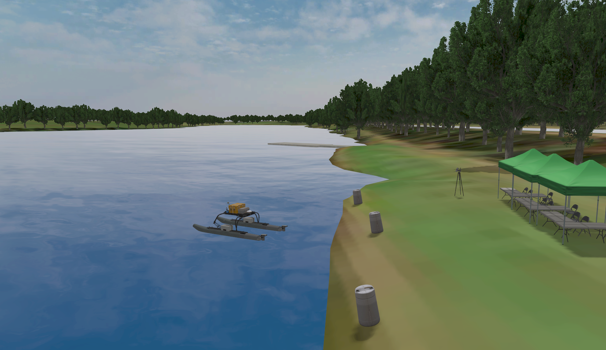

# Virtual RobotX (VRX)
# 虚拟机器人竞赛平台（VRX）

This repository is the home to the source code and software documentation for the VRX simulation environment, which supports simulation of unmanned surface vehicles in marine environments.
> 本仓库是VRX仿真环境的源代码和软件文档中心，支持在海洋环境中对无人水面艇（USV）进行仿真。

* Designed in coordination with RobotX organizers, this project provides arenas and tasks similar to those featured in past and future RobotX competitions, as well as a description of the WAM-V platform.
  > 与RobotX组织者协作设计，本项目提供类似于过去和未来RobotX竞赛中出现的竞技场和任务，以及WAM-V平台的描述。

* For RobotX competitors this simulation environment is intended as a first step toward developing tools prototyping solutions in advance of physical on-water testing.
  > 对于RobotX参赛者，此仿真环境旨在作为开发工具和原型解决方案的第一步，以便在实际水上测试之前进行验证。

* We also welcome users with simulation needs beyond RobotX. As we continue to improve the environment, we hope to offer support to a wide range of potential applications.
  > 我们也欢迎有RobotX之外仿真需求的用户。随着我们不断改进环境，希望能为广泛的应用场景提供支持。

## Now supporting Gazebo Sim and ROS 2 by default
## 现已默认支持 Gazebo Sim 和 ROS 2

We're happy to announce with release 2.0 VRX has transitioned from Gazebo Classic to the newer Gazebo simulator (formerly [Ignition Gazebo](https://www.openrobotics.org/blog/2022/4/6/a-new-era-for-gazebo)).
> 我们很高兴地宣布，从2.0版本开始，VRX已从Gazebo Classic过渡到更新的Gazebo仿真器（前身为Ignition Gazebo）。

* Gazebo Garden and ROS 2 are now default prerequisites for VRX.
  > Gazebo Garden和ROS 2现在是VRX的默认前提条件。

* This is the recommended configuration for new users.
  > 这是推荐新用户使用的配置。

* Users who wish to continue running Gazebo Classic and ROS 1 can still do so using the `gazebo_classic` branch of this repository.
  > 希望继续使用Gazebo Classic和ROS 1的用户仍然可以使用本仓库的`gazebo_classic`分支。

  * Tutorials for VRX Classic will remain available on our Wiki.
    > VRX Classic的教程将继续在我们的Wiki上提供。

  * VRX Classic will transition from an officially supported branch to a community supported branch by Spring 2023.
    > VRX Classic将在2023年春季从官方支持分支过渡到社区支持分支。

## The VRX Competition
## VRX 竞赛

The VRX environment is also the "virtual venue" for the [VRX Competition](https://github.com/osrf/vrx/wiki). Please see our Wiki for tutorials and links to registration and documentation relevant to the virtual competition.
> VRX环境也是[VRX竞赛](https://github.com/osrf/vrx/wiki)的"虚拟赛场"。请参阅我们的Wiki获取教程以及与虚拟竞赛相关的注册和文档链接。




## Getting Started
## 快速入门

 * Watch the [Release 2.3 Highlight Video](https://vimeo.com/851696025).
   > 观看[2.3版本亮点视频](https://vimeo.com/851696025)。

 * The [VRX Wiki](https://github.com/osrf/vrx/wiki) provides documentation and tutorials.
   > [VRX Wiki](https://github.com/osrf/vrx/wiki)提供了文档和教程。

 * The instructions assume a basic familiarity with the ROS environment and Gazebo.  If these tools are new to you, we recommend starting with the excellent [ROS Tutorials](http://wiki.ros.org/ROS/Tutorials)
   > 说明文档假定您对ROS环境和Gazebo有基本了解。如果这些工具对您来说是全新的，我们建议从优秀的[ROS教程](http://wiki.ros.org/ROS/Tutorials)开始学习。

 * For technical problems, please use the [project issue tracker](https://github.com/osrf/vrx/issues) to describe your problem or request support.
   > 如遇到技术问题，请使用[项目问题跟踪器](https://github.com/osrf/vrx/issues)描述您的问题或请求支持。

## Reference
## 参考文献

If you use the VRX simulation in your work, please cite our summary publication, [Toward Maritime Robotic Simulation in Gazebo](https://wiki.nps.edu/display/BB/Publications?preview=/1173263776/1173263778/PID6131719.pdf):
> 如果您在工作中使用了VRX仿真，请引用我们的综述论文：[Toward Maritime Robotic Simulation in Gazebo](https://wiki.nps.edu/display/BB/Publications?preview=/1173263776/1173263778/PID6131719.pdf)：

```
@InProceedings{bingham19toward,
  Title                    = {Toward Maritime Robotic Simulation in Gazebo},
  Author                   = {Brian Bingham and Carlos Aguero and Michael McCarrin and Joseph Klamo and Joshua Malia and Kevin Allen and Tyler Lum and Marshall Rawson and Rumman Waqar},
  Booktitle                = {Proceedings of MTS/IEEE OCEANS Conference},
  Year                     = {2019},
  Address                  = {Seattle, WA},
  Month                    = {October}
}
```

## Contributing
## 贡献指南

This project is under active development to support the VRX and RobotX teams. We are adding and improving things all the time. Our primary focus is to provide the fundamental aspects of the robot and environment, but we rely on the community to develop additional functionality around their particular use cases.
> 本项目正在积极开发中，以支持VRX和RobotX团队。我们一直在添加和改进功能。我们的主要重点是提供机器人和环境的基本方面，但我们依靠社区围绕其特定用例开发额外功能。

If you have any questions about these topics, or would like to work on other aspects, please contribute.  You can contact us directly (see below), submit an [issue](https://github.com/osrf/vrx/issues) or, better yet, submit a [pull request](https://github.com/osrf/vrx/pulls/)!
> 如果您对这些主题有任何疑问，或希望参与其他方面的开发，请贡献您的力量！您可以直接联系我们（见下方），提交[问题](https://github.com/osrf/vrx/issues)，或者更好的是，提交[拉取请求](https://github.com/osrf/vrx/pulls/)！

## Contributors
## 贡献者

We continue to receive important improvements from the community.  We have done our best to document this on our [Contributors Wiki](https://github.com/osrf/vrx/wiki/Contributors).
> 我们持续收到来自社区的重要改进。我们已尽力在[贡献者Wiki](https://github.com/osrf/vrx/wiki/Contributors)上记录这些贡献。

## Contacts
## 联系方式

 * Carlos Agüero <caguero@openrobotics.org>
 * Michael McCarrin <mrmccarr@nps.edu>
 * Brian Bingham <bbingham@nps.edu>
