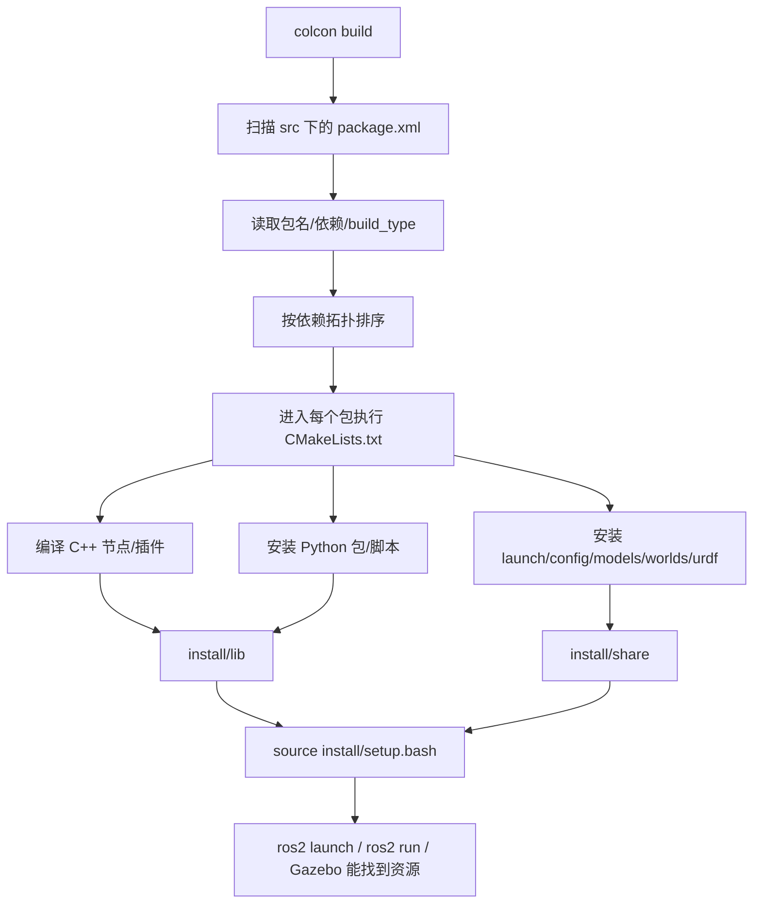

# ROS 2 包、package.xml、CMakeLists.txt 零基础说明（结合 VRX humble）

> 适用项目：`/home/han/Ai_ws/Study/vrx_ws/src/vrx-humble`  
> 你现在最需要建立的概念：**ROS 2 的一个“包 package”不是 Python 的 pip 包，也不只是一个文件夹；它是 colcon/ament/ROS 2 能识别、能编译、能安装、能运行、能被其它包依赖的一组源码和资源。**

---

## 1. 先用一句话理解

在 ROS 2 里，一个包通常至少有两个核心文件：

```text
某个包/
  package.xml      # 告诉 ROS/colcon：我是谁、我依赖谁、我用什么构建系统
  CMakeLists.txt   # 告诉 CMake/ament：怎么编译、怎么安装、哪些文件要放到 install 里
```

你可以这样类比：

| 文件 | 类比 | 作用 |
|---|---|---|
| `package.xml` | 身份证 + 依赖清单 | 说明这个 ROS 包叫什么、版本、作者、许可证、构建/运行/测试依赖 |
| `CMakeLists.txt` | 施工图纸 + 安装说明 | 说明源码怎么编译成可执行文件/库，资源文件装到哪里 |
| `colcon build` | 总包工头 | 扫描所有 package.xml，按依赖顺序调用每个包的 CMakeLists.txt |
| `install/` | 成品安装目录 | 编译好的程序、库、launch、模型、配置都会放这里 |

---

## 2. ROS 2 工作区到底是什么？

你当前工作区是：

```text
/home/han/Ai_ws/Study/vrx_ws
```

典型结构：

```text
vrx_ws/
  src/        # 源码放这里，你改代码主要改这里
  build/      # colcon/CMake 的中间编译目录，一般不手改
  install/    # 编译安装结果，source setup.bash 后 ROS 才能找到包
  log/        # 编译日志
```

你当前的 VRX 源码在：

```text
/home/han/Ai_ws/Study/vrx_ws/src/vrx-humble
```

VRX humble 里面有 5 个 ROS 2 包：

```text
src/vrx-humble/vrx_gz/package.xml
src/vrx-humble/vrx_ros/package.xml
src/vrx-humble/vrx_urdf/vrx_gazebo/package.xml
src/vrx-humble/vrx_urdf/wamv_description/package.xml
src/vrx-humble/vrx_urdf/wamv_gazebo/package.xml
```

`colcon build` 会在 `src/` 下面递归找 `package.xml`，找到这些包，然后按照依赖关系编译。

---

## 3. colcon build 的真实流程

当你执行：

```bash
cd /home/han/Ai_ws/Study/vrx_ws
source /opt/ros/humble/setup.bash
colcon build --symlink-install
```

大致发生这些事：

```text
1. colcon 扫描 src/ 目录
2. 找到所有 package.xml
3. 读取每个 package.xml 的包名和依赖
4. 根据依赖排序：被依赖的先编译
5. 对每个 ament_cmake 包执行 CMake
6. CMake 读取 CMakeLists.txt
7. 编译 C++ 可执行文件/动态库
8. 安装 Python 包、launch、config、models、worlds、urdf 等资源
9. 生成 install/setup.bash
10. 你 source install/setup.bash 后，ROS 2 才能找到这些包
```

可以画成：



---

## 4. package.xml：逐行理解

先看 VRX 的 `vrx_ros/package.xml`，它最简单：

文件：

```text
/home/han/Ai_ws/Study/vrx_ws/src/vrx-humble/vrx_ros/package.xml
```

内容精简后：

```xml
<?xml version="1.0"?>
<package format="2">
  <name>vrx_ros</name>
  <version>0.0.0</version>
  <description>VRX ROS resources</description>

  <maintainer email="caguero@openrobotics.org">Carlos Agüero</maintainer>
  <license>Apache License 2.0</license>

  <author>Ian Chen</author>
  <author>Carlos Agüero</author>

  <buildtool_depend>ament_cmake</buildtool_depend>

  <depend>geometry_msgs</depend>
  <depend>rclcpp</depend>
  <depend>rosgraph_msgs</depend>
  <depend>ros_gz_bridge</depend>
  <depend>ros_gz_interfaces</depend>
  <depend>sensor_msgs</depend>
  <depend>tf2</depend>
  <depend>tf2_ros</depend>

  <test_depend>ament_cmake_gtest</test_depend>

  <export>
    <build_type>ament_cmake</build_type>
  </export>
</package>
```

### 4.1 `<package format="2">`

表示这是 ROS package manifest，format 2 是 ROS 2 常用格式。

你可以理解为：

```text
从这里开始，这个 XML 文件描述一个 ROS 包。
```

### 4.2 `<name>`

```xml
<name>vrx_ros</name>
```

这是包名。这个名字非常重要。

以后你会用：

```bash
ros2 pkg list | grep vrx_ros
ros2 pkg prefix vrx_ros
ros2 run vrx_ros optical_frame_publisher
```

包名必须和 `CMakeLists.txt` 里的：

```cmake
project(vrx_ros)
```

保持一致。

### 4.3 `<version>`

```xml
<version>0.0.0</version>
```

包版本。对本地编译不是最关键，但发布 Debian 包、发布 ROS 包时很重要。

### 4.4 `<description>`

```xml
<description>VRX ROS resources</description>
```

包描述，告诉人这个包干什么。

### 4.5 `<maintainer>`、`<author>`、`<license>`

```xml
<maintainer email="...">Carlos Agüero</maintainer>
<author>Ian Chen</author>
<license>Apache License 2.0</license>
```

说明维护者、作者、许可证。

这些对开源项目很重要。没有 license 的包，很多情况下不能规范发布。

### 4.6 `<buildtool_depend>`

```xml
<buildtool_depend>ament_cmake</buildtool_depend>
```

意思是：这个包用 `ament_cmake` 作为构建工具。

你可以理解为：

```text
我要用 ROS 2 的 CMake 构建系统来编译我。
```

VRX 的 5 个包基本都是 `ament_cmake` 包。

### 4.7 `<depend>`

```xml
<depend>rclcpp</depend>
<depend>sensor_msgs</depend>
<depend>tf2_ros</depend>
```

`<depend>` 是通用依赖，通常表示编译和运行都需要。

以 `vrx_ros` 为例：

| 依赖 | 为什么需要 |
|---|---|
| `rclcpp` | C++ ROS 2 节点库，`optical_frame_publisher.cc`、`pose_tf_broadcaster.cc` 要用 |
| `geometry_msgs` | 位姿、Twist、Transform 等消息 |
| `sensor_msgs` | 图像、CameraInfo、IMU 等传感器消息 |
| `tf2` | 坐标变换数学库 |
| `tf2_ros` | ROS 2 TF 发布/订阅 |
| `rosgraph_msgs` | `/clock` 等图相关消息 |
| `ros_gz_bridge` | ROS 与 Gazebo topic 桥接 |
| `ros_gz_interfaces` | ros_gz 自定义消息接口 |

### 4.8 `<build_depend>`、`<exec_depend>`、`<test_depend>` 区别

VRX 的 `vrx_gz/package.xml` 里有更细分的写法：

```xml
<build_depend>ament_cmake_python</build_depend>
<build_depend>vrx_ros</build_depend>
<build_depend>std_msgs</build_depend>

<exec_depend>ament_index_python</exec_depend>
<exec_depend>launch</exec_depend>
<exec_depend>launch_ros</exec_depend>
<exec_depend>joy</exec_depend>
<exec_depend>joy_teleop</exec_depend>
<exec_depend>ros_gz_sim</exec_depend>
<exec_depend>std_msgs</exec_depend>
<exec_depend>xacro</exec_depend>
<exec_depend>vrx_ros</exec_depend>

<test_depend>ament_cmake_gtest</test_depend>
<test_depend>ament_cmake_flake8</test_depend>
```

区别：

| 标签 | 含义 | 例子 |
|---|---|---|
| `<build_depend>` | 编译这个包时需要 | 编译 C++ 插件时要 `std_msgs`、`vrx_ros` |
| `<exec_depend>` | 运行这个包时需要 | launch 运行时要 `launch_ros`、`ros_gz_sim`、`xacro` |
| `<test_depend>` | 测试时需要 | `ament_cmake_gtest`、flake8 |
| `<depend>` | 简写，表示 build/export/exec 都可能需要 | `rclcpp`、`sensor_msgs` |

一句话：

```text
package.xml 的依赖主要给 colcon、rosdep、ROS 包管理系统看，告诉它“我需要谁”。
```

### 4.9 `<export><build_type>ament_cmake</build_type></export>`

```xml
<export>
  <build_type>ament_cmake</build_type>
</export>
```

告诉 colcon：

```text
这个包是 ament_cmake 包，构建时请按 CMake/ament_cmake 方式处理。
```

如果是纯 Python ROS 2 包，可能是：

```xml
<build_type>ament_python</build_type>
```

但 VRX 这里主要是 `ament_cmake`，即使包里有 Python，也通过 `ament_cmake_python` 安装。

---

## 5. CMakeLists.txt：逐行理解

### 5.1 `vrx_ros/CMakeLists.txt`：最适合入门

文件：

```text
/home/han/Ai_ws/Study/vrx_ws/src/vrx-humble/vrx_ros/CMakeLists.txt
```

内容：

```cmake
cmake_minimum_required(VERSION 3.10.2 FATAL_ERROR)

project(vrx_ros)

find_package(ament_cmake REQUIRED)

find_package(geometry_msgs REQUIRED)
find_package(gz-msgs9 REQUIRED)
find_package(gz-transport12 REQUIRED)
set(GZ_TRANSPORT_VER ${gz-transport12_VERSION_MAJOR})
find_package(rclcpp REQUIRED)
find_package(ros_gz_interfaces REQUIRED)
find_package(rosgraph_msgs REQUIRED)
find_package(sensor_msgs REQUIRED)
find_package(tf2 REQUIRED)
find_package(tf2_msgs REQUIRED)
find_package(tf2_ros REQUIRED)

add_executable(optical_frame_publisher src/optical_frame_publisher.cc)
ament_target_dependencies(optical_frame_publisher
  geometry_msgs
  rclcpp
  tf2
  tf2_ros
  sensor_msgs
)

add_executable(pose_tf_broadcaster src/pose_tf_broadcaster.cc)
ament_target_dependencies(pose_tf_broadcaster
  geometry_msgs
  rclcpp
  tf2
  tf2_ros
  tf2_msgs
)

install(TARGETS
  optical_frame_publisher
  pose_tf_broadcaster
  DESTINATION lib/${PROJECT_NAME})
install(DIRECTORY
  launch
  DESTINATION share/${PROJECT_NAME})

ament_package()
```

### 5.2 `cmake_minimum_required`

```cmake
cmake_minimum_required(VERSION 3.10.2 FATAL_ERROR)
```

意思：

```text
最低需要 CMake 3.10.2；如果版本不够，直接报错。
```

### 5.3 `project(vrx_ros)`

```cmake
project(vrx_ros)
```

定义 CMake 项目名。ROS 2 包里通常和 `package.xml` 的 `<name>` 一致。

`${PROJECT_NAME}` 在这里就等于 `vrx_ros`。

所以：

```cmake
DESTINATION lib/${PROJECT_NAME}
```

等价于：

```cmake
DESTINATION lib/vrx_ros
```

### 5.4 `find_package(...)`

```cmake
find_package(ament_cmake REQUIRED)
find_package(rclcpp REQUIRED)
find_package(sensor_msgs REQUIRED)
find_package(tf2_ros REQUIRED)
```

意思：

```text
在系统/ROS 环境里找到这些包的 CMake 配置，否则报错。
```

`package.xml` 里写依赖，只是声明“我需要它”。

`CMakeLists.txt` 里 `find_package`，才是真正编译时去找它。

两者区别：

| 位置 | 作用 |
|---|---|
| `package.xml` | 给 colcon/rosdep/包管理器看依赖关系 |
| `CMakeLists.txt find_package` | 给 CMake 编译器看，真的把依赖找出来用于编译/链接 |

初学者最容易漏掉这个：

> 只在 `package.xml` 加依赖，不在 `CMakeLists.txt` 里 `find_package`，C++ 可能编不过。  
> 只在 `CMakeLists.txt` 里 `find_package`，不在 `package.xml` 里声明，colcon/rosdep/发布时依赖关系不完整。

### 5.5 `add_executable`

```cmake
add_executable(optical_frame_publisher src/optical_frame_publisher.cc)
```

意思：

```text
把 src/optical_frame_publisher.cc 编译成一个可执行程序，名字叫 optical_frame_publisher。
```

编译安装后你可以运行：

```bash
ros2 run vrx_ros optical_frame_publisher
```

第二个：

```cmake
add_executable(pose_tf_broadcaster src/pose_tf_broadcaster.cc)
```

会生成：

```bash
ros2 run vrx_ros pose_tf_broadcaster
```

### 5.6 `ament_target_dependencies`

```cmake
ament_target_dependencies(optical_frame_publisher
  geometry_msgs
  rclcpp
  tf2
  tf2_ros
  sensor_msgs
)
```

意思：

```text
optical_frame_publisher 这个可执行程序编译/链接时需要这些 ROS 2 依赖。
```

如果 C++ 文件里写了：

```cpp
#include <rclcpp/rclcpp.hpp>
#include <sensor_msgs/msg/image.hpp>
```

那 CMake 就必须知道 `rclcpp` 和 `sensor_msgs` 在哪里。

`ament_target_dependencies` 就是把 include 路径、库链接等都给你处理好。

### 5.7 `install(TARGETS ...)`

```cmake
install(TARGETS
  optical_frame_publisher
  pose_tf_broadcaster
  DESTINATION lib/${PROJECT_NAME})
```

意思：

```text
把编译出来的两个可执行程序安装到 install/lib/vrx_ros/ 下面。
```

所以最终大概会有：

```text
/home/han/Ai_ws/Study/vrx_ws/install/vrx_ros/lib/vrx_ros/optical_frame_publisher
/home/han/Ai_ws/Study/vrx_ws/install/vrx_ros/lib/vrx_ros/pose_tf_broadcaster
```

或者在某些布局下类似：

```text
/home/han/Ai_ws/Study/vrx_ws/install/lib/vrx_ros/optical_frame_publisher
```

ROS 2 的 `ros2 run` 就是通过安装索引找到这些程序。

### 5.8 `install(DIRECTORY ...)`

```cmake
install(DIRECTORY
  launch
  DESTINATION share/${PROJECT_NAME})
```

意思：

```text
把当前包里的 launch/ 目录复制/安装到 install/share/vrx_ros/launch。
```

这样 launch 文件才能被找到。

比如：

```bash
ros2 pkg prefix vrx_ros
```

然后可以在安装目录里看到 `share/vrx_ros/launch`。

### 5.9 `ament_package()`

```cmake
ament_package()
```

这是 ament_cmake 包的收尾语句，非常重要。

它会生成 ROS 2 包索引信息，让这个包被：

```bash
ros2 pkg list
ros2 pkg prefix vrx_ros
ros2 run vrx_ros ...
ros2 launch vrx_ros ...
```

识别。

初学者记住：

```text
ament_cmake 包的 CMakeLists.txt 最后基本都要有 ament_package()。
```

---

## 6. VRX 里的五个包分别怎么用 package.xml 和 CMakeLists.txt？

### 6.1 `vrx_ros`：C++ ROS 2 节点包

路径：

```text
/home/han/Ai_ws/Study/vrx_ws/src/vrx-humble/vrx_ros
```

它编译两个 C++ 节点：

```text
src/optical_frame_publisher.cc
src/pose_tf_broadcaster.cc
```

CMake 里对应：

```cmake
add_executable(optical_frame_publisher src/optical_frame_publisher.cc)
add_executable(pose_tf_broadcaster src/pose_tf_broadcaster.cc)
```

安装到：

```cmake
DESTINATION lib/${PROJECT_NAME}
```

所以它是一个典型的：

```text
C++ ROS 2 节点包
```

你以后自己写 C++ 节点，基本就是模仿它。

---

### 6.2 `vrx_gz`：Gazebo 插件 + Python launch helper + 世界/模型资源包

路径：

```text
/home/han/Ai_ws/Study/vrx_ws/src/vrx-humble/vrx_gz
```

这是 VRX 最核心的包。

它包含：

```text
C++ Gazebo 插件：vrx_gz/src/*.cc/*.hh
Python 工具：vrx_gz/src/vrx_gz/*.py
Launch 文件：vrx_gz/launch/*.py
World 文件：vrx_gz/worlds/*.sdf
Gazebo 模型：vrx_gz/models/*
配置：vrx_gz/config/*.yaml
```

#### 6.2.1 它找 Gazebo 依赖

CMake 里：

```cmake
find_package(gz-sim7 REQUIRED)
find_package(gz-common5 REQUIRED COMPONENTS graphics)
find_package(gz-math7 REQUIRED)
find_package(gz-msgs9 REQUIRED)
find_package(gz-transport12 REQUIRED)
find_package(gz-plugin2 REQUIRED COMPONENTS loader register)
find_package(gz-rendering7 REQUIRED)
find_package(gz-sensors7 REQUIRED)
find_package(gz-utils2 REQUIRED)
find_package(sdformat13 REQUIRED)
find_package(Eigen3 REQUIRED)
```

这说明 `vrx_gz` 不是普通 ROS 节点包，它大量依赖 Gazebo Sim。

#### 6.2.2 它编译 Gazebo 动态库插件

例如：

```cmake
add_library(Waves SHARED
  src/Wavefield.cc
)
```

意思是把 `Wavefield.cc` 编译成共享库：

```text
libWaves.so
```

又如：

```cmake
add_library(ScoringPlugin SHARED
  src/ScoringPlugin.cc
)
```

会生成：

```text
libScoringPlugin.so
```

Gazebo 插件一般是 `.so` 动态库，不是你直接 `ros2 run` 的程序。

它们通常由 SDF 文件中的 `<plugin>` 标签加载。

#### 6.2.3 `SHARED` 是什么意思？

```cmake
add_library(Waves SHARED src/Wavefield.cc)
```

`SHARED` 表示动态库，也就是 Linux 上的 `.so` 文件。

Gazebo 运行时会动态加载这些 `.so` 插件。

#### 6.2.4 `target_link_libraries`

```cmake
target_link_libraries(Waves PUBLIC
  gz-common${GZ_COMMON_VER}::gz-common${GZ_COMMON_VER}
  gz-sim${GZ_SIM_VER}::core
  gz-math${GZ_MATH_VER}
  Eigen3::Eigen
)
```

意思：

```text
Waves 这个库链接 Gazebo common、Gazebo sim core、Gazebo math、Eigen。
```

如果不链接，编译可能能过，但链接阶段会找不到符号。

简单理解：

```text
#include 解决“头文件在哪”
link_libraries 解决“函数实现在哪”
```

#### 6.2.5 批量创建插件

CMake 里有：

```cmake
list(APPEND VRX_GZ_PLUGINS
  AcousticPingerPlugin
  BallShooterPlugin
  LightBuoyPlugin
  NavigationScoringPlugin
  GymkhanaScoringPlugin
  PerceptionScoringPlugin
  PlacardPlugin
  PublisherPlugin
  ScanDockScoringPlugin
  SimpleHydrodynamics
  Surface
  USVWind
  WaveVisual
  WildlifeScoringPlugin
)

foreach(PLUGIN ${VRX_GZ_PLUGINS})
  add_library(${PLUGIN} SHARED src/${PLUGIN}.cc)
  target_link_libraries(${PLUGIN} PUBLIC
    gz-sim${GZ_SIM_VER}::core
    gz-plugin${GZ_PLUGIN_VER}::gz-plugin${GZ_PLUGIN_VER}
    gz-rendering${GZ_RENDERING_VER}::gz-rendering${GZ_RENDERING_VER}
    gz-sensors${GZ_SENSORS_VER}::gz-sensors${GZ_SENSORS_VER}
    gz-utils${GZ_UTILS_VER}::gz-utils${GZ_UTILS_VER}
    ScoringPlugin
    Waves
    Eigen3::Eigen
  )
endforeach()
```

这段很重要。

它的意思是：

```text
对 VRX_GZ_PLUGINS 列表里的每个插件名，自动执行：
add_library(插件名 SHARED src/插件名.cc)
并链接同一批 Gazebo/VRX 依赖。
```

等价于手写很多遍：

```cmake
add_library(AcousticPingerPlugin SHARED src/AcousticPingerPlugin.cc)
add_library(BallShooterPlugin SHARED src/BallShooterPlugin.cc)
add_library(LightBuoyPlugin SHARED src/LightBuoyPlugin.cc)
...
```

只是用 `foreach` 更简洁。

#### 6.2.6 安装插件

```cmake
install(
  TARGETS ${VRX_GZ_PLUGINS}
  DESTINATION lib)
```

意思：

```text
把这些插件库安装到 install/lib。
```

Gazebo 通过库路径找到它们。

#### 6.2.7 安装 Python 包

```cmake
ament_python_install_package(
  vrx_gz
  PACKAGE_DIR src/vrx_gz
)
```

意思：

```text
把 src/vrx_gz 这个 Python 包安装成 ROS 2 可 import 的 Python 模块。
```

所以 launch 文件里可以写：

```python
import vrx_gz.launch
from vrx_gz.model import Model
```

如果没有这句，安装后 Python 可能找不到 `vrx_gz` 模块。

#### 6.2.8 安装资源

```cmake
install(DIRECTORY
  config
  launch
  models
  worlds
  DESTINATION share/${PROJECT_NAME})
```

意思是把：

```text
config/
launch/
models/
worlds/
```

安装到：

```text
install/share/vrx_gz/
```

所以 `ros2 launch vrx_gz ...` 能找到 launch 文件，Gazebo 能找到 models/worlds。

---

### 6.3 `vrx_gazebo`：WAM-V 生成工具和配置资源包

路径：

```text
/home/han/Ai_ws/Study/vrx_ws/src/vrx-humble/vrx_urdf/vrx_gazebo
```

这个包名字虽然带 `gazebo`，但在 humble 版本里主要是：

```text
WAM-V 配置生成器 + compliance 检查 + 模型/launch/config 资源
```

CMake：

```cmake
install(DIRECTORY models/
  DESTINATION share/${PROJECT_NAME}/models)

install(DIRECTORY launch/
  DESTINATION share/${PROJECT_NAME}/launch)

install(DIRECTORY config/
  DESTINATION share/${PROJECT_NAME}/config)

install(PROGRAMS scripts/generate_wamv.py
  DESTINATION lib/${PROJECT_NAME})

ament_python_install_package(
  vrx_gazebo
  PACKAGE_DIR src/vrx_gazebo
)
```

这里没有 `add_executable`，说明它不编译 C++ 程序。

它做的是：

| CMake 语句 | 结果 |
|---|---|
| `install(DIRECTORY models/)` | 安装模型资源 |
| `install(DIRECTORY launch/)` | 安装 launch 文件 |
| `install(DIRECTORY config/)` | 安装配置文件 |
| `install(PROGRAMS scripts/generate_wamv.py ...)` | 安装 Python 可执行脚本 |
| `ament_python_install_package(vrx_gazebo ...)` | 安装 Python 模块 |

你运行：

```bash
ros2 launch vrx_gazebo generate_wamv.launch.py ...
```

背后就依赖这个包安装的 launch、script、Python 模块。

---

### 6.4 `wamv_description`：WAM-V 基础模型包

路径：

```text
/home/han/Ai_ws/Study/vrx_ws/src/vrx-humble/vrx_urdf/wamv_description
```

CMake：

```cmake
find_package(xacro REQUIRED)

ament_environment_hooks("hooks/resource_paths.dsv.in")
ament_environment_hooks("hooks/resource_paths.sh")

xacro_add_files(
  urdf/wamv_base.urdf.xacro
    INSTALL DESTINATION urdf
)

install(DIRECTORY models/
  DESTINATION share/${PROJECT_NAME}/models)

install(DIRECTORY urdf/
  DESTINATION share/${PROJECT_NAME}/urdf)
```

它主要安装：

```text
WAM-V 基础 URDF/Xacro
WAM-V mesh 模型
环境 hook
```

`xacro_add_files` 是 xacro 包提供的 CMake 函数，用来处理/安装 xacro 文件。

---

### 6.5 `wamv_gazebo`：WAM-V Gazebo 传感器/动力学模板包

路径：

```text
/home/han/Ai_ws/Study/vrx_ws/src/vrx-humble/vrx_urdf/wamv_gazebo
```

CMake：

```cmake
find_package(xacro REQUIRED)
find_package(wamv_description REQUIRED)

install(DIRECTORY models/
  DESTINATION share/${PROJECT_NAME}/models)

install(DIRECTORY urdf/
  DESTINATION share/${PROJECT_NAME}/urdf)
```

它主要提供：

```text
传感器组件 xacro
动力学插件 xacro
推进器布局 xacro
GPS 模型等资源
```

它依赖：

```xml
<depend>wamv_description</depend>
<depend>xacro</depend>
```

因为它要在基础 WAM-V 船体上加 Gazebo 相关的传感器、动力学、推进器配置。

---

## 7. 环境 hook 是什么？

你在几个包里会看到：

```cmake
ament_environment_hooks("hooks/resource_paths.dsv.in")
ament_environment_hooks("hooks/resource_paths.sh")
```

这是什么意思？

ROS 2 包安装后，你执行：

```bash
source install/setup.bash
```

这时不只是设置 `ROS_PACKAGE_PATH`，还会执行各个包注册的环境 hook。

VRX 的 hook 主要用于设置 Gazebo 资源路径，例如让 Gazebo 找到：

```text
models/
worlds/
urdf/
meshes/
```

你可以检查：

```bash
echo $GZ_SIM_RESOURCE_PATH
```

如果没有 source `install/setup.bash`，Gazebo 很可能找不到 VRX 模型，出现类似：

```text
Unable to find uri model://...
```

所以 hook 的核心作用：

```text
把本包安装后的模型/世界/资源路径加入 Gazebo 搜索路径。
```

---

## 8. `install` 到底安装到了哪里？

以 `vrx_gz` 为例：

```cmake
install(DIRECTORY
  config
  launch
  models
  worlds
  DESTINATION share/${PROJECT_NAME})
```

因为 `${PROJECT_NAME}` 是 `vrx_gz`，所以安装后类似：

```text
install/share/vrx_gz/config
install/share/vrx_gz/launch
install/share/vrx_gz/models
install/share/vrx_gz/worlds
```

以 `vrx_ros` 为例：

```cmake
install(TARGETS
  optical_frame_publisher
  pose_tf_broadcaster
  DESTINATION lib/${PROJECT_NAME})
```

安装后类似：

```text
install/lib/vrx_ros/optical_frame_publisher
install/lib/vrx_ros/pose_tf_broadcaster
```

你可以自己验证：

```bash
cd /home/han/Ai_ws/Study/vrx_ws
find install -path '*vrx_gz*' | head -50
find install -path '*vrx_ros*' | head -50
find install -name 'optical_frame_publisher' -o -name 'pose_tf_broadcaster'
```

---

## 9. `package.xml` 和 `CMakeLists.txt` 为什么要同时写依赖？

这点非常关键。

假设你写了一个 C++ 节点，用到了 `rclcpp` 和 `sensor_msgs`。

### 9.1 package.xml 要写

```xml
<depend>rclcpp</depend>
<depend>sensor_msgs</depend>
```

这是告诉 ROS/colcon/rosdep：

```text
我的包依赖 rclcpp 和 sensor_msgs。
```

### 9.2 CMakeLists.txt 也要写

```cmake
find_package(rclcpp REQUIRED)
find_package(sensor_msgs REQUIRED)

add_executable(my_node src/my_node.cpp)
ament_target_dependencies(my_node rclcpp sensor_msgs)
```

这是告诉 CMake：

```text
编译 my_node 时，请把 rclcpp 和 sensor_msgs 的头文件/库链接进来。
```

### 9.3 二者关系

| 文件 | 问题 |
|---|---|
| `package.xml` | “这个包依赖谁？” |
| `CMakeLists.txt` | “具体怎么把依赖用于编译/链接/安装？” |

所以它们不是重复，而是服务于不同层次。

---

## 10. 如果我要新增一个 C++ ROS 2 节点，该改什么？

假设你在 `vrx_ros` 包里新增：

```text
/home/han/Ai_ws/Study/vrx_ws/src/vrx-humble/vrx_ros/src/my_debug_node.cc
```

### 10.1 如果用了新依赖，先改 package.xml

比如用了 `std_msgs`，则加：

```xml
<depend>std_msgs</depend>
```

### 10.2 改 CMakeLists.txt

加入：

```cmake
find_package(std_msgs REQUIRED)

add_executable(my_debug_node src/my_debug_node.cc)
ament_target_dependencies(my_debug_node
  rclcpp
  std_msgs
)
```

还要把它加入 install：

```cmake
install(TARGETS
  optical_frame_publisher
  pose_tf_broadcaster
  my_debug_node
  DESTINATION lib/${PROJECT_NAME})
```

### 10.3 编译运行

```bash
cd /home/han/Ai_ws/Study/vrx_ws
colcon build --symlink-install --packages-select vrx_ros
source install/setup.bash
ros2 run vrx_ros my_debug_node
```

---

## 11. 如果我要新增一个 Gazebo 插件，该改什么？

假设你在 `vrx_gz/src` 下新增：

```text
MyPlugin.cc
MyPlugin.hh
```

### 11.1 改 CMakeLists.txt

如果它和其它插件依赖一样，可以加到列表：

```cmake
list(APPEND VRX_GZ_PLUGINS
  AcousticPingerPlugin
  ...
  MyPlugin
)
```

因为已有：

```cmake
foreach(PLUGIN ${VRX_GZ_PLUGINS})
  add_library(${PLUGIN} SHARED src/${PLUGIN}.cc)
  target_link_libraries(${PLUGIN} PUBLIC ...)
endforeach()
```

CMake 会自动编译：

```text
src/MyPlugin.cc -> libMyPlugin.so
```

### 11.2 安装

已有：

```cmake
install(
  TARGETS ${VRX_GZ_PLUGINS}
  DESTINATION lib)
```

只要你加入列表，就会一起安装。

### 11.3 在 SDF 里加载

某个 world/model 的 SDF 里要写 `<plugin>`，示意：

```xml
<plugin
  filename="MyPlugin"
  name="vrx::MyPlugin">
</plugin>
```

实际 `filename` 和 `name` 要根据插件注册宏写法确定。你需要参考 VRX 现有插件的 SDF 使用方式。

### 11.4 编译

```bash
cd /home/han/Ai_ws/Study/vrx_ws
colcon build --symlink-install --packages-select vrx_gz
source install/setup.bash
```

---

## 12. 如果我要新增 Python 工具，该改什么？

在 `vrx_gazebo` 这类包里，如果你新增 Python module：

```text
src/vrx_gazebo/my_tool.py
```

只要已有：

```cmake
ament_python_install_package(
  vrx_gazebo
  PACKAGE_DIR src/vrx_gazebo
)
```

它通常会跟着 Python 包安装。

如果你新增的是可执行脚本：

```text
scripts/my_script.py
```

要加：

```cmake
install(PROGRAMS scripts/my_script.py
  DESTINATION lib/${PROJECT_NAME})
```

并确保脚本有执行权限：

```bash
chmod +x scripts/my_script.py
```

---

## 13. 如果我要新增 launch/config/models/worlds 资源，该改什么？

如果 CMake 里已经有：

```cmake
install(DIRECTORY
  config
  launch
  models
  worlds
  DESTINATION share/${PROJECT_NAME})
```

那么你新增这些目录下的文件，一般不需要改 CMake：

```text
vrx_gz/launch/new.launch.py
vrx_gz/config/new.yaml
vrx_gz/models/new_model/...
vrx_gz/worlds/new_world.sdf
```

重新 build/source 后就能安装到：

```text
install/share/vrx_gz/...
```

但如果你新增了一个从来没被 install 的目录，比如：

```text
vrx_gz/maps/
```

你就要改：

```cmake
install(DIRECTORY
  config
  launch
  models
  worlds
  maps
  DESTINATION share/${PROJECT_NAME})
```

---

## 14. VRX 中各种 CMake 命令速查表

| 命令 | 含义 | VRX 例子 |
|---|---|---|
| `cmake_minimum_required` | 指定最低 CMake 版本 | 所有包都有 |
| `project(...)` | 定义项目/包名 | `project(vrx_gz)` |
| `find_package(...)` | 找依赖包 | `find_package(rclcpp REQUIRED)` |
| `set(...)` | 设置变量 | `set(GZ_SIM_VER ${gz-sim7_VERSION_MAJOR})` |
| `add_executable(...)` | 编译可执行程序 | `optical_frame_publisher` |
| `add_library(... SHARED ...)` | 编译动态库 `.so` | Gazebo 插件 |
| `target_link_libraries(...)` | 链接外部库 | Gazebo/Eigen/ScoringPlugin |
| `ament_target_dependencies(...)` | 给 ROS 2 target 加依赖 | `rclcpp sensor_msgs tf2_ros` |
| `install(TARGETS ...)` | 安装可执行程序/库 | 安装节点和插件 |
| `install(DIRECTORY ...)` | 安装目录资源 | launch/config/models/worlds |
| `install(PROGRAMS ...)` | 安装脚本 | `generate_wamv.py` |
| `ament_python_install_package(...)` | 安装 Python 模块 | `vrx_gz`、`vrx_gazebo` |
| `ament_environment_hooks(...)` | 注册环境变量 hook | Gazebo 资源路径 |
| `xacro_add_files(...)` | 处理/安装 xacro | `wamv_description` |
| `foreach(...) endforeach()` | 循环生成多个 target | 批量 Gazebo 插件 |
| `ament_package()` | 生成 ROS 2 包索引，收尾 | 所有 ament_cmake 包 |

---

## 15. package.xml 标签速查表

| 标签 | 含义 | VRX 例子 |
|---|---|---|
| `<name>` | 包名 | `vrx_gz` |
| `<version>` | 版本 | `1.3.0`、`0.0.0` |
| `<description>` | 描述 | `VRX gazebo resources` |
| `<maintainer>` | 维护者 | Carlos Agüero |
| `<author>` | 作者 | Ian Chen |
| `<license>` | 许可证 | Apache 2.0 |
| `<url>` | 相关链接 | wiki/issue tracker |
| `<buildtool_depend>` | 构建工具依赖 | `ament_cmake` |
| `<build_depend>` | 编译时依赖 | `ament_cmake_python` |
| `<exec_depend>` | 运行时依赖 | `launch_ros`、`ros_gz_sim` |
| `<test_depend>` | 测试依赖 | `ament_cmake_gtest` |
| `<depend>` | 通用依赖 | `rclcpp`、`xacro` |
| `<replace>` | 替代旧包声明 | `vmrc_gazebo` |
| `<export>` | 导出元信息 | build type |
| `<build_type>` | 构建类型 | `ament_cmake` |

---

## 16. 用命令观察一个包

### 16.1 查看包是否被 ROS 发现

```bash
source /home/han/Ai_ws/Study/vrx_ws/install/setup.bash
ros2 pkg list | grep vrx_gz
```

### 16.2 查看包安装前缀

```bash
ros2 pkg prefix vrx_gz
ros2 pkg prefix vrx_ros
```

### 16.3 查看包的 package.xml

```bash
ros2 pkg xml vrx_ros
```

### 16.4 查看可执行程序

```bash
ros2 pkg executables vrx_ros
```

你应该能看到类似：

```text
vrx_ros optical_frame_publisher
vrx_ros pose_tf_broadcaster
```

### 16.5 找安装结果

```bash
find /home/han/Ai_ws/Study/vrx_ws/install -name 'optical_frame_publisher'
find /home/han/Ai_ws/Study/vrx_ws/install -name 'libStationkeepingScoringPlugin.so'
find /home/han/Ai_ws/Study/vrx_ws/install -path '*vrx_gz/worlds*' | head
```

---

## 17. 你读 VRX 包时应该怎么读？

对每个包按这个顺序：

```text
1. 先看 package.xml 的 <name>
2. 看 <description> 知道它大概干什么
3. 看 depend/build_depend/exec_depend 知道它依赖谁
4. 看 <build_type> 知道它怎么构建
5. 再看 CMakeLists.txt
6. 找 add_executable：有哪些 ROS 2 节点？
7. 找 add_library：有哪些库/插件？
8. 找 install：哪些东西会被安装？
9. 找 ament_python_install_package：有没有 Python 模块？
10. 找 ament_environment_hooks：有没有环境变量影响？
```

---

## 18. VRX 五个包一眼看懂版

| 包 | package.xml 说明 | CMakeLists.txt 做什么 | 运行时怎么体现 |
|---|---|---|---|
| `vrx_ros` | 依赖 `rclcpp`、`tf2_ros`、`sensor_msgs` 等 | 编译两个 C++ ROS 节点并安装 launch | `ros2 run vrx_ros ...`、TF/相机 frame |
| `vrx_gz` | 依赖 Gazebo、launch、ros_gz_sim、xacro 等 | 编译大量 Gazebo 插件，安装 Python helper、launch、models、worlds、config | `ros2 launch vrx_gz competition.launch.py ...`、Gazebo 加载插件 |
| `vrx_gazebo` | WAM-V 配置生成相关 | 安装 config、models、launch、generate_wamv.py、Python 模块 | `ros2 launch vrx_gazebo generate_wamv.launch.py ...` |
| `wamv_description` | WAM-V 基础模型 | 安装基础 URDF/Xacro、models、hook | 其它包能找到 WAM-V base |
| `wamv_gazebo` | WAM-V Gazebo 模板 | 安装传感器/动力学/推进器 xacro、models | 生成带传感器/推进器/动力学的 WAM-V |

---

## 19. 重要误区

### 误区 1：有 package.xml 就能运行

错。

`package.xml` 只是声明包。没有正确的 `CMakeLists.txt` 安装，launch、可执行文件、模型可能找不到。

### 误区 2：CMakeLists.txt 只是 C++ 项目用的

错。

VRX 里很多包即使主要是资源/Python，也用 CMakeLists.txt 来安装：

```cmake
install(DIRECTORY launch/ ...)
install(DIRECTORY urdf/ ...)
ament_python_install_package(...)
```

### 误区 3：改了 src 文件不用重新 build

不一定。

- 如果是 `--symlink-install` 下的 Python/launch/config，有时 source 后即可；
- 如果是 C++ `.cc/.hh`，必须重新 `colcon build`；
- 如果改了 install 规则，也要重新 build；
- 如果新增文件没被 install 规则覆盖，也要改 CMakeLists.txt。

### 误区 4：`find_package` 和 `package.xml` 写一个就够

错。

规范 ROS 2 包通常两个都要写。

### 误区 5：Gazebo 插件可以 `ros2 run`

一般不行。

Gazebo 插件是 `.so` 动态库，由 Gazebo/SDF 加载，不是普通 ROS 2 可执行程序。

---

## 20. 给你的练习：真正建立概念

### 练习 1：验证安装位置

```bash
cd /home/han/Ai_ws/Study/vrx_ws
source install/setup.bash
ros2 pkg prefix vrx_gz
ros2 pkg prefix vrx_ros
find install -name 'libStationkeepingScoringPlugin.so'
find install -name 'pose_tf_broadcaster'
```

你要回答：

```text
C++ ROS 节点安装在哪里？
Gazebo 插件安装在哪里？
world 文件安装在哪里？
```

### 练习 2：读 `vrx_ros`

打开：

```text
/home/han/Ai_ws/Study/vrx_ws/src/vrx-humble/vrx_ros/package.xml
/home/han/Ai_ws/Study/vrx_ws/src/vrx-humble/vrx_ros/CMakeLists.txt
```

写出：

```text
这个包叫什么？
它编译了几个可执行程序？
每个程序依赖哪些 ROS 包？
它安装了哪个目录？
```

### 练习 3：读 `vrx_gz`

打开：

```text
/home/han/Ai_ws/Study/vrx_ws/src/vrx-humble/vrx_gz/package.xml
/home/han/Ai_ws/Study/vrx_ws/src/vrx-humble/vrx_gz/CMakeLists.txt
```

写出：

```text
它依赖哪些 Gazebo 库？
它编译了哪些插件？
哪些资源被安装到 share/vrx_gz？
Python 包为什么能被 import？
```

### 练习 4：新增一个 launch 文件

在：

```text
/home/han/Ai_ws/Study/vrx_ws/src/vrx-humble/vrx_gz/launch
```

新增一个简单 launch 文件。因为 CMake 已经安装整个 `launch` 目录，所以你不需要额外改 CMakeLists.txt。然后：

```bash
colcon build --symlink-install --packages-select vrx_gz
source install/setup.bash
ros2 launch vrx_gz 你的launch文件.py
```

### 练习 5：新增一个 C++ 节点

模仿 `vrx_ros` 添加 `my_debug_node.cc`，并改：

```text
package.xml
CMakeLists.txt
```

然后：

```bash
colcon build --symlink-install --packages-select vrx_ros
source install/setup.bash
ros2 pkg executables vrx_ros
ros2 run vrx_ros my_debug_node
```

---

## 21. 最后用一句话总结

在 VRX/ROS 2 中：

```text
package.xml 决定“这个包是谁、依赖谁、用什么构建”。
CMakeLists.txt 决定“这个包怎么被编译、怎么被安装、最终 ROS/Gazebo 能找到什么”。
colcon build 负责读取它们，并把源码变成 install 目录里的可运行系统。
source install/setup.bash 负责把这个系统注册进你的当前终端环境。
```

你只要牢牢记住这四层：

```text
源码 src/  ->  package.xml/CMakeLists.txt  ->  colcon build  ->  install/setup.bash
```

后面看 VRX 的 launch、插件、WAM-V 配置就会清楚很多。
