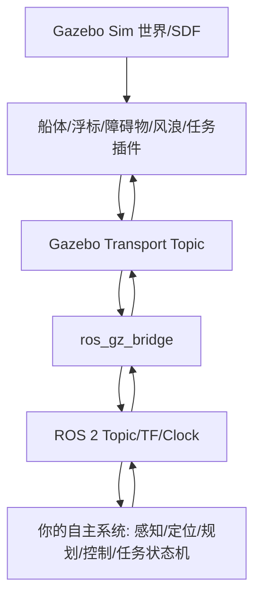

# VRX（osrf/vrx humble 分支）完全参悟学习路线与逐步实践手册

> 适用对象：你当前工作区中的 VRX Humble/Gazebo Garden 版本。  
> 当前本地路径：`/home/han/Ai_ws/Study/vrx_ws`  
> 源码路径：`/home/han/Ai_ws/Study/vrx_ws/src/vrx-humble`  
> 生成日期：2026-07-09  
> 官方仓库：<https://github.com/osrf/vrx/tree/humble>  
> 官方 Wiki：<https://github.com/osrf/vrx/wiki>

---

## 0. 先给结论：完全参悟透彻大约需要多久？

“完全参悟透彻”不要理解成“能运行一下仿真”，而应理解为你能做到：

1. 独立安装、编译、运行 VRX；
2. 能解释每个 ROS 2 包、每个 launch、每类 world、每个核心 Gazebo 插件的作用；
3. 能自定义 WAM-V 船体传感器、推进器、水动力、风浪环境；
4. 能写自己的自主航行控制、路径跟踪、感知、避障、任务执行节点；
5. 能读懂并修改 scoring plugin、bridge、xacro、SDF/URDF；
6. 能定位常见问题：Gazebo 插件加载失败、ROS-Gazebo 桥接失败、TF 错误、传感器 topic 缺失、仿真慢、模型资源找不到；
7. 能向上游提交合理 PR 或基于 VRX 做研究/比赛方案。

### 时间估算

| 你的基础 | 到“能用” | 到“熟练” | 到“彻底吃透/可改源码/可比赛/可研究” |
|---|---:|---:|---:|
| 已熟悉 ROS 2、Gazebo Sim、C++、Python、机器人控制 | 3-7 天 | 3-5 周 | 8-12 周，约 180-300 小时 |
| 会 ROS 2 基础，不熟 Gazebo 插件/船舶动力学 | 1-2 周 | 6-8 周 | 12-18 周，约 300-500 小时 |
| 只会 Python/C++，机器人基础薄弱 | 3-5 周 | 10-16 周 | 5-8 个月，约 600-900 小时 |
| 零 ROS/Gazebo 基础 | 1-2 个月 | 4-6 个月 | 8-12 个月以上 |

**建议目标**：如果你每天投入 3-4 小时，建议按 **16 周主线计划** 执行；如果每天 6-8 小时，可以压缩到 8-10 周。

---

## 1. 版本与资料边界：先避免走错路

VRX 已经历多个技术栈阶段：

- 旧版 VRX Classic：ROS 1 + Gazebo Classic，主要在 `gazebo_classic` 分支；
- 你指定的 `humble` 分支：ROS 2 Humble + Gazebo Garden/gz-sim7；
- 当前 Wiki 首页可能会提到新版本默认使用 ROS 2 Jazzy + Gazebo Harmonic，这是主线/新版方向。

**本手册以 `humble` 分支为准**。如果 Wiki 的某些页面出现 Jazzy/Harmonic 命令，而你操作的是本工作区，则优先采用：

```bash
source /opt/ros/humble/setup.bash
source /home/han/Ai_ws/Study/vrx_ws/install/setup.bash
```

以及 Humble 相关包：

```bash
sudo apt install \
  python3-sdformat13 \
  ros-humble-xacro \
  ros-humble-ros-gz-interfaces \
  ros-humble-ros-gz-sim \
  ros-humble-ros-gz-bridge \
  ros-humble-joy \
  ros-humble-joy-teleop
```

本地检查结果显示，你当前工作区已 source 后可见以下 VRX 包：

```text
vrx_gazebo
vrx_gz
vrx_ros
wamv_description
wamv_gazebo
```

本地 ROS 发行版为：

```text
ROS_DISTRO=humble
```

---

## 2. 项目总体认知

VRX = Virtual RobotX，是无人水面艇 USV 的仿真环境，主要服务于 RobotX/VRX 比赛与海事机器人研究。它提供：

- 海洋/湖面环境；
- WAM-V 船体模型；
- 传感器模型；
- 推进器/水动力/风浪模型；
- 竞赛任务世界；
- 评分插件；
- ROS 2 与 Gazebo Sim 的桥接；
- 自定义船体配置工具。

### 2.1 你必须建立的三层模型



你学习时不要只看 ROS 2，也不要只看 Gazebo；VRX 的核心正在 **Gazebo 物理与插件 + ROS 2 桥接 + 机器人算法** 的交界处。

---

## 3. 本地项目结构精读地图

当前源码统计：

| 项 | 数量/内容 |
|---|---:|
| package.xml 包 | 5 个 |
| 源码文件总量 | 约 327 个 |
| C++ `.cc/.hh/.h` | 约 50 个 |
| Python `.py` | 约 20 个 |
| SDF/URDF/Xacro | 约 94 个 |
| world 文件 | 常规任务世界 + 2023 practice 世界 |

### 3.1 五个 ROS 2 包

| 包名 | 路径 | 作用 | 你要掌握到什么程度 |
|---|---|---|---|
| `vrx_gz` | `/home/han/Ai_ws/Study/vrx_ws/src/vrx-humble/vrx_gz` | Gazebo Sim 资源、world、模型、C++ 插件、ROS-GZ bridge launch | 必须精读，是项目核心 |
| `vrx_ros` | `/home/han/Ai_ws/Study/vrx_ws/src/vrx-humble/vrx_ros` | ROS 2 辅助节点，如 TF、光学相机坐标转换 | 必须理解，代码量小但很关键 |
| `vrx_gazebo` | `/home/han/Ai_ws/Study/vrx_ws/src/vrx-humble/vrx_urdf/vrx_gazebo` | WAM-V 生成器、配置合规检查、资源 hook | 必须会用，会改配置 |
| `wamv_description` | `/home/han/Ai_ws/Study/vrx_ws/src/vrx-humble/vrx_urdf/wamv_description` | WAM-V 基础 URDF/Xacro、基础船体/推进器模型 | 必须理解船体模型来源 |
| `wamv_gazebo` | `/home/han/Ai_ws/Study/vrx_ws/src/vrx-humble/vrx_urdf/wamv_gazebo` | WAM-V Gazebo 插件、传感器、动力学、推进布局 Xacro | 必须精读 |

### 3.2 第一遍阅读顺序

按下面顺序阅读，不要一上来钻进 C++ 插件：

1. `/home/han/Ai_ws/Study/vrx_ws/src/vrx-humble/README.md`
2. 五个 `package.xml`
3. `/home/han/Ai_ws/Study/vrx_ws/src/vrx-humble/vrx_gz/launch/vrx_environment.launch.py`
4. `/home/han/Ai_ws/Study/vrx_ws/src/vrx-humble/vrx_gz/launch/competition.launch.py`
5. `/home/han/Ai_ws/Study/vrx_ws/src/vrx-humble/vrx_gz/src/vrx_gz/launch.py`
6. `/home/han/Ai_ws/Study/vrx_ws/src/vrx-humble/vrx_gz/src/vrx_gz/model.py`
7. `/home/han/Ai_ws/Study/vrx_ws/src/vrx-humble/vrx_gz/src/vrx_gz/bridges.py`
8. `/home/han/Ai_ws/Study/vrx_ws/src/vrx-humble/vrx_urdf/vrx_gazebo/src/vrx_gazebo/configure_wamv.py`
9. `/home/han/Ai_ws/Study/vrx_ws/src/vrx-humble/vrx_urdf/vrx_gazebo/src/vrx_gazebo/compliance.py`
10. `/home/han/Ai_ws/Study/vrx_ws/src/vrx-humble/vrx_gz/src/ScoringPlugin.hh`
11. `/home/han/Ai_ws/Study/vrx_ws/src/vrx-humble/vrx_gz/src/SimpleHydrodynamics.hh`
12. `/home/han/Ai_ws/Study/vrx_ws/src/vrx-humble/vrx_gz/src/Surface.hh`
13. `/home/han/Ai_ws/Study/vrx_ws/src/vrx-humble/vrx_gz/src/Wavefield.hh`

---

## 4. 第一阶段：环境、编译、运行闭环（第 1 周）

目标：你必须能稳定启动仿真，并知道每个命令在干什么。

### 4.1 进入工作区

```bash
cd /home/han/Ai_ws/Study/vrx_ws
```

### 4.2 source 环境

```bash
source /opt/ros/humble/setup.bash
source /home/han/Ai_ws/Study/vrx_ws/install/setup.bash
```

检查：

```bash
echo $ROS_DISTRO
ros2 pkg list | grep -E '^(vrx_gz|vrx_ros|vrx_gazebo|wamv_description|wamv_gazebo)$'
echo $GZ_SIM_RESOURCE_PATH
```

期望：

```text
humble
vrx_gazebo
vrx_gz
vrx_ros
wamv_description
wamv_gazebo
```

### 4.3 重新编译

```bash
cd /home/han/Ai_ws/Study/vrx_ws
source /opt/ros/humble/setup.bash
colcon build --symlink-install
source install/setup.bash
```

如果只改了某个包，可用：

```bash
colcon build --symlink-install --packages-select vrx_gz
colcon build --symlink-install --packages-select vrx_ros
colcon build --symlink-install --packages-select vrx_gazebo
```

### 4.4 查看 launch 参数

```bash
source /home/han/Ai_ws/Study/vrx_ws/install/setup.bash
ros2 launch vrx_gz vrx_environment.launch.py --show-args
ros2 launch vrx_gz competition.launch.py --show-args
ros2 launch vrx_gz spawn.launch.py --show-args
ros2 launch vrx_gz spawn_config.launch.py --show-args
ros2 launch vrx_gazebo generate_wamv.launch.py --show-args
ros2 launch vrx_gz usv_joy_teleop.py --show-args
```

你要能解释下面参数：

| 参数 | 位置 | 含义 |
|---|---|---|
| `world` | `vrx_environment.launch.py`、`competition.launch.py` | 要加载的世界名，不带 `.sdf` |
| `sim_mode` | 同上 | `full`=仿真+spawn+bridge，`sim`=只仿真/生成，`bridge`=只桥接 |
| `bridge_competition_topics` | 同上 | 是否桥接竞赛任务 topic |
| `config_file` | 同上 | 从 YAML 批量生成/配置机器人 |
| `robot` | 同上 | 指定 YAML 中某一个机器人 |
| `headless` | 同上 | 是否无 GUI 运行 |
| `paused` | 同上 | 是否暂停启动 |
| `competition_mode` | 同上 | 是否隐藏 debug topic |
| `extra_gz_args` | 同上 | 传给 `gz sim` 的额外参数 |
| `urdf` | `competition.launch.py`、`spawn.launch.py` | 指定 WAM-V URDF |
| `component_yaml` | `generate_wamv.launch.py` | 组件/传感器配置 |
| `thruster_yaml` | `generate_wamv.launch.py` | 推进器配置 |
| `wamv_target` | `generate_wamv.launch.py` | 输出 URDF 文件 |

### 4.5 启动最小可视化仿真

```bash
source /home/han/Ai_ws/Study/vrx_ws/install/setup.bash
ros2 launch vrx_gz vrx_environment.launch.py world:=sydney_regatta
```

你要观察：

- Gazebo 是否出现 Sydney Regatta 世界；
- WAM-V 是否生成；
- 终端是否有 plugin load error；
- `gz sim` 是否实时率接近 1.0；
- topic 是否出现。

新开一个终端：

```bash
source /opt/ros/humble/setup.bash
source /home/han/Ai_ws/Study/vrx_ws/install/setup.bash
ros2 topic list
ros2 node list
ros2 topic echo /clock --once
```

### 4.6 启动无界面测试

```bash
ros2 launch vrx_gz vrx_environment.launch.py world:=sydney_regatta headless:=True
```

无 GPU 或远程服务器时优先用这个。

### 4.7 第一周验收

你完成后必须写一个笔记：

```text
/home/han/Ai_ws/Study/vrx_ws/notes/week01_environment.md
```

内容包含：

- 你机器上的 ROS/Gazebo 版本；
- 成功运行的 world；
- `ros2 topic list` 中你认为关键的 20 个 topic；
- 遇到的报错与解决方式；
- `vrx_environment.launch.py` 的执行流程图。

---

## 5. 第二阶段：逐个跑通世界与任务（第 2 周）

目标：你要知道 VRX 不是一个单一场景，而是一组任务场景。

### 5.1 常规 world 文件

位置：

```text
/home/han/Ai_ws/Study/vrx_ws/src/vrx-humble/vrx_gz/worlds
```

常规任务：

| world | 文件 | 你要观察什么 |
|---|---|---|
| `sydney_regatta` | `sydney_regatta.sdf` | 基础环境、WAM-V 默认生成 |
| `stationkeeping_task` | `stationkeeping_task.sdf` | 定点保持目标、目标误差 topic |
| `wayfinding_task` | `wayfinding_task.sdf` | 航点数组、路径任务 |
| `perception_task` | `perception_task.sdf` | 感知报告任务 |
| `wildlife_task` | `wildlife_task.sdf` | 动物模型与避让 |
| `scan_dock_deliver_task` | `scan_dock_deliver_task.sdf` | 码头、颜色序列、投递 |
| `acoustic_tracking_task` | `acoustic_tracking_task.sdf` | 声学跟踪 |
| `acoustic_perception_task` | `acoustic_perception_task.sdf` | 声学感知 |
| `follow_path_task` | `follow_path_task.sdf` | 路径跟踪 |
| `gymkhana_task` | `gymkhana_task.sdf` | 综合导航/黑盒目标 |
| `navigation_task` | `navigation_task.sdf` | 导航避障 |
| `nbpark` | `nbpark.sdf` | RoboBoat/Nathan Benderson Park 环境 |

### 5.2 逐个启动命令

每个世界至少运行一次：

```bash
ros2 launch vrx_gz competition.launch.py world:=stationkeeping_task
ros2 launch vrx_gz competition.launch.py world:=wayfinding_task
ros2 launch vrx_gz competition.launch.py world:=perception_task
ros2 launch vrx_gz competition.launch.py world:=wildlife_task
ros2 launch vrx_gz competition.launch.py world:=scan_dock_deliver_task
ros2 launch vrx_gz competition.launch.py world:=acoustic_tracking_task
ros2 launch vrx_gz competition.launch.py world:=acoustic_perception_task
ros2 launch vrx_gz competition.launch.py world:=follow_path_task
ros2 launch vrx_gz competition.launch.py world:=gymkhana_task
ros2 launch vrx_gz competition.launch.py world:=navigation_task
```

每次启动后另开终端执行：

```bash
ros2 topic list | sort
ros2 topic echo /vrx/task/info --once
```

### 5.3 2023 practice world

位置：

```text
/home/han/Ai_ws/Study/vrx_ws/src/vrx-humble/vrx_gz/worlds/2023_practice
```

示例：

```bash
ros2 launch vrx_gz competition.launch.py world:=2023_practice/practice_2023_stationkeeping0_task
ros2 launch vrx_gz competition.launch.py world:=2023_practice/practice_2023_wayfinding0_task
ros2 launch vrx_gz competition.launch.py world:=2023_practice/practice_2023_scan_dock_deliver0_task
```

注意：launch 内部会去掉路径的 basename 来判断任务类型，所以 `practice_2023_stationkeeping0_task` 这类名字会触发对应 bridge。

### 5.4 第二周验收

建立表格：

```text
/home/han/Ai_ws/Study/vrx_ws/notes/week02_worlds.md
```

每个 world 记录：

- 启动命令；
- 主要模型；
- 主要插件；
- `/vrx/task/info` 内容；
- 新增 ROS topic；
- 任务成功条件；
- 对应 scoring plugin 源码。

---

## 6. 第三阶段：理解 launch、spawn、bridge 主链路（第 3 周）

目标：你要能从一条 `ros2 launch` 命令追踪到 Gazebo 世界、模型、ROS topic 的生成过程。

### 6.1 主入口文件

精读：

```text
/home/han/Ai_ws/Study/vrx_ws/src/vrx-humble/vrx_gz/launch/vrx_environment.launch.py
/home/han/Ai_ws/Study/vrx_ws/src/vrx-humble/vrx_gz/launch/competition.launch.py
/home/han/Ai_ws/Study/vrx_ws/src/vrx-humble/vrx_gz/launch/spawn.launch.py
/home/han/Ai_ws/Study/vrx_ws/src/vrx-humble/vrx_gz/launch/spawn_config.launch.py
```

### 6.2 执行链路

你要手动画出下面链路：

```text
ros2 launch vrx_gz competition.launch.py
  -> 读取 launch 参数
  -> vrx_gz.launch.simulation(world_name, ...)
      -> ros_gz_sim/gz_sim.launch.py
      -> gz sim -v 4 -r <world>.sdf
      -> gz_version=7
  -> Model.FromConfig 或默认 WAM-V
  -> vrx_gz.launch.spawn(...)
      -> ros_gz_sim create 插入模型
      -> model.bridges(world_name)
      -> payload_bridges(...)
      -> ros_gz_bridge parameter_bridge
      -> vrx_ros pose_tf_broadcaster
      -> robot_state_publisher
  -> vrx_gz.launch.competition_bridges(...)
      -> /clock
      -> /vrx/task/info
      -> 任务专属 topic
```

### 6.3 关键 Python 文件

| 文件 | 作用 | 你要做的事 |
|---|---|---|
| `vrx_gz/src/vrx_gz/launch.py` | 仿真启动、竞赛桥接、spawn | 给每个函数写中文注释笔记 |
| `vrx_gz/src/vrx_gz/model.py` | 模型抽象、payload、bridge | 画出 Model 类字段和方法 |
| `vrx_gz/src/vrx_gz/bridge.py` | Bridge 数据结构 | 理解 bridge argument/remapping 如何生成 |
| `vrx_gz/src/vrx_gz/bridges.py` | 常用 Gazebo topic 与 ROS topic 映射 | 做 topic 对照表 |
| `vrx_gz/src/vrx_gz/payload_bridges.py` | 传感器 payload 桥接 | 理解相机、雷达、IMU、GPS 对应 topic |

### 6.4 第三周实践任务

1. 把 `competition_mode:=False` 和 `competition_mode:=True` 各跑一次；
2. 比较 `ros2 topic list` 差异；
3. 修改 `bridge_competition_topics:=False` 再比较；
4. 使用 `sim_mode:=sim` 启动，观察没有 ROS bridge 时 topic 变化；
5. 使用 `sim_mode:=bridge` 在已有仿真基础上单独启动桥接。

命令示例：

```bash
ros2 launch vrx_gz competition.launch.py world:=stationkeeping_task competition_mode:=False
ros2 topic list | sort > /tmp/topics_debug.txt

ros2 launch vrx_gz competition.launch.py world:=stationkeeping_task competition_mode:=True
ros2 topic list | sort > /tmp/topics_competition.txt

diff -u /tmp/topics_debug.txt /tmp/topics_competition.txt
```

---

## 7. 第四阶段：WAM-V 船体、URDF/Xacro、传感器、推进器（第 4-5 周）

目标：你要能从 YAML 配置生成自己的 WAM-V，并解释船体上每个 link、joint、plugin、sensor 的来源。

### 7.1 重要文件地图

| 类别 | 文件 |
|---|---|
| WAM-V 基础船体 | `/home/han/Ai_ws/Study/vrx_ws/src/vrx-humble/vrx_urdf/wamv_description/urdf/wamv_base.urdf.xacro` |
| 电池/CPU/推进器基础件 | `/home/han/Ai_ws/Study/vrx_ws/src/vrx-humble/vrx_urdf/wamv_description/urdf/battery.xacro`、`cpu_cases.xacro`、`thrusters/engine.xacro` |
| WAM-V Gazebo 总入口 | `/home/han/Ai_ws/Study/vrx_ws/src/vrx-humble/vrx_urdf/wamv_gazebo/urdf/wamv_gazebo.urdf.xacro` |
| 传感器组件 | `/home/han/Ai_ws/Study/vrx_ws/src/vrx-humble/vrx_urdf/wamv_gazebo/urdf/components/*.xacro` |
| 动力学插件 Xacro | `/home/han/Ai_ws/Study/vrx_ws/src/vrx-humble/vrx_urdf/wamv_gazebo/urdf/dynamics/wamv_gazebo_dynamics_plugin.xacro` |
| 推进布局 | `/home/han/Ai_ws/Study/vrx_ws/src/vrx-humble/vrx_urdf/wamv_gazebo/urdf/thruster_layouts/*.xacro` |
| 生成脚本 | `/home/han/Ai_ws/Study/vrx_ws/src/vrx-humble/vrx_urdf/vrx_gazebo/scripts/generate_wamv.py` |
| 配置逻辑 | `/home/han/Ai_ws/Study/vrx_ws/src/vrx-humble/vrx_urdf/vrx_gazebo/src/vrx_gazebo/configure_wamv.py` |
| 合规检查 | `/home/han/Ai_ws/Study/vrx_ws/src/vrx-humble/vrx_urdf/vrx_gazebo/src/vrx_gazebo/compliance.py` |

### 7.2 生成自定义 WAM-V

创建实验目录：

```bash
mkdir -p /home/han/Ai_ws/Study/vrx_ws/experiments/my_wamv
cd /home/han/Ai_ws/Study/vrx_ws/experiments/my_wamv
```

复制示例配置：

```bash
cp /home/han/Ai_ws/Study/vrx_ws/src/vrx-humble/vrx_urdf/vrx_gazebo/config/wamv_config/example_thruster_config.yaml ./
cp /home/han/Ai_ws/Study/vrx_ws/src/vrx-humble/vrx_urdf/vrx_gazebo/config/wamv_config/example_component_config.yaml ./
```

生成 URDF：

```bash
source /home/han/Ai_ws/Study/vrx_ws/install/setup.bash
ros2 launch vrx_gazebo generate_wamv.launch.py \
  component_yaml:=/home/han/Ai_ws/Study/vrx_ws/experiments/my_wamv/example_component_config.yaml \
  thruster_yaml:=/home/han/Ai_ws/Study/vrx_ws/experiments/my_wamv/example_thruster_config.yaml \
  wamv_target:=/home/han/Ai_ws/Study/vrx_ws/experiments/my_wamv/my_wamv.urdf \
  wamv_locked:=False
```

检查输出：

```bash
ls -lh /home/han/Ai_ws/Study/vrx_ws/experiments/my_wamv/my_wamv.urdf
grep -n "plugin\|sensor\|joint\|link" /home/han/Ai_ws/Study/vrx_ws/experiments/my_wamv/my_wamv.urdf | head -100
```

用自定义 URDF 运行：

```bash
ros2 launch vrx_gz competition.launch.py \
  world:=sydney_regatta \
  urdf:=/home/han/Ai_ws/Study/vrx_ws/experiments/my_wamv/my_wamv.urdf
```

### 7.3 必须完成的 6 个 WAM-V 实验

| 实验 | 操作 | 验收 |
|---|---|---|
| 1 | 删除一个相机 | topic 中相机 topic 消失 |
| 2 | 增加/移动一个 GPS | URDF 中 link 位置变化，topic 正常 |
| 3 | 改 IMU 位姿 | TF 与 sensor frame 变化 |
| 4 | 改成 T 型推进器 | 船体可侧向/转向表现变化 |
| 5 | 故意让推进器越界 | compliance.py 报错，你能解释原因 |
| 6 | 故意超过组件数量限制 | numeric compliance 报错，你能定位配置文件 |

### 7.4 推进器布局必须理解

精读：

```text
/home/han/Ai_ws/Study/vrx_ws/src/vrx-humble/vrx_urdf/wamv_gazebo/urdf/thruster_layouts/wamv_aft_thrusters.xacro
/home/han/Ai_ws/Study/vrx_ws/src/vrx-humble/vrx_urdf/wamv_gazebo/urdf/thruster_layouts/wamv_t_thrusters.xacro
/home/han/Ai_ws/Study/vrx_ws/src/vrx-humble/vrx_urdf/wamv_gazebo/urdf/thruster_layouts/wamv_x_thrusters.xacro
/home/han/Ai_ws/Study/vrx_ws/src/vrx-humble/vrx_urdf/wamv_gazebo/urdf/thruster_layouts/wamv_gazebo_thruster_config.xacro
```

你要能回答：

- 两推进器差速转向原理是什么？
- T 型布局比 H 型多了什么自由度？
- X 型布局为何更接近全向？
- 推进器指令从 ROS topic 到 Gazebo joint/force 的链路是什么？

---

## 8. 第五阶段：ROS 2 接口、TF、传感器数据（第 6 周）

目标：你要能写出一个外部 ROS 2 package，通过 VRX topic 驱动 WAM-V。

### 8.1 先做 topic 字典

运行：

```bash
ros2 launch vrx_gz competition.launch.py world:=sydney_regatta
```

另开终端：

```bash
ros2 topic list | sort > /home/han/Ai_ws/Study/vrx_ws/notes/topics_sydney_regatta.txt
ros2 node list > /home/han/Ai_ws/Study/vrx_ws/notes/nodes_sydney_regatta.txt
ros2 interface list | grep -E 'sensor_msgs|geometry_msgs|ros_gz_interfaces' | sort > /home/han/Ai_ws/Study/vrx_ws/notes/interfaces_ref.txt
```

对每个关键 topic 写下：

- topic 名；
- message type；
- Gazebo 原 topic；
- bridge 方向；
- 由哪个文件定义。

### 8.2 精读 `vrx_ros`

文件：

```text
/home/han/Ai_ws/Study/vrx_ws/src/vrx-humble/vrx_ros/src/optical_frame_publisher.cc
/home/han/Ai_ws/Study/vrx_ws/src/vrx-humble/vrx_ros/src/pose_tf_broadcaster.cc
```

你要理解：

- 为什么相机需要 optical frame；
- `robot_state_publisher` 和 `pose_tf_broadcaster` 分别负责什么；
- `/clock` 与 `use_sim_time` 为什么重要；
- `frame_prefix: wamv/` 会影响哪些 frame。

### 8.3 手写第一个控制节点

创建自己的包：

```bash
cd /home/han/Ai_ws/Study/vrx_ws/src
ros2 pkg create my_vrx_bringup --build-type ament_python --dependencies rclpy geometry_msgs sensor_msgs nav_msgs std_msgs
```

写一个最简单的 cmd_vel publisher：

```bash
mkdir -p /home/han/Ai_ws/Study/vrx_ws/src/my_vrx_bringup/my_vrx_bringup
cat > /home/han/Ai_ws/Study/vrx_ws/src/my_vrx_bringup/my_vrx_bringup/open_loop_cmd.py <<'PY'
import rclpy
from rclpy.node import Node
from geometry_msgs.msg import Twist

class OpenLoopCmd(Node):
    def __init__(self):
        super().__init__('open_loop_cmd')
        self.pub = self.create_publisher(Twist, '/wamv/cmd_vel', 10)
        self.timer = self.create_timer(0.1, self.tick)

    def tick(self):
        msg = Twist()
        msg.linear.x = 1.0
        msg.angular.z = 0.1
        self.pub.publish(msg)

def main():
    rclpy.init()
    node = OpenLoopCmd()
    rclpy.spin(node)
    node.destroy_node()
    rclpy.shutdown()

if __name__ == '__main__':
    main()
PY
```

然后修改 `setup.py` 增加 console script。编译运行：

```bash
cd /home/han/Ai_ws/Study/vrx_ws
colcon build --symlink-install --packages-select my_vrx_bringup
source install/setup.bash
ros2 run my_vrx_bringup open_loop_cmd
```

验收：WAM-V 能动，且你知道指令经过了哪个 bridge。

---

## 9. 第六阶段：Gazebo C++ 插件体系（第 7-9 周）

目标：你要读懂 VRX 的 C++ 插件，不要求一开始全部能改，但必须知道每个插件负责什么。

### 9.1 插件清单

`vrx_gz/CMakeLists.txt` 中构建的核心库/插件：

| 插件/库 | 文件 | 功能 |
|---|---|---|
| `Waves` | `Wavefield.cc/hh` | 波场生成基础库 |
| `PolyhedraBuoyancyDrag` | `PolyhedraBuoyancyDrag.cc/hh`、`PolyhedronVolume`、`ShapeVolume` | 多面体浮力与阻力 |
| `ScoringPlugin` | `ScoringPlugin.cc/hh` | 评分插件基类 |
| `StationkeepingScoringPlugin` | 同名 `.cc/.hh` | 定点保持评分 |
| `WayfindingScoringPlugin` | 同名 `.cc/.hh` | 航点任务评分 |
| `AcousticPerceptionScoringPlugin` | 同名 `.cc/.hh` | 声学感知评分 |
| `AcousticTrackingScoringPlugin` | 同名 `.cc/.hh` | 声学跟踪评分 |
| `AcousticPingerPlugin` | 同名 `.cc/.hh` | 声学信标/接收相关 |
| `BallShooterPlugin` | 同名 `.cc/.hh` | 发射小球 |
| `LightBuoyPlugin` | 同名 `.cc/.hh` | 灯浮标逻辑 |
| `NavigationScoringPlugin` | 同名 `.cc/.hh` | 导航任务评分 |
| `GymkhanaScoringPlugin` | 同名 `.cc/.hh` | Gymkhana 任务评分 |
| `PerceptionScoringPlugin` | 同名 `.cc/.hh` | 感知任务评分 |
| `PlacardPlugin` | 同名 `.cc/.hh` | 标牌/图案相关 |
| `PublisherPlugin` | 同名 `.cc/.hh` | 通用发布器 |
| `ScanDockScoringPlugin` | 同名 `.cc/.hh` | 扫描、靠泊、投递评分 |
| `SimpleHydrodynamics` | 同名 `.cc/.hh` | 简化水动力模型 |
| `Surface` | 同名 `.cc/.hh` | 水面浮力/表面交互 |
| `USVWind` | 同名 `.cc/.hh` | 风对 USV 作用 |
| `WaveVisual` | 同名 `.cc/.hh` | 波浪可视化 |
| `WildlifeScoringPlugin` | 同名 `.cc/.hh` | 野生动物避让任务评分 |
| `WaypointMarkers` | 同名 `.cc/.hh` | 航点可视化辅助 |

### 9.2 插件阅读方法

每个插件按以下模板读：

```text
1. 文件名：
2. 插件类型：World / Model / System / Visual / Sensor？
3. 通过哪个 SDF 文件加载？
4. SDF 参数有哪些？默认值是什么？
5. Configure() 做了什么？
6. PreUpdate/PostUpdate 做了什么？
7. 订阅哪些 Gazebo topic？
8. 发布哪些 Gazebo topic？
9. 哪些 topic 被 ros_gz_bridge 桥接到 ROS？
10. 与其它插件/模型的依赖关系？
11. 如何最小修改并验证？
```

### 9.3 推荐阅读顺序

1. `ScoringPlugin.hh/cc`：先看所有任务评分的共同骨架；
2. `StationkeepingScoringPlugin.hh/cc`：最简单任务评分；
3. `WayfindingScoringPlugin.hh/cc`：航点类任务；
4. `ScanDockScoringPlugin.hh/cc`：复杂状态机任务；
5. `SimpleHydrodynamics.hh/cc`：理解运动阻尼；
6. `Surface.hh/cc`：理解浮力；
7. `Wavefield.hh/cc`：理解波场；
8. `USVWind.hh/cc`：理解风载荷；
9. `BallShooterPlugin`、`LightBuoyPlugin`、`PlacardPlugin`：理解任务道具；
10. `PolyhedraBuoyancyDrag`：进阶浮力阻力模型。

### 9.4 插件修改实验

每个实验都要能回滚。建议用 git 管理你的工作区或先复制文件。

| 实验 | 修改点 | 验收 |
|---|---|---|
| A | 在 `StationkeepingScoringPlugin` 中增加日志 | 启动 stationkeeping world，终端出现日志 |
| B | 改目标误差阈值 | 同样控制输入下评分变化 |
| C | 改 `SimpleHydrodynamics` 某个阻尼系数 | 同样 cmd_vel 下船速变化 |
| D | 改 `USVWind` 风力系数 | 有风 world 中轨迹变化 |
| E | 改 `Wavefield` 参数 | 可视化/运动扰动变化 |

编译：

```bash
cd /home/han/Ai_ws/Study/vrx_ws
colcon build --symlink-install --packages-select vrx_gz
source install/setup.bash
```

---

## 10. 第七阶段：水动力、风、浪、坐标系（第 10 周）

目标：你不只是“会跑”，还要知道为什么船会这样动。

### 10.1 必读文件

```text
/home/han/Ai_ws/Study/vrx_ws/src/vrx-humble/vrx_gz/src/SimpleHydrodynamics.hh
/home/han/Ai_ws/Study/vrx_ws/src/vrx-humble/vrx_gz/src/SimpleHydrodynamics.cc
/home/han/Ai_ws/Study/vrx_ws/src/vrx-humble/vrx_gz/src/Surface.hh
/home/han/Ai_ws/Study/vrx_ws/src/vrx-humble/vrx_gz/src/Surface.cc
/home/han/Ai_ws/Study/vrx_ws/src/vrx-humble/vrx_gz/src/Wavefield.hh
/home/han/Ai_ws/Study/vrx_ws/src/vrx-humble/vrx_gz/src/Wavefield.cc
/home/han/Ai_ws/Study/vrx_ws/src/vrx-humble/vrx_gz/src/USVWind.hh
/home/han/Ai_ws/Study/vrx_ws/src/vrx-humble/vrx_gz/src/USVWind.cc
/home/han/Ai_ws/Study/vrx_ws/src/vrx-humble/vrx_urdf/wamv_gazebo/urdf/dynamics/wamv_gazebo_dynamics_plugin.xacro
```

### 10.2 你要掌握的概念

- 世界坐标系 ENU/NED 差异；
- 船体坐标系：surge/sway/heave/roll/pitch/yaw；
- 水动力阻尼：线性阻尼、二次阻尼；
- 附加质量；
- 浮力与重力平衡；
- 风速、风向、风载荷；
- 波浪周期、波高、波向；
- Gazebo update loop：`Configure`、`PreUpdate`、`PostUpdate`。

### 10.3 数值实验

建立记录表：

```text
/home/han/Ai_ws/Study/vrx_ws/notes/week10_dynamics_experiments.md
```

每次只改一个参数：

1. 改 x 方向线性阻尼；
2. 改 yaw 阻尼；
3. 改风速；
4. 改波浪增益；
5. 改船体质量/惯量（谨慎）；
6. 记录同一控制输入下 60 秒后的位移、航向、速度。

---

## 11. 第八阶段：比赛任务与评分逻辑（第 11-12 周）

目标：你要能为每个任务写出策略，不只是读插件。

### 11.1 任务与源码对应表

| 任务 | world | scoring/plugin | 你的策略方向 |
|---|---|---|---|
| Stationkeeping | `stationkeeping_task` | `StationkeepingScoringPlugin` | PID/MPC 定点保持 |
| Wayfinding | `wayfinding_task` | `WayfindingScoringPlugin` | 航点跟踪、LOS guidance |
| Perception | `perception_task` | `PerceptionScoringPlugin` | 视觉/雷达检测，生成报告 |
| Wildlife | `wildlife_task` | `WildlifeScoringPlugin` | 目标识别 + 避让规则 |
| Scan Dock Deliver | `scan_dock_deliver_task` | `ScanDockScoringPlugin` | 码头识别、靠泊控制、球投递 |
| Acoustic Tracking | `acoustic_tracking_task` | `AcousticTrackingScoringPlugin` | 声学目标定位/跟踪 |
| Acoustic Perception | `acoustic_perception_task` | `AcousticPerceptionScoringPlugin` | 声学感知分类/报告 |
| Gymkhana | `gymkhana_task` | `GymkhanaScoringPlugin` | 综合路径/避障/目标跟踪 |
| Navigation | `navigation_task` | `NavigationScoringPlugin` | 航道识别、避障、通过门 |
| Follow Path | `follow_path_task` | bridge/task 逻辑 | 路径跟踪 |

### 11.2 每个任务的学习步骤

对每个任务都执行：

1. 打开 world 文件；
2. 找 `<plugin>` 标签；
3. 找评分插件类；
4. 找任务 topic bridge；
5. 运行 world；
6. echo `/vrx/task/info`；
7. echo 任务专属 topic；
8. 写一个最小策略节点；
9. 记录得分/状态变化；
10. 改一个参数验证你的理解。

示例：Stationkeeping

```bash
ros2 launch vrx_gz competition.launch.py world:=stationkeeping_task
ros2 topic echo /vrx/task/info --once
ros2 topic echo /vrx/stationkeeping/goal --once
ros2 topic echo /vrx/stationkeeping/pose_error --once
```

你要回答：

- 目标 pose 从哪里来？
- error topic 是否 competition mode 下隐藏？
- task 完成条件是什么？
- 船体控制量如何影响 error？

---

## 12. 第九阶段：写自己的完整自主系统（第 13-14 周）

目标：基于 VRX 做一个可扩展 solution，而不是临时脚本。

### 12.1 推荐包结构

在 `/home/han/Ai_ws/Study/vrx_ws/src` 下创建：

```text
my_vrx_solution/
  package.xml
  setup.py 或 CMakeLists.txt
  launch/
    stationkeeping.launch.py
    wayfinding.launch.py
    full_solution.launch.py
  config/
    controller.yaml
    planner.yaml
    perception.yaml
  my_vrx_solution/
    __init__.py
    stationkeeping_node.py
    wayfinding_node.py
    guidance.py
    pid.py
    los.py
    task_manager.py
    perception_stub.py
    utils_tf.py
  test/
```

### 12.2 必须实现的模块

| 模块 | 输入 | 输出 | 最小实现 |
|---|---|---|---|
| 状态估计 | TF/GPS/IMU/pose | `RobotState` | 先用 ground truth/TF |
| PID 控制 | 目标 pose、当前 pose | `cmd_vel` | x/y/yaw 三通道 |
| LOS 航点跟踪 | waypoint array | 目标航向/速度 | line-of-sight guidance |
| 任务管理 | `/vrx/task/info` | 当前任务状态 | state machine |
| 传感器接口 | camera/lidar/imu/gps | 标准内部数据结构 | 先记录/可视化 |
| 调试可视化 | state/target/path | marker/log | RViz marker 或日志 |

### 12.3 先做 Stationkeeping

最小闭环：

```text
/vrx/stationkeeping/goal
          ↓
读取目标 pose
          ↓
读取当前 pose/TF
          ↓
误差 e_x, e_y, e_yaw
          ↓
PID 计算 Twist
          ↓
发布 /wamv/cmd_vel
```

注意：实际 topic 名以 `ros2 topic list` 为准。如果有命名空间 `/wamv/...`，必须使用实际命名空间。

### 12.4 再做 Wayfinding

最小闭环：

```text
/vrx/wayfinding/waypoints
          ↓
选择当前 waypoint
          ↓
到达阈值判断
          ↓
LOS 算目标航向
          ↓
速度控制 + 航向控制
          ↓
/wamv/cmd_vel
```

### 12.5 再做避障/感知

顺序：

1. 先用 LiDAR 做近距离障碍物避让；
2. 再用相机做目标颜色/标牌识别；
3. 最后考虑多传感器融合。

不要一开始就上深度学习。先做传统几何算法，确保任务链路通。

---

## 13. 第十阶段：测试、调试、性能、CI（第 15 周）

目标：让你的理解可复现、可验证。

### 13.1 常用调试命令

```bash
# ROS 图
rqt_graph

# topic
ros2 topic list
ros2 topic info /clock
ros2 topic hz /clock
ros2 topic echo /vrx/task/info --once

# node
ros2 node list
ros2 node info /wamv/robot_state_publisher

# TF
ros2 run tf2_tools view_frames
ros2 run tf2_ros tf2_echo world wamv/base_link

# Gazebo topic
gz topic -l
gz topic -e -t /clock

# Gazebo 服务
gz service -l
```

### 13.2 常见问题定位表

| 现象 | 优先检查 | 可能原因 |
|---|---|---|
| Gazebo 找不到模型 | `$GZ_SIM_RESOURCE_PATH` | 没 source install/setup.bash |
| 插件加载失败 | `install/lib`、终端错误、gz-sim7 版本 | 没编译/库路径错误/版本不匹配 |
| ROS topic 缺失 | `sim_mode`、`bridge_competition_topics` | bridge 没启动 |
| `/clock` 没有 | competition bridge/ros_gz_bridge | bridge 失败 |
| TF 断裂 | `robot_state_publisher`、`pose_tf_broadcaster` | URDF 错误/命名空间错误 |
| 相机图像 frame 不对 | `optical_frame_publisher` | optical frame 未启动 |
| 仿真很慢 | GPU/GUI/模型数量 | 用 `headless:=True`，降低传感器频率 |
| WAM-V 不动 | `/wamv/cmd_vel`、bridge 方向、推进器配置 | topic 名错/bridge 未启动/推进器异常 |
| 自定义 WAM-V 不合规 | `compliance.py`、bounding box yaml | 组件越界/数量超限 |

### 13.3 测试

运行项目自带测试：

```bash
cd /home/han/Ai_ws/Study/vrx_ws
colcon test --event-handlers console_direct+
colcon test-result --verbose
```

如果测试太慢，先按包：

```bash
colcon test --packages-select vrx_ros --event-handlers console_direct+
colcon test --packages-select vrx_gz --event-handlers console_direct+
```

---

## 14. 第十一阶段：上游贡献与源码级掌握（第 16 周及以后）

目标：能改项目，而不是只在项目上层写节点。

### 14.1 贡献前必须做

1. 阅读 `README.md`；
2. 看 `.github/workflows/ci.yml`；
3. 本地 `colcon build` 通过；
4. 本地 `colcon test` 通过；
5. 只做小而清晰的改动；
6. 写清楚复现步骤；
7. 不混合格式化与逻辑修改。

### 14.2 适合第一批 PR 的方向

- 修正文档中的 Humble/Jazzy 版本混淆说明；
- 增加某个 launch 参数说明；
- 增加一个 world 的 README；
- 给某个 Python 函数增加单元测试；
- 修复小的 topic 命名/注释错误；
- 增加一个示例自定义 WAM-V 配置。

### 14.3 真正高级的方向

- 新增任务世界；
- 新增 scoring plugin；
- 新增传感器模型；
- 改进水动力/波浪模型；
- 做多船仿真；
- 接入更真实的海况；
- 做 COLREG 规则验证；
- 做强化学习/模型预测控制基准。

---

## 15. 16 周详细计划

### 第 1 周：安装、编译、基础运行

| 天 | 任务 | 产出 |
|---|---|---|
| D1 | 阅读 README、Wiki 首页、确认版本边界 | `notes/week01_environment.md` 初稿 |
| D2 | source 环境、编译、包检查 | 编译日志与包列表 |
| D3 | 启动 `sydney_regatta` | 截图/日志/topic list |
| D4 | 查看 launch args | launch 参数表 |
| D5 | headless 模式与 GUI 模式对比 | 性能记录 |
| D6 | 故意不 source，观察错误 | 故障笔记 |
| D7 | 总结第一周 | 一页架构图 |

### 第 2 周：跑通所有 world

| 天 | 任务 | 产出 |
|---|---|---|
| D1 | `stationkeeping_task`、`wayfinding_task` | 任务 topic 记录 |
| D2 | `perception_task`、`wildlife_task` | 模型/插件记录 |
| D3 | `scan_dock_deliver_task` | 任务状态机初读 |
| D4 | `acoustic_tracking_task`、`acoustic_perception_task` | 声学 topic 表 |
| D5 | `follow_path_task`、`gymkhana_task`、`navigation_task` | 全任务对照表 |
| D6 | 2023 practice world | practice 表 |
| D7 | 总结 | `notes/week02_worlds.md` |

### 第 3 周：launch/spawn/bridge

| 天 | 任务 | 产出 |
|---|---|---|
| D1 | 精读 `vrx_environment.launch.py` | 中文流程注释 |
| D2 | 精读 `competition.launch.py` | 参数与执行流程 |
| D3 | 精读 `launch.py` simulation/spawn | 函数调用图 |
| D4 | 精读 `model.py` | Model 类图 |
| D5 | 精读 `bridge.py/bridges.py` | topic bridge 表 |
| D6 | 比较 competition/debug topic | diff 结果 |
| D7 | 总结 | bridge 原理文档 |

### 第 4 周：WAM-V 基础 URDF/Xacro

| 天 | 任务 | 产出 |
|---|---|---|
| D1 | 学 URDF/Xacro 基础 | xacro 笔记 |
| D2 | 读 `wamv_base.urdf.xacro` | link/joint 表 |
| D3 | 读 `wamv_gazebo.urdf.xacro` | 插件加载表 |
| D4 | 读 components | sensor 组件表 |
| D5 | 生成自定义 URDF | `experiments/my_wamv/my_wamv.urdf` |
| D6 | RViz/TF 查看 | TF 图 |
| D7 | 总结 | WAM-V 结构图 |

### 第 5 周：推进器与组件合规

| 天 | 任务 | 产出 |
|---|---|---|
| D1 | 读 thruster layouts | H/T/X 推进布局图 |
| D2 | 改推进器 YAML | 新 URDF |
| D3 | 改组件 YAML | 新传感器布局 |
| D4 | 故意制造合规错误 | 错误解释 |
| D5 | 读 `compliance.py` | 合规类图 |
| D6 | 读 bounding_boxes/numeric yaml | 规则表 |
| D7 | 总结 | 自定义 WAM-V 教程 |

### 第 6 周：ROS 2 topic、TF、传感器

| 天 | 任务 | 产出 |
|---|---|---|
| D1 | topic list/type/hz 全记录 | topic 字典 |
| D2 | 读 `pose_tf_broadcaster.cc` | TF 流程图 |
| D3 | 读 `optical_frame_publisher.cc` | 相机 frame 笔记 |
| D4 | 写 open-loop cmd node | WAM-V 可动 |
| D5 | 写 TF/GPS/IMU 订阅节点 | 状态打印 |
| D6 | 记录 rosbag | bag 文件 |
| D7 | 总结 | ROS 接口说明 |

### 第 7-9 周：C++ 插件

| 周 | 重点 | 产出 |
|---|---|---|
| 第 7 周 | `ScoringPlugin` + stationkeeping/wayfinding | 评分插件继承图 |
| 第 8 周 | perception/wildlife/scan-dock/gymkhana | 任务状态机图 |
| 第 9 周 | hydrodynamics/surface/wave/wind | 物理插件笔记 |

### 第 10 周：动力学数值实验

| 天 | 任务 | 产出 |
|---|---|---|
| D1 | 固定 cmd_vel 基线测试 | baseline 曲线 |
| D2 | 改线性阻尼 | 对比曲线 |
| D3 | 改 yaw 阻尼 | 对比曲线 |
| D4 | 改风 | 漂移曲线 |
| D5 | 改浪 | 扰动曲线 |
| D6 | 总结参数影响 | 参数敏感性表 |
| D7 | 复原源码 | clean build |

### 第 11-12 周：任务策略

| 周 | 任务 | 产出 |
|---|---|---|
| 第 11 周 | Stationkeeping + Wayfinding + Follow Path | 控制节点与曲线 |
| 第 12 周 | Perception/Wildlife/ScanDock/Acoustic | 任务策略草案 |

### 第 13-14 周：自己的 solution 包

| 周 | 任务 | 产出 |
|---|---|---|
| 第 13 周 | 状态估计、PID、LOS、task manager | `my_vrx_solution` |
| 第 14 周 | 多任务 launch、配置化、日志、bag | 可重复运行方案 |

### 第 15 周：调试、测试、性能

| 天 | 任务 | 产出 |
|---|---|---|
| D1 | colcon test | 测试报告 |
| D2 | TF 调试 | frames.pdf |
| D3 | rosbag 回放 | 可复现实验 |
| D4 | headless 性能 | 性能表 |
| D5 | 常见故障复现 | troubleshooting 笔记 |
| D6 | 清理代码 | lint/build 通过 |
| D7 | 总结 | 使用手册 |

### 第 16 周：源码贡献级掌握

| 天 | 任务 | 产出 |
|---|---|---|
| D1 | 找一个小 issue/文档问题 | 问题说明 |
| D2 | 新建分支修复 | patch |
| D3 | 本地测试 | test log |
| D4 | 写 PR 描述 | PR 草稿 |
| D5 | 复盘架构 | 总结文档 |
| D6 | 规划下个高级方向 | roadmap |
| D7 | 完成阶段总结 | “我已掌握什么/还差什么” |

---

## 16. 每日固定学习动作

每天按这个节奏，不要跳：

1. **运行**：至少启动一个 world；
2. **观察**：记录 topic、TF、Gazebo console；
3. **阅读**：读 1-2 个源码文件；
4. **修改**：做一个最小可控改动；
5. **验证**：编译并运行；
6. **记录**：写 10-20 行笔记；
7. **回滚/整理**：确保工作区可再次编译。

推荐笔记目录：

```bash
mkdir -p /home/han/Ai_ws/Study/vrx_ws/notes
mkdir -p /home/han/Ai_ws/Study/vrx_ws/experiments
```

---

## 17. “完全参悟”的自测清单

如果下面 80% 你都能不查资料回答/实现，就接近真正掌握。

### 17.1 环境与构建

- [ ] 为什么 Humble 分支需要 gz-sim7/Garden？
- [ ] `GZ_SIM_RESOURCE_PATH` 由哪里设置？
- [ ] `ament_environment_hooks` 起什么作用？
- [ ] `colcon build --symlink-install` 与普通 build 的差别？
- [ ] 如何只编译 `vrx_gz`？

### 17.2 Launch 与 Bridge

- [ ] `world:=stationkeeping_task` 如何变成 `stationkeeping_task.sdf`？
- [ ] `sim_mode:=full/sim/bridge` 分别做什么？
- [ ] `competition_mode:=True` 隐藏哪些 topic？
- [ ] `ros_gz_bridge parameter_bridge` 参数如何生成？
- [ ] 机器人 namespace `/wamv` 如何形成？

### 17.3 WAM-V 模型

- [ ] WAM-V 基础船体由哪个 xacro 定义？
- [ ] 传感器组件如何从 YAML 进入 URDF？
- [ ] 推进器如何从 YAML 进入 URDF？
- [ ] compliance bounding box 在哪里？
- [ ] 如何定位 URDF 中某个 camera link？

### 17.4 Gazebo 插件

- [ ] `ScoringPlugin` 基类提供了什么？
- [ ] Stationkeeping 的目标 pose 如何发布？
- [ ] Wayfinding 的 waypoint topic 如何桥接？
- [ ] `SimpleHydrodynamics` 的阻尼如何影响船速？
- [ ] `Surface` 与 `PolyhedraBuoyancyDrag` 有什么区别？
- [ ] `Wavefield` 如何影响视觉和物理？

### 17.5 自主算法

- [ ] 如何根据目标 pose 发布 `/wamv/cmd_vel`？
- [ ] 如何处理 yaw wrap 到 `[-pi, pi]`？
- [ ] 如何把 GPS/IMU/TF 转成统一状态？
- [ ] 如何做 waypoint 切换？
- [ ] 如何记录 rosbag 并复现实验？

### 17.6 调试

- [ ] Gazebo 找不到模型时查什么？
- [ ] 插件加载失败时查什么？
- [ ] ROS topic 没出现时查什么？
- [ ] TF 不连通时查什么？
- [ ] 仿真低于实时率时如何优化？

---

## 18. 推荐阅读资料顺序

### 官方资料

1. VRX humble 仓库：<https://github.com/osrf/vrx/tree/humble>
2. VRX Wiki 首页：<https://github.com/osrf/vrx/wiki>
3. VRX Tutorials：<https://github.com/osrf/vrx/wiki/tutorials>
4. VRX System Requirements：<https://github.com/osrf/vrx/wiki/system_requirements>
5. VRX Technical Documentation：<https://github.com/osrf/vrx/wiki/documentation>
6. Gazebo Sim 插件开发文档：<https://gazebosim.org/api/sim/7/createsystemplugins.html>
7. ROS 2 Humble 文档：<https://docs.ros.org/en/humble/>
8. ros_gz 文档：<https://github.com/gazebosim/ros_gz>

### 本地已有资料

你工作区已有一个较完整的中文 Wiki 汇总：

```text
/home/han/Ai_ws/Study/vrx_ws/VRX_Wiki_Documentation.md
```

建议用法：

- 当作中文索引；
- 但遇到版本命令时以本手册的 Humble/Garden 边界为准；
- 和官方 Wiki 对照阅读。

---

## 19. 最小路线与完整路线

### 如果你只想尽快能做项目：4 周最小路线

1. 第 1 周：环境、运行、world、topic；
2. 第 2 周：WAM-V 自定义、ROS bridge、cmd_vel 控制；
3. 第 3 周：Stationkeeping + Wayfinding 控制节点；
4. 第 4 周：读 scoring plugin，做一个完整任务 demo。

### 如果你想真正彻底掌握：16 周路线

按本文第 15 章执行，不建议跳过 C++ 插件和水动力部分。

### 如果你想做比赛/研究：16 周后继续

1. 做完整任务栈；
2. 做可重复评测脚本；
3. 做参数扫描；
4. 做算法 ablation；
5. 写论文/报告/PR。

---

## 20. 你下一步马上做什么？

从现在开始执行以下 10 条命令/动作：

```bash
cd /home/han/Ai_ws/Study/vrx_ws
mkdir -p notes experiments
source /opt/ros/humble/setup.bash
source install/setup.bash
ros2 pkg list | grep -E '^(vrx_gz|vrx_ros|vrx_gazebo|wamv_description|wamv_gazebo)$'
ros2 launch vrx_gz vrx_environment.launch.py --show-args > notes/launch_args_vrx_environment.txt
ros2 launch vrx_gz competition.launch.py --show-args > notes/launch_args_competition.txt
find src/vrx-humble/vrx_gz/worlds -type f -name '*.sdf' | sort > notes/world_files.txt
find src/vrx-humble -name package.xml | sort > notes/packages.txt
```

然后启动：

```bash
ros2 launch vrx_gz vrx_environment.launch.py world:=sydney_regatta
```

再开新终端：

```bash
cd /home/han/Ai_ws/Study/vrx_ws
source /opt/ros/humble/setup.bash
source install/setup.bash
ros2 topic list | sort > notes/topics_sydney_regatta.txt
ros2 node list > notes/nodes_sydney_regatta.txt
ros2 topic echo /clock --once
```

完成后，你就进入了第 1 周的正式学习闭环。

---

## 21. 最重要的学习原则

1. **先跑，再读，再改，再验证**。只读源码会很慢。
2. **每个概念都要找到对应文件**。比如“风”必须落到 `USVWind.cc` 和 world/plugin 配置。
3. **每个 topic 都要找到 bridge 来源**。不要只会 `ros2 topic echo`。
4. **每个任务都要找到 scoring plugin**。任务规则不在口头描述里，而在插件和 SDF 参数里。
5. **每次只改一个变量**。水动力、风浪、控制器不要一起改。
6. **写笔记比看十遍更重要**。你最后要形成自己的 VRX 中文手册。

---

## 22. 参考来源

- VRX humble 官方源码：<https://github.com/osrf/vrx/tree/humble>
- VRX 官方 Wiki：<https://github.com/osrf/vrx/wiki>
- VRX Wiki Tutorials：<https://github.com/osrf/vrx/wiki/tutorials>
- VRX Wiki System Requirements：<https://github.com/osrf/vrx/wiki/system_requirements>
- VRX Wiki Documentation：<https://github.com/osrf/vrx/wiki/documentation>
- 本地源码：`/home/han/Ai_ws/Study/vrx_ws/src/vrx-humble`
- 本地中文 Wiki 汇总：`/home/han/Ai_ws/Study/vrx_ws/VRX_Wiki_Documentation.md`

---

## 附加补充：ROS 2 包、package.xml、CMakeLists.txt 零基础说明

如果你对 ROS 2 包没有概念，请先读这个补充文档：

```text
/home/han/Ai_ws/Study/vrx_ws/ROS2_package_xml_CMakeLists_零基础说明.md
```

它专门解释：什么是 ROS 2 package、`package.xml` 每个标签是什么意思、`CMakeLists.txt` 每条常见命令是什么意思、VRX 五个包分别如何编译和安装。
